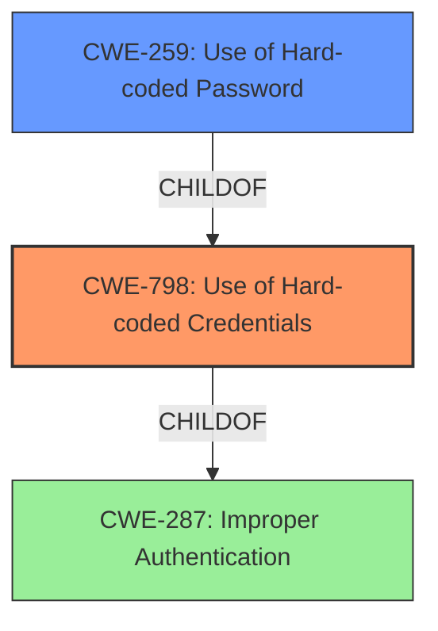

# Raw Analyzer Response for CVE-2021-3652

# Summary
| CWE ID | CWE Name | Confidence | CWE Abstraction Level | CWE Vulnerability Mapping Label | CWE-Vulnerability Mapping Notes |
|---|---|---|---|---|---|
| CWE-798 | Use of Hard-coded Credentials | 1 | Base | Allowed | Primary CWE |
| CWE-259 | Use of Hard-coded Password | 0.8 | Variant | Allowed | Secondary Candidate |
| CWE-287 | Improper Authentication | 0.6 | Class | Discouraged | Secondary Candidate |

## Evidence and Confidence

*   **Confidence Score:** 0.9
*   **Evidence Strength:** HIGH

## Relationship Analysis
The primary weakness is the **use of a hard-coded credential, specifically an asterisk, as a password hash**, leading to authentication bypass. CWE-798 (Use of Hard-coded Credentials) is the most appropriate base CWE. CWE-259 (Use of Hard-coded Password) is a variant of CWE-798 and could be considered since the asterisk is acting as a password. CWE-287 (Improper Authentication) is a broader class that encompasses authentication failures, but it is less specific than CWE-798 or CWE-259.

## Vulnerability Chain
The vulnerability chain starts with the **improper handling of an asterisk as a password hash (CWE-798)**, which then leads to an authentication bypass.

## Summary of Analysis
The analysis identified the **root cause** as the **incorrect handling of an asterisk (*) as a crypted password hash**. The system incorrectly allows any password to bind to an entry where the password hash is set to "*".

The vulnerability description states: "If an asterisk is imported as password hashes, either accidentally or maliciously, then instead of being inactive, any password will successfully match during authentication. This flaw allows an attacker to successfully authenticate as a user whose password was disabled."

The CVE Reference Links Content Summary provides further evidence. For example: "The vulnerability stems from the improper handling of asterisk characters ('*') when used as password hashes. Instead of being treated as an invalid or disabled password, an asterisk allows any password to successfully authenticate."

The relationship graph influenced the decision by showing the hierarchical relationship between CWE-798, CWE-259, and CWE-287. While CWE-287 is a parent, it is too general, whereas CWE-798 and CWE-259 are more specific.

CWE-798 (Use of Hard-coded Credentials) is the most appropriate because the asterisk is effectively functioning as a hard-coded credential that bypasses authentication. CWE-259 (Use of Hard-coded Password) is also relevant because the asterisk is acting as a password in this scenario. However, since it is a password hash, the more general CWE-798 is more appropriate.

Relevant CWE Information:

# Enhanced Context (25 CWEs)

## CWE-1391: Use of Weak Credentials
**Abstraction Level**: Class
**Similarity Score**: 0.78
**Source**: dense

**Description**:
The product uses weak credentials (such as a default key or hard-coded password) that can be calculated, derived, reused, or guessed by an attacker.

**Mapping Guidance**:
- Usage: Allowed-with-Review
- Rationale: This CWE entry is a Class and might have Base-level children that would be more appropriate

This CWE is similar, but not quite as precise as CWE-798, which specifically calls out hard-coded credentials.

## CWE-798: Use of Hard-coded Credentials
**Abstraction Level**: Base
**Similarity Score**: 0.78
**Source**: dense

**Description**:
The product contains hard-coded credentials, such as a password or cryptographic key.

**Mapping Guidance**:
- Usage: Allowed
- Rationale: This CWE entry is at the Base level of abstraction, which is a preferred level of abstraction for mapping to the root causes of vulnerabilities.

This is the primary CWE selected because it accurately describes the **root cause** of the vulnerability.

## CWE-916: Use of Password Hash With Insufficient Computational Effort
**Abstraction Level**: Base
**Similarity Score**: 0.78
**Source**: dense

**Description**:
The product generates a hash for a password, but it uses a scheme that does not provide a sufficient level of computational effort that would make password cracking attacks infeasible or expensive.

**Mapping Guidance**:
- Usage: Allowed
- Rationale: This CWE entry is at the Base level of abstraction, which is a preferred level of abstraction for mapping to the root causes of vulnerabilities.

This CWE is relevant but doesn't directly address the **root cause**, which is the use of an asterisk as a password hash, not the computational effort.

## CWE-303: Incorrect Implementation of Authentication Algorithm
**Abstraction Level**: Base
**Similarity Score**: 0.76
**Source**: dense

**Description**:
The requirements for the product dictate the use of an established authentication algorithm, but the implementation of the algorithm is incorrect.

**Mapping Guidance**:
- Usage: Allowed
- Rationale: This CWE entry is at the Base level of abstraction, which is a preferred level of abstraction for mapping to the root causes of vulnerabilities.

This CWE could be considered, but the **root cause** is not an incorrect implementation of an algorithm, but rather the **improper handling of the asterisk character**.

## CWE-1390: Weak Authentication
**Abstraction Level**: Class
**Similarity Score**: 0.76
**Source**: dense

**Description**:
The product uses an authentication mechanism to restrict access to specific users or identities, but the mechanism does not sufficiently prove that the claimed identity is correct.

**Mapping Guidance**:
- Usage: Allowed-with-Review
- Rationale: This CWE entry is a Class and might have Base-level children that would be more appropriate

This is a more general case of the vulnerability and is less specific than CWE-798.

## CWE-328: Use of Weak Hash
**Abstraction Level**: Base
**Similarity Score**: 0.75
**Source**: dense

**Description**:
The product uses an algorithm that produces a digest (output value) that does not meet security expectations for a hash function that allows an adversary to reasonably determine the original input (preimage attack), find another input that can produce the same hash (2nd preimage attack), or find multiple inputs that evaluate to the same hash (birthday attack).

**Mapping Guidance**:
- Usage: Allowed
- Rationale: This CWE entry is at the Base level of abstraction, which is a preferred level of abstraction for mapping to the root causes of vulnerabilities.

This CWE is not applicable because the asterisk is not a weak hash algorithm but rather an **improperly handled value**.

## CWE-836: Use of Password Hash Instead of Password for Authentication
**Abstraction Level**: Base
**Similarity Score**: 0.75
**Source**: dense

**Description**:
The product records password hashes in a data store, receives a hash of a password from a client, and compares the supplied hash to the hash obtained from the data store.

**Mapping Guidance**:
- Usage: Allowed
- Rationale: This CWE entry is at the Base level of abstraction, which is a preferred level of abstraction for mapping to the root causes of vulnerabilities.

This CWE is not relevant because the vulnerability is not related to using a password hash instead of a password, but rather the **improper handling of a specific character** as a password hash.

## CWE-807: Reliance on Untrusted Inputs in a Security Decision
**Abstraction Level**: Base
**Similarity Score**: 0.75
**Source**: dense

**Description**:
The product uses a protection mechanism that relies on the existence or values of an input, but the input can be modified by an untrusted actor in a way that bypasses the protection mechanism.

**Mapping Guidance**:
- Usage: Allowed
- Rationale: This CWE entry is at the Base level of abstraction, which is a preferred level of abstraction for mapping to the root causes of vulnerabilities.

This CWE is not as directly relevant as CWE-798, as the **root cause** is specifically the **improper handling of a hard-coded value** rather than a general reliance on untrusted inputs.

## CWE-288: Authentication Bypass Using an Alternate Path or Channel
**Abstraction Level**: Base
**Similarity Score**: 0.75
**Source**: dense

**Description**:
The product requires authentication, but the product has an alternate path or channel that does not require authentication.

**Mapping Guidance**:
- Usage: Allowed