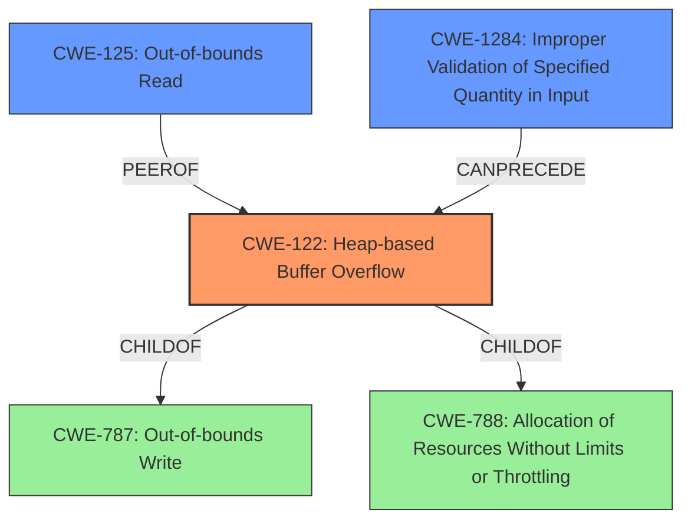

# Analysis Report for CVE-2021-36531

# Vulnerability Analysis Report: CVE-2021-36531

## Description


## Analysis (with Relationship Data)

# Summary
| CWE ID | CWE Name | Confidence | CWE Abstraction Level | CWE Vulnerability Mapping Label | CWE-Vulnerability Mapping Notes |
|---|---|---|---|---|---|
| CWE-122 | Heap-based Buffer Overflow | 0.9 | Variant | Allowed | Primary CWE |
| CWE-125 | Out-of-bounds Read | 0.7 | Base | Allowed | Secondary Candidate |
| CWE-1284 | Improper Validation of Specified Quantity in Input | 0.6 | Base | Allowed | Secondary Candidate |

## Evidence and Confidence

*   **Confidence Score:** 0.8
*   **Evidence Strength:** HIGH

## Relationship Analysis
The primary CWE is CWE-122, which is a variant of CWE-788 (Allocation of Resources Without Limits or Throttling) and CWE-787 (Out-of-bounds Write). CWE-125 (Out-of-bounds Read) is related, as the vulnerability involves reading memory beyond the allocated buffer. CWE-1284 (Improper Validation of Specified Quantity in Input) could be a contributing factor if the size of the buffer was not properly validated.



## Vulnerability Chain
The vulnerability chain starts with a missing or **improper validation** of the buffer size (potentially CWE-1284). This leads to a **heap overflow** (CWE-122) because the `GetByte()` function reads memory without proper boundary checks. The overflow results in a crash (denial of service) and potentially code execution. Additionally, the `GetByte()` function performs an **out-of-bounds read** (CWE-125) due to the missing boundary checks.

## Summary of Analysis
The primary weakness is a **heap-based buffer overflow** (CWE-122) in the `GetByte()` function. This occurs because the function reads memory without boundary checks when `NGIFLIB_NO_FILE` mode is enabled. The vulnerability description explicitly mentions a "**heap overflow**" and the "CVE Reference Links Content Summary" confirms this, stating: "The vulnerability is a heap-buffer-overflow in the `GetByte()` function of `ngiflib.c`" and "The `GetByte()` function reads beyond the allocated buffer on the heap." This aligns perfectly with the description of CWE-122: "A heap overflow condition is a buffer overflow, where the buffer that can be overwritten is allocated in the heap portion of memory".

The vulnerability also involves an **out-of-bounds read** (CWE-125), as the function reads data beyond the allocated buffer. The "CVE Reference Links Content Summary" supports this, noting that "the function to read memory without proper boundary checks" which can cause the out-of-bounds read.

CWE-1284 (Improper Validation of Specified Quantity in Input) is a plausible contributing factor if the size of the buffer to be read was not properly validated before the `GetByte()` function was called. The description indicates that the function reads without boundary checks which may also be because the length wasn't properly validated.

CWE-190 (Integer Overflow or Wraparound) was considered but not selected. While integer overflows can lead to buffer overflows, there is no direct evidence of integer manipulation in this case. The root cause is the **missing boundary check**, not an integer overflow.

CWE-120 (Buffer Copy without Checking Size of Input ('Classic Buffer Overflow')) was also considered but deemed less appropriate than CWE-122. CWE-120 is specific to buffer copy operations, while CWE-122 is a more general heap-based overflow. Given that the `GetByte()` function reads memory, not necessarily copies it, CWE-122 is a better fit.

The selection of CWE-122, CWE-125, and CWE-1284 at the Variant/Base level is optimal because these CWEs provide the most specific and accurate representation of the vulnerability based on the available evidence.


## CWE Relationship Analysis

Current CWEs represent these abstraction levels: .


### Vulnerability Chain Analysis

**Chain starting from CWE-787:**
- 787 (Out-of-bounds Write) - ROOT


**Chain starting from CWE-122:**
- 122 (Heap-based Buffer Overflow) - ROOT


### CWE Relationship Diagram

```mermaid
graph TD
    classDef primary fill:#f96,stroke:#333,stroke-width:2px
    classDef secondary fill:#69f,stroke:#333
    classDef tertiary fill:#9e9,stroke:#333
```


*Report generated on 2025-04-02 13:21:41*
