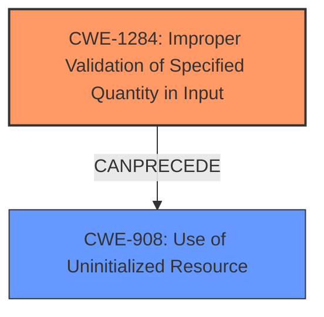

# Analysis Report for CVE-2021-3655

# Vulnerability Analysis Report: CVE-2021-3655

## Description


## Analysis (with Relationship Data)

# Summary
| CWE ID    | CWE Name                                                                                                                                               | Confidence | CWE Abstraction Level | CWE Vulnerability Mapping Label | CWE-Vulnerability Mapping Notes |
| --------- | ------------------------------------------------------------------------------------------------------------------------------------------------------ | ---------- | ----------------------- | --------------------------------- | ------------------------------- |
| CWE-1284  | Improper Validation of Specified Quantity in Input                                                                                                    | 0.95       | Base                    | Primary                           | Allowed                         |
| CWE-908   | Use of Uninitialized Resource                                                                                                                              | 0.75       | Base                    | Secondary                         | Allowed                         |

## Evidence and Confidence

*   **Confidence Score:** 0.85
*   **Evidence Strength:** HIGH

## Relationship Analysis
The primary weakness identified is **CWE-1284 [Improper Validation of Specified Quantity in Input]**, which is a Base level CWE. The vulnerability description explicitly states that the **rootcause** is "**missing size validations** on inbound SCTP packets." This aligns perfectly with the description of CWE-1284, which covers cases where a product receives input specifying a quantity (like size) but **does not validate** that the quantity has the required properties.

CWE-1284 can **CANPRECEDE** CWE-789 (Memory Allocation with Excessive Size Value). In this case, it **CANPRECEDE** a **CWE-908 [Use of Uninitialized Resource]**, because if you don't validate the size, you could end up reading uninitialized memory.



## Vulnerability Chain
The vulnerability chain starts with the **missing size validation** (**CWE-1284 [Improper Validation of Specified Quantity in Input]**). This leads to the kernel attempting to read data without ensuring the size is valid. As a result, the kernel may read uninitialized memory (**CWE-908 [Use of Uninitialized Resource]**), potentially causing a crash (Denial of Service).

## Summary of Analysis
The analysis is based on the provided vulnerability description and the CVE Reference Links Content Summary. The **rootcause** is explicitly stated as "**missing size validations**," which directly maps to **CWE-1284 [Improper Validation of Specified Quantity in Input]**. The vulnerability description also indicates that this **missing validation** leads to reading uninitialized memory, which is **CWE-908 [Use of Uninitialized Resource]**.

The retriever results also support **CWE-1284 [Improper Validation of Specified Quantity in Input]** as the top candidate. The relationship analysis confirms that **CWE-1284 [Improper Validation of Specified Quantity in Input]** can precede **CWE-908 [Use of Uninitialized Resource]**, which is consistent with the vulnerability description.

The evidence provided is sufficient to justify the selection of **CWE-1284 [Improper Validation of Specified Quantity in Input]** as the primary CWE and **CWE-908 [Use of Uninitialized Resource]** as a secondary CWE. The selected CWEs are at the optimal level of specificity because they directly represent the **rootcause** and the immediate consequence of the vulnerability.

**CWEs Considered But Not Used:**

*   **CWE-789 [Memory Allocation with Excessive Size Value]**: While excessive memory allocation might be a potential consequence, the **rootcause** is the **missing size validation**, not necessarily the excessive allocation itself.
*   **CWE-770 [Allocation of Resources Without Limits or Throttling]**: This is similar to CWE-789, but the **rootcause** is still the **missing validation**, not the lack of limits on resource allocation.
*   **CWE-787 [Out-of-bounds Write]**: The description in the CVE indicates "**Out-of-bounds read** due to **missing validation**."
*   **CWE-119 [Improper Restriction of Operations within the Bounds of a Memory Buffer]**: This is a more general CWE, and **CWE-1284 [Improper Validation of Specified Quantity in Input]** is more specific to the **rootcause**.
*   **CWE-476 [NULL Pointer Dereference]**: There is no indication of null pointers in the description.
*   **CWE-1325 [Improperly Controlled Sequential Memory Allocation]**: This is more about allocating multiple objects without limits, which is not the case here.
*   **CWE-401 [Missing Release of Memory after Effective Lifetime]**: There is no indication about memory leaks.
*   **CWE-909 [Missing Initialization of Resource]**: The **impact** of the **missing size validation** is that it may allow the kernel to read uninitialized memory. The **rootcause** is the **missing size validation**, not the missing initialization of a resource.


## CWE Relationship Analysis

Current CWEs represent these abstraction levels: .


### Vulnerability Chain Analysis

**Chain starting from CWE-476:**
- 476 (NULL Pointer Dereference) - ROOT


**Chain starting from CWE-787:**
- 787 (Out-of-bounds Write) - ROOT


### CWE Relationship Diagram

```mermaid
graph TD
    classDef primary fill:#f96,stroke:#333,stroke-width:2px
    classDef secondary fill:#69f,stroke:#333
    classDef tertiary fill:#9e9,stroke:#333
```


*Report generated on 2025-04-02 03:47:58*
