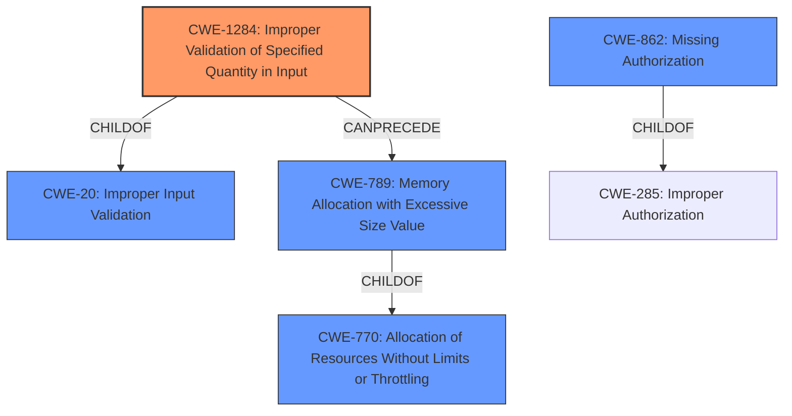

# Analysis Report for CVE-2021-3656

# Vulnerability Analysis Report: CVE-2021-3656

## Description


## Analysis (with Relationship Data)

# Summary
| CWE ID    | CWE Name                                                                                                                                                             | Confidence | CWE Abstraction Level | CWE Vulnerability Mapping Label | CWE-Vulnerability Mapping Notes |
| :-------- | :------------------------------------------------------------------------------------------------------------------------------------------------------------------- | :--------- | :---------------------- | :-------------------------------- | :------------------------------ |
| CWE-1284  | Improper Validation of Specified Quantity in Input                                                                                                                   | 0.9        | Base                    | Allowed                           | Primary CWE                     |
| CWE-862   | Missing Authorization                                                                                                                                                | 0.7        | Class                   | Allowed-with-Review             | Secondary Candidate             |
| CWE-770   | Allocation of Resources Without Limits or Throttling                                                                                                              | 0.6        | Base                    | Allowed                           | Secondary Candidate             |

## Evidence and Confidence

*   **Confidence Score:** 0.8
*   **Evidence Strength:** HIGH

## Relationship Analysis
The primary CWE is CWE-1284, which falls under CWE-20 (Improper Input Validation). It can precede CWE-789 (Memory Allocation with Excessive Size Value), which is a child of CWE-770 (Allocation of Resources Without Limits or Throttling). CWE-862, Missing Authorization, is a peer of other authorization-related CWEs, all falling under the broader category of authentication and authorization issues. The selection of CWE-1284 is at the Base level, which is the optimal level of specificity, while CWE-862 and CWE-770 are broader classifications that capture related aspects of the vulnerability.



## Vulnerability Chain
The vulnerability chain starts with **improper validation of the `virt_ext` field** (CWE-1284), which leads to the disabling of VMLOAD/VMSAVE intercepts and VLS. This, in turn, allows the L2 guest to read/write physical pages of the host, potentially causing a system crash, data leak, or guest-to-host escape. A potential issue is resource allocation (CWE-770).

## Summary of Analysis
The initial analysis focused on the **improper validation** aspect of the vulnerability, which is explicitly mentioned in the vulnerability description: "Due to **improper validation of the virt_ext field**". The CVE Reference Links Content Summary further supports this: "Root cause: **Improper validation of the `virt_ext` field** in the VMCB". This aligns directly with CWE-1284 (Improper Validation of Specified Quantity in Input), which is at the Base level and has a clear description of what the flaw is about.

CWE-862 (Missing Authorization) was considered because the **improper validation** effectively bypasses the intended security mechanisms for isolating the guest. If the L1 guest can manipulate the VMCB to disable VMLOAD/VMSAVE intercepts without proper authorization checks, it's akin to missing authorization. However, since the core issue is about validating the input (VMCB) and not directly about access control, CWE-1284 is a better fit as the primary weakness.

CWE-770 (Allocation of Resources Without Limits or Throttling) was considered because the **improper validation** could lead to excessive resource allocation if the `virt_ext` field controls resource allocation, but evidence is lacking that resource allocation is impacted.

The selection of CWE-1284 is at the optimal level of specificity because it directly addresses the **improper validation** of the `virt_ext` field, which is the root cause of the vulnerability.


## CWE Relationship Analysis

Current CWEs represent these abstraction levels: .


### Vulnerability Chain Analysis

**Chain starting from CWE-862:**
- 862 (Missing Authorization) - ROOT


**Chain starting from CWE-285:**
- 285 (Improper Authorization) - ROOT


### CWE Relationship Diagram

```mermaid
graph TD
    classDef primary fill:#f96,stroke:#333,stroke-width:2px
    classDef secondary fill:#69f,stroke:#333
    classDef tertiary fill:#9e9,stroke:#333
```


*Report generated on 2025-04-02 05:18:16*
