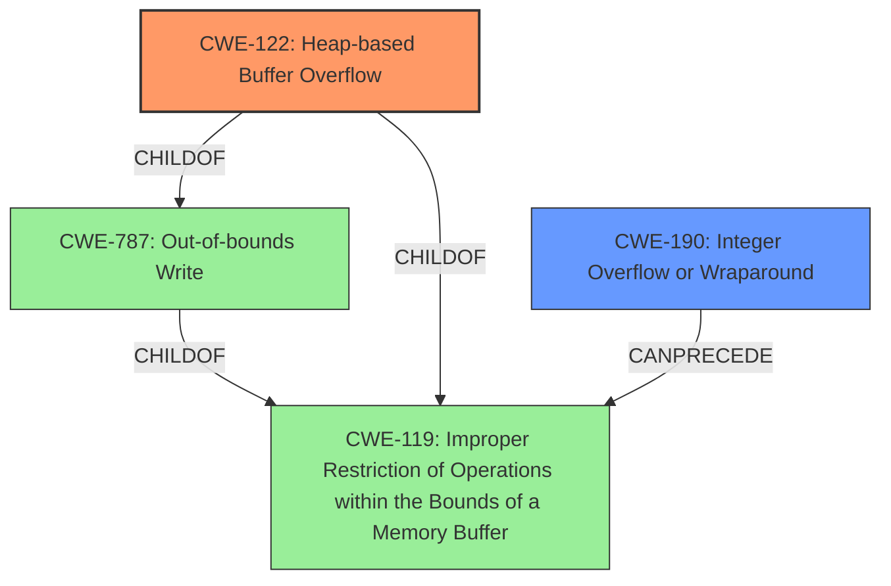

# Analysis Report for CVE-2021-3657

# Vulnerability Analysis Report: CVE-2021-3657

## Description


## Analysis (with Relationship Data)

# Summary
| CWE ID | CWE Name | Confidence | CWE Abstraction Level | CWE Vulnerability Mapping Label | CWE-Vulnerability Mapping Notes |
|---|---|---|---|---|---|
| CWE-122 | Heap-based Buffer Overflow | 0.8 | Variant | Primary | Allowed |
| CWE-190 | Integer Overflow or Wraparound | 0.6 | Base | Secondary | Allowed |

## Evidence and Confidence

*   **Confidence Score:** 0.7
*   **Evidence Strength:** MEDIUM

## Relationship Analysis
The primary CWE is CWE-122, a **Variant** of CWE-787 (Out-of-bounds Write) and CWE-119 (Improper Restriction of Operations within the Bounds of a Memory Buffer). CWE-119 is a **Class** that is often misused, so a more specific **Variant** like CWE-122 is preferred. CWE-190 (Integer Overflow or Wraparound) can **CanPrecede** CWE-119.



## Vulnerability Chain
The vulnerability chain starts with **inadequate handling of extremely large IMAP literals**, which leads to **buffer overflows**, and ultimately results in remote code execution. An Integer Overflow (CWE-190) might precede the buffer overflow. The **buffer overflow** in this case is specifically a heap-based buffer overflow due to the large literals being handled, which leads to memory corruption.

## Summary of Analysis
The primary weakness is a **buffer overflow** due to the **inadequate handling of extremely large IMAP literals**. The evidence explicitly mentions **buffer overflows** as the weakness and remote code execution as the impact.

>A flaw was found in mbsync versions prior to 1.4.4. Due to **inadequate handling of extremely large (>=2GiB) IMAP literals**, malicious or compromised IMAP servers, and hypothetically even external email senders, could cause several different **buffer overflows**, which could conceivably be exploited for remote code execution.

Since the vulnerability involves large literals, it's likely that the buffer is allocated on the heap, making CWE-122 (Heap-based Buffer Overflow) a good fit. CWE-119 (Improper Restriction of Operations within the Bounds of a Memory Buffer) is too general, and the guidance discourages its use when a more specific CWE is available.

CWE-190 (Integer Overflow or Wraparound) is considered as a secondary CWE. If the size of the IMAP literals is not correctly handled due to an integer overflow during size calculation, this could lead to a smaller buffer being allocated than required, triggering the overflow.

CWE-130 (Improper Handling of Length Parameter Inconsistency) was considered but not chosen as the primary CWE. While the vulnerability involves large IMAP literals, the core issue is the buffer overflow resulting from this inadequate handling, rather than the length parameter inconsistency itself.

CWE-1284 (Improper Validation of Specified Quantity in Input) was considered but not chosen. While there is a specified quantity (the size of the IMAP literal), the root cause is not directly related to improper validation but to the **inadequate handling** leading to **buffer overflows**.

CWE-126 (Buffer Over-read) was considered but is not the primary issue, as the description focuses on writing past the buffer.

The selection of CWE-122 is at the optimal level of specificity because it accurately describes the type of buffer overflow (heap-based) resulting from the **inadequate handling of extremely large IMAP literals**.

Relevant CWE Information:

# Enhanced Context (25 CWEs)
The following CWEs were identified as potentially relevant to this vulnerability:

## CWE-312: Cleartext Storage of Sensitive Information
**Abstraction Level**: Base
**Similarity Score**: 0.77
**Source**: dense

**Description**:
The product stores sensitive information in cleartext within a resource that might be accessible to another control sphere.

**Mapping Guidance**:
- Usage: Allowed
- Rationale: This CWE entry is at the Base level of abstraction, which is a preferred level of abstraction for mapping to the root causes of vulnerabilities.

## CWE-319: Cleartext Transmission of Sensitive Information
**Abstraction Level**: Base
**Similarity Score**: 0.77
**Source**: dense

**Description**:
The product transmits sensitive or security-critical data in cleartext in a communication channel that can be sniffed by unauthorized actors.

**Mapping Guidance**:
- Usage: Allowed
- Rationale: This CWE entry is at the Base level of abstraction, which is a preferred level of abstraction for mapping to the root causes of vulnerabilities.

## CWE-226: Sensitive Information in Resource Not Removed Before Reuse
**Abstraction Level**: Base
**Similarity Score**: 0.76
**Source**: dense

**Description**:
The product releases a resource such as memory or a file so that it can be made available for reuse, but it does not clear or "zeroize" the information contained in the resource before the product performs a critical state transition or makes the resource available for reuse by other entities.

**Mapping Guidance**:
- Usage: Allowed
- Rationale: This CWE entry is at the Base level of abstraction, which is a preferred level of abstraction for mapping to the root causes of vulnerabilities.

## CWE-130: Improper Handling of Length Parameter Inconsistency
**Abstraction Level**: Base
**Similarity Score**: 0.76
**Source**: dense

**Description**:
The product parses a formatted message or structure, but it does not handle or incorrectly handles a length field that is inconsistent with the actual length of the associated data.

**Mapping Guidance**:
- Usage: Allowed
- Rationale: This CWE entry is at the Base level of abstraction, which is a preferred level of abstraction for mapping to the root causes of vulnerabilities.

## CWE-131: Incorrect Calculation of Buffer Size
**Abstraction Level**: Base
**Similarity Score**: 0.76
**Source**: dense

**Description**:
The product does not correctly calculate the size to be used when allocating a buffer, which could lead to a buffer overflow.

**Mapping Guidance**:
- Usage: Allowed
- Rationale: This CWE entry is at the Base level of abstraction, which is a preferred level of abstraction for mapping to the root causes of vulnerabilities.

## CWE-538: Insertion of Sensitive Information into Externally-Accessible File or Directory
**Abstraction Level**: Base
**Similarity Score**: 0.76
**Source**: dense

**Description**:
The product places sensitive information into files or directories that are accessible to actors who are allowed to have access to the files, but not to the sensitive information.

**Mapping Guidance**:
- Usage: Allowed
- Rationale: This CWE entry is at the Base level of abstraction, which is a preferred level of abstraction for mapping to the root causes of vulnerabilities.

## CWE-212: Improper Removal of Sensitive Information Before Storage or Transfer
**Abstraction Level**: Base
**Similarity Score**: 0.76
**Source**: dense

**Description**:
The product stores, transfers, or shares a resource that contains sensitive information, but it does not properly remove that information before the product makes the resource available to unauthorized actors.

**Mapping Guidance**:
- Usage: Allowed
- Rationale: This CWE entry is at the Base level of abstraction, which is a preferred level of abstraction for mapping to the root causes of vulnerabilities.

## CWE-311: Missing Encryption of Sensitive Data
**Abstraction Level**: Class
**Similarity Score**: 0.76
**Source**: dense

**Description**:
The product does not encrypt sensitive or critical information before storage or transmission.

**Mapping Guidance**:
- Usage: Discouraged
- Rationale: CWE-311 is high-level with more precise children available. It is a level-1 Class (i.e., a child of a Pillar).

## CWE-119: Improper Restriction of Operations within the Bounds of a Memory Buffer
**Abstraction Level**: Class
**Similarity Score**: 0.76
**Source**: dense

**Description**:
The product performs operations on a memory buffer, but it reads from or writes to a memory location outside the buffer's intended boundary. This may result in read or write operations on unexpected memory locations that could be linked to other variables, data structures,


## CWE Relationship Analysis

Current CWEs represent these abstraction levels: .


### Vulnerability Chain Analysis

**Chain starting from CWE-787:**
- 787 (Out-of-bounds Write) - ROOT


**Chain starting from CWE-122:**
- 122 (Heap-based Buffer Overflow) - ROOT


### CWE Relationship Diagram

```mermaid
graph TD
    classDef primary fill:#f96,stroke:#333,stroke-width:2px
    classDef secondary fill:#69f,stroke:#333
    classDef tertiary fill:#9e9,stroke:#333
```


*Report generated on 2025-04-02 14:29:25*
