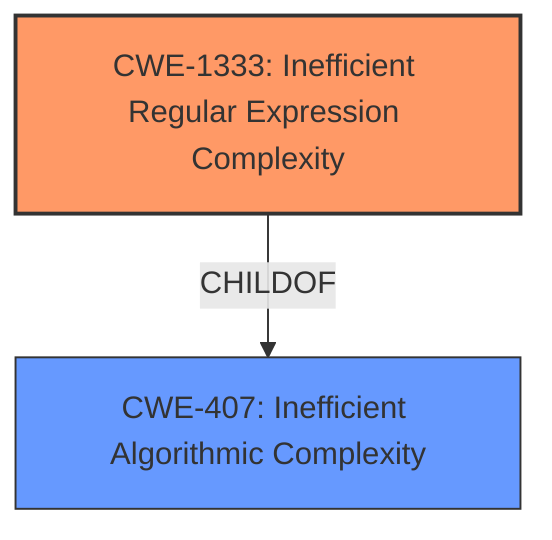

# Enhanced Analysis for CVE-2021-36716

# Summary
| CWE ID  | CWE Name                                | Confidence | CWE Abstraction Level | CWE Vulnerability Mapping Label | CWE-Vulnerability Mapping Notes |
| :-------- | :-------------------------------------- | :--------- | :---------------------- | :------------------------------ | :-------------------------------- |
| CWE-1333 | Inefficient Regular Expression Complexity | 1.0        | Base                    | Allowed                       | Primary CWE                       |

## Evidence and Confidence

*   **Confidence Score:** 1.0
*   **Evidence Strength:** HIGH

## Relationship Analysis
The primary CWE is CWE-1333, which is a base-level CWE and a child of CWE-407 (Inefficient Algorithmic Complexity). The vulnerability description explicitly mentions a **regular expression denial of service**, making CWE-1333 a strong fit. There are no clear chain relationships apparent from the description or the provided CWE relationships.



## Vulnerability Chain
The vulnerability chain starts with a crafted input leading to an inefficient regular expression, which then results in excessive CPU consumption.
  - Crafted Input -> Inefficient Regular Expression (CWE-1333) -> Excessive CPU Consumption (Impact)

## Summary of Analysis
The initial analysis and the retriever results strongly suggest CWE-1333 (Inefficient Regular Expression Complexity) as the primary CWE. The vulnerability description explicitly states "**regular expression denial of service**", which aligns directly with the name and description of CWE-1333. This CWE is at the Base level of abstraction, which is preferred. The evidence is sufficient and directly supports the mapping. The confidence score is high (1.0).

Relevant CWE Information:

# Enhanced Context (25 CWEs)

## CWE-1333: Inefficient Regular Expression Complexity
**Abstraction:** Base
**Similarity Score**: 1.00

### Description
The product uses a regular expression with an inefficient, possibly exponential worst-case computational complexity that consumes excessive CPU cycles.

The provided vulnerability description mentions "**regular expression denial of service** flaw... An attacker that is able to provide crafted input to the isEmail(input) function may cause an application to consume an excessive amount of CPU." This clearly maps to CWE-1333, as it describes a situation where a regular expression's inefficiency leads to excessive CPU usage.

The other CWEs were considered but not selected.

*   CWE-674 (Uncontrolled Recursion): While recursion can lead to resource exhaustion, the specific mention of a regular expression makes CWE-1333 a more precise fit.
*   CWE-770 (Allocation of Resources Without Limits or Throttling): This is about allocating resources without limits, while the vulnerability is about an inefficient regular expression.
*   CWE-400 (Uncontrolled Resource Consumption) and CWE-834 (Excessive Iteration): These are broader categories. CWE-1333 is more specific to the use of regular expressions.
*   CWE-185 (Incorrect Regular Expression): This CWE is about the regular expression not functioning as intended by the developer, whereas CWE-1333 is about the regular expression being inefficient. The key is the resource consumption in the vulnerability.
*   CWE-789 (Memory Allocation with Excessive Size Value): This vulnerability is about memory allocation and the current vulnerability is about CPU Consumption.
*   CWE-407 (Inefficient Algorithmic Complexity): CWE-1333 is a child (more specific) of CWE-407, but given the focus on regular expression, CWE-1333 is a better fit.


## CWE Relationship Analysis

Current CWEs represent these abstraction levels: .


### Vulnerability Chain Analysis

**Chain starting from CWE-674:**
- 674 (Uncontrolled Recursion) - ROOT


**Chain starting from CWE-185:**
- 185 (Incorrect Regular Expression) - ROOT


### CWE Relationship Diagram

```mermaid
graph TD
    classDef primary fill:#f96,stroke:#333,stroke-width:2px
    classDef secondary fill:#69f,stroke:#333
    classDef tertiary fill:#9e9,stroke:#333
```