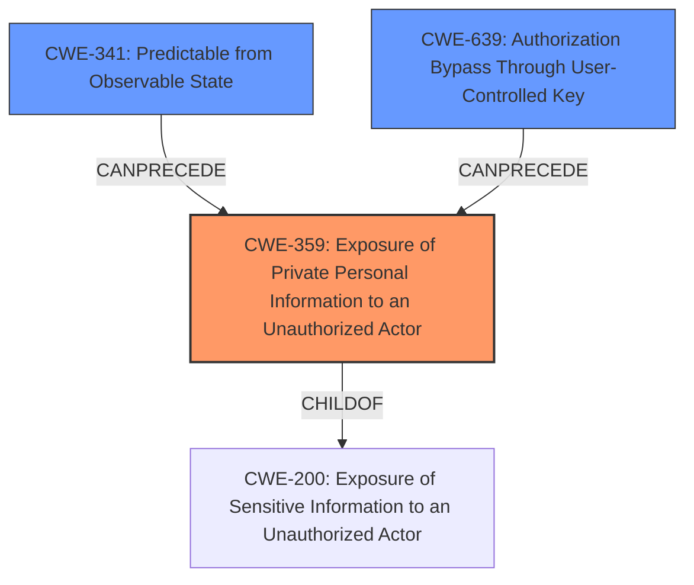

# Analysis for CVE-2021-36723

# Summary
| CWE ID | CWE Name | Confidence | CWE Abstraction Level | CWE Vulnerability Mapping Label | CWE-Vulnerability Mapping Notes |
|---|---|---|---|---|---|
| CWE-359 | Exposure of Private Personal Information to an Unauthorized Actor | 0.9 | Base | Allowed | Primary CWE |
| CWE-341 | Predictable from Observable State | 0.6 | Base | Allowed | Secondary Candidate |
| CWE-639 | Authorization Bypass Through User-Controlled Key | 0.5 | Base | Allowed | Secondary Candidate |

## Evidence and Confidence

*   **Confidence Score:** 0.8
*   **Evidence Strength:** MEDIUM

## Relationship Analysis
The primary CWE selected, CWE-359 [Exposure of Private Personal Information to an Unauthorized Actor], is a Base level CWE and a child of CWE-200 [Exposure of Sensitive Information to an Unauthorized Actor]. The vulnerability description indicates a **lack of identification mechanisms and predictable IDs**, leading to the exposure of private personal information. This aligns well with CWE-359's description. The secondary CWE candidates considered, CWE-341 [Predictable from Observable State] and CWE-639 [Authorization Bypass Through User-Controlled Key], represent potential contributing factors, where predictable IDs could stem from an observable state (CWE-341) or lead to authorization bypass (CWE-639).

## Vulnerability Chain
The vulnerability chain starts with the **lack of identification mechanisms and predictable IDs**. This allows an attacker to scrape files (predictable from observable state CWE-341). Due to the **lack of identification mechanisms**, the attacker is able to access the files which leads to exposure of private personal information (CWE-359)

## Summary of Analysis
The initial assessment, heavily based on the provided evidence, pointed towards CWE-359 [Exposure of Private Personal Information to an Unauthorized Actor] as the primary weakness, supported by the key phrase "Exposure Of Private Personal Information". The **lack of identification mechanisms and predictable IDs** indicates that the system **does not properly prevent** a person's private, personal information from being accessed by unauthorized actors."

The graph relationships influenced the inclusion of CWE-341 [Predictable from Observable State] and CWE-639 [Authorization Bypass Through User-Controlled Key] as secondary candidates. The predictable IDs contribute to the ease of scraping, and the **lack of identification mechanisms** implies a potential authorization bypass.

The selected CWEs are at the optimal level of specificity because CWE-359 [Exposure of Private Personal Information to an Unauthorized Actor] directly addresses the observed impact, while CWE-341 [Predictable from Observable State] and CWE-639 [Authorization Bypass Through User-Controlled Key] represent potential contributing factors. Higher-level CWEs like CWE-200 [Exposure of Sensitive Information to an Unauthorized Actor] would be too generic, while lower-level variants would require more specific evidence.

Other CWEs Considered but Not Used:

*   CWE-200 [Exposure of Sensitive Information to an Unauthorized Actor]: While relevant, it's too broad. CWE-359 [Exposure of Private Personal Information to an Unauthorized Actor] is a more specific child that directly addresses the exposure of private personal information. The mapping guidance for CWE-200 discourages its use when more specific options exist.
*   CWE-330 [Use of Insufficiently Random Values]: While predictable IDs might stem from insufficient randomness, the description focuses on the exposure itself rather than the randomness of the IDs.
*   CWE-532 [Insertion of Sensitive Information into Log File]: The vulnerability doesn't involve log files, so this is not applicable.
*   CWE-668 [Exposure of Resource to Wrong Sphere]: This is a high-level Class CWE and is less specific than CWE-359 [Exposure of Private Personal Information to an Unauthorized Actor]. The mapping guidance discourages the use of CWE-668 when lower-level CWEs are available.
*   CWE-213 [Exposure of Sensitive Information Due to Incompatible Policies]: This CWE relates to cases where information exposure is due to conflicting policies, which is not the case here.
*   CWE-804 [Guessable CAPTCHA]: This is not relevant as the vulnerability is not related to CAPTCHAs.
*   CWE-862 [Missing Authorization]: This is closely related but the description of the vulnerability focuses on **lack of identification mechanisms**, and not that there is missing authorization.