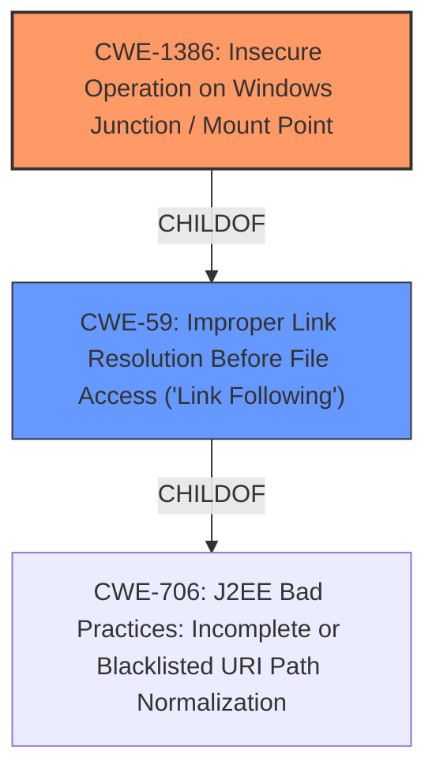

# Analysis Report for CVE-2021-36744

# Vulnerability Analysis Report: CVE-2021-36744

## Description


## Analysis (with Relationship Data)

# Summary
| CWE ID | CWE Name | Confidence | CWE Abstraction Level | CWE Vulnerability Mapping Label | CWE-Vulnerability Mapping Notes |
|---|---|---|---|---|---|
| CWE-1386 | Insecure Operation on Windows Junction / Mount Point | 1.0 | Base | Allowed | Primary CWE |
| CWE-59 | Improper Link Resolution Before File Access ('Link Following') | 0.8 | Base | Allowed | Secondary Candidate |

## Evidence and Confidence

*   **Confidence Score:** 0.9
*   **Evidence Strength:** HIGH

## Relationship Analysis
The primary CWE, CWE-1386, is a specific type of CWE-59. CWE-1386 directly addresses the **insecure operation on Windows junctions/mount points**, while CWE-59 is a more general case of improper link resolution. The vulnerability description specifically mentions a **"directory junction vulnerability"**, making CWE-1386 the more appropriate choice.


## Vulnerability Chain
The vulnerability chain starts with the **improper handling of directory junctions (CWE-1386)**, leading to the potential deletion of arbitrary files. This, in turn, can result in a denial of service and potentially privilege escalation. The **directory junction vulnerability** is the root cause, and the denial of service is the impact.

## Summary of Analysis
Initially, several CWEs were considered based on the retriever results, including CWE-59, CWE-250, CWE-732, CWE-427, CWE-363, CWE-367, CWE-23 and CWE-20. However, a closer examination of the vulnerability description and the **CVE Reference Links Content Summary** reveals that the core issue is the **"improper handling of directory junctions"**. This points directly to CWE-1386, which specifically addresses **"Insecure Operation on Windows Junction / Mount Point"**. The evidence from **CVE Reference Links Content Summary** says, "The vulnerability stems from the **improper handling of directory junctions** within the Trend Micro Maximum Security Agent. An attacker can create a directory junction that, when processed by the vulnerable service, leads to the deletion of an arbitrary file."

CWE-59 was also considered because CWE-1386 is a child of CWE-59.

The graph relationships confirm that CWE-1386 is a more specialized form of CWE-59. Therefore, CWE-1386 is the optimal level of specificity for this vulnerability.

Relevant CWE Information:

# Enhanced Context (25 CWEs)

## CWE-1386: Insecure Operation on Windows Junction / Mount Point
**Abstraction:** Base
**Status:** Incomplete

### Description
The product opens a file or directory, but it does not properly prevent the name from being associated with a junction or mount point to a destination that is outside of the intended control sphere.

### Extended Description


Depending on the intended action being performed, this could allow an attacker to cause the product to read, write, delete, or otherwise operate on unauthorized files.


In Windows, NTFS5 allows for file system objects called reparse points. Applications can create a hard link from one directory to another directory, called a junction point. They can also create a mapping from a directory to a drive letter, called a mount point. If a file is used by a privileged program, but it can be replaced with a hard link to a sensitive file (e.g., AUTOEXEC.BAT), an attacker could excalate privileges. When the process opens the file, the attacker can assume the privileges of that process, tricking the privileged process to read, modify, or delete the sensitive file, preventing the program from accurately processing data. Note that one can also point to registries and semaphores.
### Relationships
ChildOf -> CWE-59

### Observed Examples
- **CVE-2021-26426:** Privileged service allows attackers to delete unauthorized files using a directory junction, leading to arbitrary code execution as SYSTEM.

## CWE-59: Improper Link Resolution Before File Access ('Link Following')
**Abstraction:** Base
**Status:** Draft

### Description
The product attempts to access a file based on the filename, but it does not properly prevent that filename from identifying a link or shortcut that resolves to an unintended resource.
### Relationships
ChildOf -> CWE-706
ChildOf -> CWE-706


## CWE Relationship Analysis

Current CWEs represent these abstraction levels: .


### Vulnerability Chain Analysis

**Chain starting from CWE-732:**
- 732 (Incorrect Permission Assignment for Critical Resource) - ROOT


**Chain starting from CWE-250:**
- 250 (Execution with Unnecessary Privileges) - ROOT


### CWE Relationship Diagram

```mermaid
graph TD
    classDef primary fill:#f96,stroke:#333,stroke-width:2px
    classDef secondary fill:#69f,stroke:#333
    classDef tertiary fill:#9e9,stroke:#333
```


*Report generated on 2025-04-01 20:47:16*
