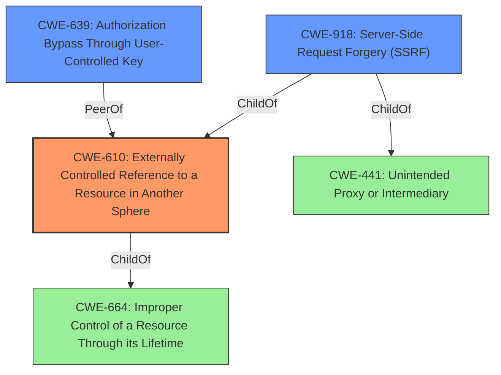

# Analysis for CVE-2021-36749

# Summary
| CWE ID | CWE Name | Confidence | CWE Abstraction Level | CWE Vulnerability Mapping Label | CWE-Vulnerability Mapping Notes |
|---|---|---|---|---|---|
| CWE-610 | Externally Controlled Reference to a Resource in Another Sphere | 0.9 | Class | Allowed | Primary CWE |
| CWE-918 | Server-Side Request Forgery (SSRF) | 0.7 | Base | Allowed | Secondary Candidate |
| CWE-639 | Authorization Bypass Through User-Controlled Key | 0.6 | Base | Allowed | Secondary Candidate |

## Evidence and Confidence

*   **Confidence Score:** 0.8
*   **Evidence Strength:** HIGH

## Relationship Analysis
The primary CWE selected is CWE-610 (Externally Controlled Reference to a Resource in Another Sphere). This is a Class-level CWE. The vulnerability involves using an externally controlled input (the HTTP InputSource) to reference a resource (local file system) outside the intended sphere of control. CWE-918 (Server-Side Request Forgery) and CWE-639 (Authorization Bypass Through User-Controlled Key) were considered as secondary candidates. CWE-918 is a child of CWE-610 and could be considered as the indirect interaction with another server to retrieve resources. CWE-639 could be considered because the application-level restriction bypass is a form of authorization bypass.

## Vulnerability Chain
The vulnerability chain begins with the **improper** external control of the InputSource, specifically the HTTP InputSource. This allows authenticated users to **read data from other sources than intended**, such as the local file system. This bypasses application-level restrictions, effectively granting unauthorized access to resources.

## Summary of Analysis
The initial assessment identified several potential CWEs, including CWE-610, CWE-863, and CWE-918. The selection of CWE-610 as the primary CWE is based on the evidence that the vulnerability allows authenticated users to **read data from other sources than intended**, which aligns with the description of CWE-610: "The product uses an externally controlled name or reference that resolves to a resource that is outside of the intended control sphere." The vulnerability description explicitly mentions that users can bypass application-level restrictions by passing a file URL to the HTTP InputSource. This is a clear example of an externally controlled reference leading to access outside the intended sphere.

CWE-918 (Server-Side Request Forgery) was considered because the HTTP InputSource is used to read data from external sources, but the description emphasizes the access to the local file system, making CWE-610 a more direct fit.

CWE-639 (Authorization Bypass Through User-Controlled Key) was considered because the **application-level restriction** is bypassed.

The final decision to prioritize CWE-610 is based on its direct relevance to the **root cause** of the vulnerability: the external control of a resource reference.

Relevant CWE Information:

# Enhanced Context (25 CWEs)
The following CWEs were identified as potentially relevant to this vulnerability:

## CWE-80: Improper Neutralization of Script-Related HTML Tags in a Web Page (Basic XSS)
**Abstraction Level**: Variant
**Similarity Score**: 0.79
**Source**: dense

**Description**:
The product receives input from an upstream component, but it does not neutralize or incorrectly neutralizes special characters such as "<", ">", and "&" that could be interpreted as web-scripting elements when they are sent to a downstream component that processes web pages.

**Mapping Guidance**:
- Usage: Allowed
- Rationale: This CWE entry is at the Variant level of abstraction, which is a preferred level of abstraction for mapping to the root causes of vulnerabilities.

**Reasons for Exclusion:** This CWE is not relevant because the vulnerability is not about XSS.

## CWE-74: Improper Neutralization of Special Elements in Output Used by a Downstream Component ('Injection')
**Abstraction Level**: Class
**Similarity Score**: 0.77
**Source**: dense

**Description**:
The product constructs all or part of a command, data structure, or record using externally-influenced input from an upstream component, but it does not neutralize or incorrectly neutralizes special elements that could modify how it is parsed or interpreted when it is sent to a downstream component.

**Mapping Guidance**:
- Usage: Discouraged
- Rationale: CWE-74 is high-level and often misused when lower-level weaknesses are more appropriate.

**Reasons for Exclusion:** This CWE is too broad and doesn't accurately describe the vulnerability. The issue is not about neutralizing special elements, but about controlling resource access.

## CWE-610: Externally Controlled Reference to a Resource in Another Sphere
**Abstraction Level**: Class
**Similarity Score**: 0.77
**Source**: dense

**Description**:
The product uses an externally controlled name or reference that resolves to a resource that is outside of the intended control sphere.

**Mapping Guidance**:
- Usage: Discouraged
- Rationale: This CWE entry is a level-1 Class (i.e., a child of a Pillar). It might have lower-level children that would be more appropriate

**Reasons for Inclusion:** This CWE directly relates to the vulnerability, where the externally controlled HTTP InputSource can reference resources outside the intended sphere.

## CWE-113: Improper Neutralization of CRLF Sequences in HTTP Headers ('HTTP Request/Response Splitting')
**Abstraction Level**: Variant
**Similarity Score**: 0.76
**Source**: dense

**Description**:
The product receives data from an HTTP agent/component (e.g., web server, proxy, browser, etc.), but it does not neutralize or incorrectly neutralizes CR and LF characters before the data is included in outgoing HTTP headers.

**Mapping Guidance**:
- Usage: Allowed
- Rationale: This CWE entry is at the Variant level of abstraction, which is a preferred level of abstraction for mapping to the root causes of vulnerabilities.

**Reasons for Exclusion:** This CWE is not relevant as the vulnerability is not related to CRLF injection.

## CWE-116: Improper Encoding or Escaping of Output
**Abstraction Level**: Class
**Similarity Score**: 0.76
**Source**: dense

**Description**:
The product prepares a structured message for communication with another component, but encoding or escaping of the data is either missing or done incorrectly. As a result, the intended structure of the message is not preserved.

**Mapping Guidance**:
- Usage: Allowed-with-Review
- Rationale: This CWE entry is a Class and might have Base-level children that would be more appropriate

**Reasons for Exclusion:** This CWE is not relevant as the vulnerability is not about encoding or escaping output.

## CWE-918: Server-Side Request Forgery (SSRF)
**Abstraction Level**: Base
**Similarity Score**: 0.76
**Source**: dense

**Description**:
The web server receives a URL or similar request from an upstream component and retrieves the contents of this URL, but it does not sufficiently ensure that the request is being sent to the expected destination.

**Mapping Guidance**:
- Usage: Allowed
- Rationale: This CWE entry is at the Base level of abstraction, which is a preferred level of abstraction for mapping to the root causes of vulnerabilities.

**Reasons for Inclusion:** The HTTP InputSource can be used to read data from external URLs, potentially leading to SSRF. However, accessing the local file system is the primary concern.

## CWE-184: Incomplete List of Disallowed Inputs
**Abstraction Level**: Base
**Similarity Score**: 0.76
**Source**: dense

**Description**:
The product implements a protection mechanism that relies on a list of inputs (or properties of inputs) that are not allowed by policy or otherwise require other action to neutralize before additional processing takes place, but the list is incomplete.

**Mapping Guidance**:
- Usage: Allowed
- Rationale: This CWE entry is at the Base level of abstraction, which is a preferred level of abstraction for mapping to the root causes of vulnerabilities.

**Reasons for Exclusion:** This CWE is not relevant because the vulnerability is not about an