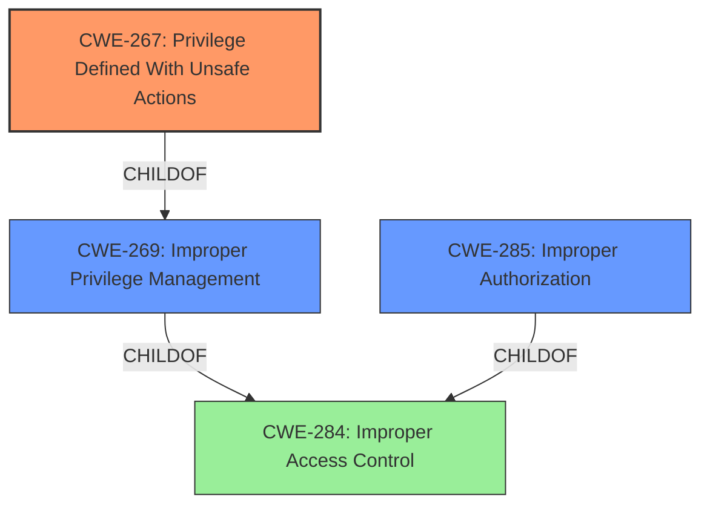

# Analysis Report for CVE-2021-36784

# Vulnerability Analysis Report: CVE-2021-36784

## Description


## Analysis (with Relationship Data)

# Summary
| CWE ID | CWE Name | Confidence | CWE Abstraction Level | CWE Vulnerability Mapping Label | CWE-Vulnerability Mapping Notes |
|---|---|---|---|---|---|
| CWE-267 | Privilege Defined With Unsafe Actions | 1 | Base | Allowed | Primary CWE |
| CWE-285 | Improper Authorization | 0.7 | Class | Discouraged | Secondary Candidate |
| CWE-269 | Improper Privilege Management | 0.6 | Class | Discouraged | Secondary Candidate |

## Evidence and Confidence

*   **Confidence Score:** 0.9
*   **Evidence Strength:** HIGH

## Relationship Analysis
The primary CWE selected, CWE-267, is a child of CWE-269 (Improper Privilege Management), indicating a more specific type of privilege issue. CWE-285 (Improper Authorization) is a peer of CWE-267 but represents a broader class of authorization flaws, making CWE-267 a better fit due to its focus on unsafe actions associated with defined privileges. All three CWEs are children of CWE-284 (Improper Access Control), showing the high-level nature of access control weaknesses. The abstraction levels influenced the decision, favoring the more specific Base level CWE-267 over the Class level CWEs.



## Vulnerability Chain
The vulnerability chain starts with the **improper privilege management**, where users with restricted admin roles can create or update Global Roles and grant themselves permissions they should not have. This leads to **privilege escalation**, allowing them to gain full admin control over the Rancher system.

## Summary of Analysis
The initial analysis focused on the **Improper Privilege Management** vulnerability. The key phrase "Improper Privilege Management" from the vulnerability description points towards privilege-related CWEs. The "CVE Reference Links Content Summary" provides more details, stating that the vulnerability stems from a lack of restrictions on permissions when creating or editing Global Roles, allowing users to grant themselves higher-level administrative privileges.

The retriever results highlighted CWE-267 (Privilege Defined With Unsafe Actions), CWE-285 (Improper Authorization), and CWE-269 (Improper Privilege Management) as potential candidates.

CWE-269 is **discouraged** due to its high-level nature and frequent misuse. CWE-285 is also **discouraged** as it is a class-level CWE. CWE-267 is allowed and more specific, focusing on the scenario where a privilege, role, or capability can be used to perform unsafe actions that were not intended. This aligns well with the vulnerability, where the restricted-admin role, intended to have limited privileges, can be used to escalate to full admin privileges by modifying Global Roles.

Therefore, CWE-267 (Privilege Defined With Unsafe Actions) is the most appropriate primary CWE. It's at the Base level of abstraction and directly addresses the root cause where existing privileges can be exploited to perform unintended, unsafe actions.

Relevant CWE Information:

# Enhanced Context (25 CWEs)
The following CWEs were identified as potentially relevant to this vulnerability:

## CWE-267: Privilege Defined With Unsafe Actions
**Abstraction Level**: Base
**Similarity Score**: 0.77
**Source**: dense

**Description**:
A particular privilege, role, capability, or right can be used to perform unsafe actions that were not intended, even when it is assigned to the correct entity.

**Mapping Guidance**:
- Usage: Allowed
- Rationale: This CWE entry is at the Base level of abstraction, which is a preferred level of abstraction for mapping to the root causes of vulnerabilities.

## CWE-285: Improper Authorization
**Abstraction Level**: Class
**Similarity Score**: 5912.73
**Source**: sparse

**Description**:
The product does not perform or incorrectly performs an authorization check when an actor attempts to access a resource or perform an action.

**Mapping Guidance**:
- Usage: Discouraged
- Rationale: CWE-285 is high-level and lower-level CWEs can frequently be used instead. It is a level-1 Class (i.e., a child of a Pillar).

## CWE-269: Improper Privilege Management
**Abstraction Level**: Class
**Similarity Score**: 0.76
**Source**: dense

**Description**:
The product does not properly assign, modify, track, or check privileges for an actor, creating an unintended sphere of control for that actor.

**Mapping Guidance**:
- Usage: Discouraged
- Rationale: CWE-269 is commonly misused. It can be conflated with "privilege escalation," which is a technical impact.

CWE-267 is preferred because it is more specific to the root cause, where a defined privilege is misused to perform unsafe actions.

CWE-285 and CWE-269 were considered but deemed less appropriate due to their higher abstraction level and the specific nature of the vulnerability being rooted in the misuse of existing privileges, rather than a general lack of authorization or privilege management.


## CWE Relationship Analysis

Current CWEs represent these abstraction levels: .


### Vulnerability Chain Analysis

**Chain starting from CWE-285:**
- 285 (Improper Authorization) - ROOT


**Chain starting from CWE-269:**
- 269 (Improper Privilege Management) - ROOT


### CWE Relationship Diagram

```mermaid
graph TD
    classDef primary fill:#f96,stroke:#333,stroke-width:2px
    classDef secondary fill:#69f,stroke:#333
    classDef tertiary fill:#9e9,stroke:#333
```


*Report generated on 2025-04-02 15:35:26*
