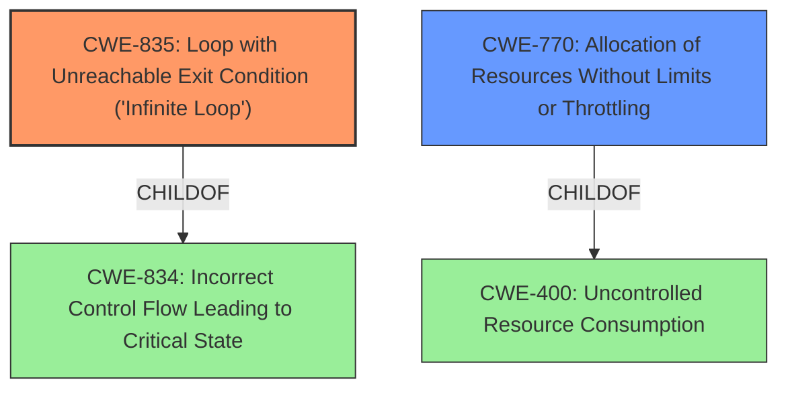

# Enhanced Analysis for CVE-2021-3679

# Summary
| CWE ID | CWE Name | Confidence | CWE Abstraction Level | CWE Vulnerability Mapping Label | CWE-Vulnerability Mapping Notes |
|---|---|---|---|---|---|
| CWE-835 | Loop with Unreachable Exit Condition ('Infinite Loop') | 1.0 | Base | Primary | Allowed |
| CWE-770 | Allocation of Resources Without Limits or Throttling | 0.8 | Base | Secondary | Allowed |

## Evidence and Confidence

*   **Confidence Score:** 0.9
*   **Evidence Strength:** HIGH

## Relationship Analysis
The primary CWE identified is CWE-835 (Loop with Unreachable Exit Condition ('Infinite Loop')), which is a Base-level CWE. It has a ChildOf relationship with CWE-834 (Incorrect Control Flow Leading to Critical State). A secondary CWE is CWE-770 (Allocation of Resources Without Limits or Throttling), which is also a Base-level CWE and a child of CWE-400 (Uncontrolled Resource Consumption). These relationships helped refine the selection to the most specific and relevant CWEs.



## Vulnerability Chain
The vulnerability chain starts with a **bug** in the `rb_per_cpu_empty()` function, leading to an **incorrect conditional evaluation**. This results in a **deadloop** (CWE-835) which leads to **resource starvation** and a **denial of service**.

## Summary of Analysis
The initial analysis pointed towards resource exhaustion and infinite loops. The provided evidence, particularly the CVE Reference Links Content Summary, clearly indicates that the **root cause** is a **bug** in the `rb_per_cpu_empty()` function that results in a **deadloop**. This aligns strongly with CWE-835 (Loop with Unreachable Exit Condition ('Infinite Loop')).

The vulnerability description states "A flaw in the Linux kernel tracing module functionality could allow a privileged local user (with CAP_SYS_ADMIN capability) to cause a denial of service (resource starvation)." The "CVE Reference Links Content Summary" section contains the following supporting evidence:
*   "The rb_per_cpu_empty() function in the Linux kernel tracing module has a bug where it misinterprets the condition for an empty ring buffer leading to a deadloop."
*   "Denial of service due to resource starvation"
*   "Infinite looping"
*   "Incorrect conditional evaluation in rb_per_cpu_empty()"

CWE-770 (Allocation of Resources Without Limits or Throttling) was considered because resource starvation is mentioned, but the **root cause** is the infinite loop, not the lack of limits or throttling on resource allocation. The infinite loop *causes* the resource starvation, making CWE-835 the more appropriate primary classification.

The selected CWEs are at the optimal level of specificity because they directly address the **root cause** (CWE-835) and a contributing factor (CWE-770) of the vulnerability.

Relevant CWE Information:

# Enhanced Context (25 CWEs)

## CWE-404: Improper Resource Shutdown or Release
**Abstraction Level**: Class
**Similarity Score**: 0.77
**Source**: dense

**Description**:
The product does not release or incorrectly releases a resource before it is made available for re-use.

**Mapping Guidance**:
- Usage: Allowed-with-Review
- Rationale: This CWE entry is a Class and might have Base-level children that would be more appropriate

*Not Selected*: This CWE is about improper resource release, which is not the main issue here. The issue is the looping.

## CWE-667: Improper Locking
**Abstraction Level**: Class
**Similarity Score**: 0.77
**Source**: dense

**Description**:
The product does not properly acquire or release a lock on a resource, leading to unexpected resource state changes and behaviors.

**Mapping Guidance**:
- Usage: Allowed-with-Review
- Rationale: This CWE entry is a Class and might have Base-level children that would be more appropriate

*Not Selected*: Locking issues are not described in the vulnerability, so this CWE is not applicable.

## CWE-226: Sensitive Information in Resource Not Removed Before Reuse
**Abstraction Level**: Base
**Similarity Score**: 0.77
**Source**: dense

**Description**:
The product releases a resource such as memory or a file so that it can be made available for reuse, but it does not clear or "zeroize" the information contained in the resource before the product performs a critical state transition or makes the resource available for reuse by other entities.

**Mapping Guidance**:
- Usage: Allowed
- Rationale: This CWE entry is at the Base level of abstraction, which is a preferred level of abstraction for mapping to the root causes of vulnerabilities.

*Not Selected*: This CWE is about not clearing sensitive information, which is not the main issue.

## CWE-1325: Improperly Controlled Sequential Memory Allocation
**Abstraction Level**: Base
**Similarity Score**: 0.75
**Source**: dense

**Description**:
The product manages a group of objects or resources and performs a separate memory allocation for each object, but it does not properly limit the total amount of memory that is consumed by all of the combined objects.

**Mapping Guidance**:
- Usage: Allowed
- Rationale: This CWE entry is at the Base level of abstraction, which is a preferred level of abstraction for mapping to the root causes of vulnerabilities.

*Not Selected*: The issue is not about memory allocation, but rather a looping condition.

## CWE-805: Buffer Access with Incorrect Length Value
**Abstraction Level**: Base
**Similarity Score**: 0.75
**Source**: dense

**Description**:
The product uses a sequential operation to read or write a buffer, but it uses an incorrect length value that causes it to access memory that is outside of the bounds of the buffer.

**Mapping Guidance**:
- Usage: Allowed
- Rationale: This CWE entry is at the Base level of abstraction, which is a preferred level of abstraction for mapping to the root causes of vulnerabilities.

*Not Selected*: Buffer access with incorrect length is not the root cause.

## CWE-789: Memory Allocation with Excessive Size Value
**Abstraction Level**: Variant
**Similarity Score**: 0.75
**Source**: dense

**Description**:
The product allocates memory based on an untrusted, large size value, but it does not ensure that the size is within expected limits, allowing arbitrary amounts of memory to be allocated.

**Mapping Guidance**:
- Usage: Allowed
- Rationale: This CWE entry is at the Variant level of abstraction, which is a preferred level of abstraction for mapping to the root causes of vulnerabilities.

*Not Selected*: Memory allocation with excessive size is not the root cause.

## CWE-664: Improper Control of a Resource Through its Lifetime
**Abstraction Level**: Pillar
**Similarity Score**: 0.75
**Source**: dense

**Description**:
The product does not maintain or incorrectly maintains control over a resource throughout its lifetime of creation, use, and release.

**Mapping Guidance**:
- Usage: Discouraged
- Rationale: This CWE entry is high-level when lower-level children are available.

*Not Selected*: This is a high-level CWE, and more specific CWEs are available.

## CWE-191: Integer Underflow (Wrap or Wraparound)
**Abstraction Level**: Base
**Similarity Score**: 0.75
**Source**: dense

**Description**:
The product subtracts one value from another, such that the result is less than the minimum allowable integer value, which produces a value that is not equal to the correct result.

**Mapping Guidance**:
- Usage: Allowed
- Rationale: This CWE entry is at the Base level of abstraction, which is a preferred level of abstraction for mapping to the root causes of vulnerabilities.

*Not Selected*: Integer underflow is not the root cause.

## CWE-131: Incorrect Calculation of Buffer Size
**Abstraction Level**: Base
**Similarity Score**: 0.75
**Source**: dense

**Description**:
The product does not correctly calculate the size to be used when allocating a buffer, which could lead to a buffer overflow.

**Mapping Guidance**:
- Usage: Allowed
- Rationale: This CWE entry is at the Base level of abstraction, which is a preferred level of abstraction for mapping to the root causes of vulnerabilities.

*Not Selected*:


## CWE Relationship Analysis

Current CWEs represent these abstraction levels: .


### Vulnerability Chain Analysis

**Chain starting from CWE-667:**
- 667 (Improper Locking) - ROOT


**Chain starting from CWE-664:**
- 664 (Improper Control of a Resource Through its Lifetime) - ROOT


### CWE Relationship Diagram

```mermaid
graph TD
    classDef primary fill:#f96,stroke:#333,stroke-width:2px
    classDef secondary fill:#69f,stroke:#333
    classDef tertiary fill:#9e9,stroke:#333
```