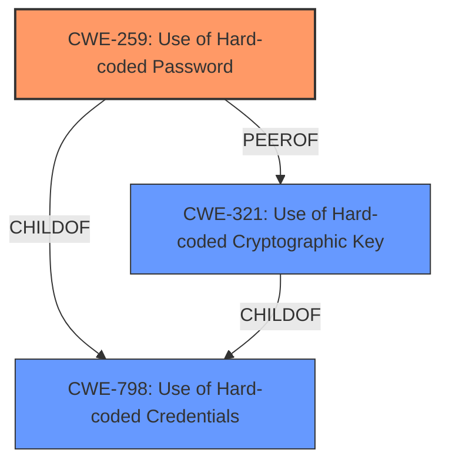

# Analysis Report for CVE-2021-36799

# Vulnerability Analysis Report: CVE-2021-36799

## Description


## Analysis (with Relationship Data)

# Summary
| CWE ID | CWE Name | Confidence | CWE Abstraction Level | CWE Vulnerability Mapping Label | CWE-Vulnerability Mapping Notes |
|---|---|---|---|---|---|
| CWE-259 | Use of Hard-coded Password | 1.0 | Variant | Allowed | Primary CWE |
| CWE-798 | Use of Hard-coded Credentials | 0.8 | Base | Allowed | Secondary Candidate |
| CWE-321 | Use of Hard-coded Cryptographic Key | 0.7 | Variant | Allowed | Secondary Candidate |

## Evidence and Confidence

*   **Confidence Score:** 0.9
*   **Evidence Strength:** HIGH

## Relationship Analysis
The primary CWE is CWE-259, which is a variant of CWE-798. CWE-798 is a base CWE and a parent of CWE-259. CWE-321 is a peer of CWE-259 and also a child of CWE-798. The selection of CWE-259 is based on the specific nature of the **hard-coded password**.



## Vulnerability Chain
The vulnerability chain starts with the **hard-coded password**, which leads to the exposure of sensitive project information.
  - **Root Cause:** CWE-259: Use of Hard-coded Password
  - **Impact:** Exposure of sensitive information, compromise of KNX installations

## Summary of Analysis
The initial analysis focused on identifying the **root cause** of the vulnerability, which is the **hard-coded password**. The vulnerability description and CVE reference links content summary clearly indicate the use of a **hard-coded password**, `ETS5Password`, along with a salt value of `Ivan Medvedev`. This allows local users to read project information.

The retriever results also pointed towards CWE-259, CWE-798, and CWE-321 as potential candidates.

The final decision to select CWE-259 as the primary CWE is based on the fact that the vulnerability specifically involves a **hard-coded password**, as opposed to a more general credential or cryptographic key. The evidence from the vulnerability description and CVE reference links content summary supports this decision.

The CWE-259 is at the Variant level of abstraction, which is the preferred level.

Relevant CWE Information:

# Enhanced Context (25 CWEs)

## CWE-259: Use of Hard-coded Password
**Abstraction:** Variant
**Status:** Draft

### Description
The product contains a **hard-coded password**, which it uses for its own inbound authentication or for outbound communication to external components.

## CWE-321: Use of Hard-coded Cryptographic Key
**Abstraction:** Variant
**Status:** Draft

### Description
The use of a **hard-coded cryptographic key** significantly increases the possibility that encrypted data may be recovered.

## CWE-798: Use of Hard-coded Credentials
**Abstraction:** Base
**Status:** Draft

### Description
The product contains **hard-coded credentials**, such as a password or cryptographic key.


## CWE Relationship Analysis

Current CWEs represent these abstraction levels: .


### Vulnerability Chain Analysis

**Chain starting from CWE-798:**
- 798 (Use of Hard-coded Credentials) - ROOT


**Chain starting from CWE-259:**
- 259 (Use of Hard-coded Password) - ROOT


### CWE Relationship Diagram

```mermaid
graph TD
    classDef primary fill:#f96,stroke:#333,stroke-width:2px
    classDef secondary fill:#69f,stroke:#333
    classDef tertiary fill:#9e9,stroke:#333
```


*Report generated on 2025-04-01 20:49:14*
