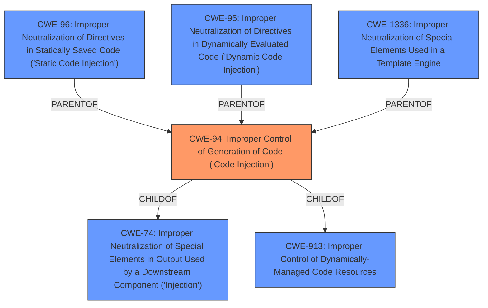

# Analysis Report for CVE-2021-36800

# Vulnerability Analysis Report: CVE-2021-36800

## Description


## Analysis (with Relationship Data)

# Summary
| CWE ID | CWE Name | Confidence | CWE Abstraction Level | CWE Vulnerability Mapping Label | CWE-Vulnerability Mapping Notes |
|---|---|---|---|---|---|
| CWE-94 | Improper Control of Generation of Code ('Code Injection') | 1.0 | Base | Allowed-with-Review | Primary CWE |

## Evidence and Confidence

*   **Confidence Score:** 1.0
*   **Evidence Strength:** HIGH

## Relationship Analysis
The primary CWE is CWE-94, which is a Base level CWE. It has hierarchical relationships with CWE-74 and CWE-913 as its parents. It also has child relationships with CWE-96, CWE-95, and CWE-1336.



## Vulnerability Chain
The chain of events is as follows:
1.  The application receives a POST request with a parameter containing a PHP callable function.
2.  Due to **lack of input sanitization**, the application directly executes the function.
3.  This results in arbitrary code execution, allowing the attacker to gain control of the server.
The root cause is the **lack of input sanitization** leading to **code injection**.

## Summary of Analysis
The vulnerability involves the execution of unsanitized user-controlled PHP code in the Money.php component of the Akaunting application. The application checks if a given value is callable and executes it, leading to remote code execution.

The selection of CWE-94 is based on the following evidence:
*   The **Vulnerability Description** states, "...suffers from a **code injection** issue... A POST... with an items[0][price] that includes a PHP callable function is executed directly."
*   The **CVE Reference Links Content Summary** states the **root cause of vulnerability** as, "The Akaunting application allows for the execution of arbitrary PHP code provided by the user. This is due to a **lack of input sanitization** in the `Money.php` middleware component. Specifically, the application checks if a given value is callable and, if so, executes it." and the **weakness** as, "**Code Injection**: The application executes unsanitized user-controlled PHP code."

CWE-94 (Improper Control of Generation of Code ('Code Injection')) is the most appropriate because the application constructs and executes a code segment (PHP callable function) using externally-influenced input without proper neutralization. The retriever results also list CWE-94 as the top candidate.

Other CWEs considered:
*   CWE-79 (Improper Neutralization of Input During Web Page Generation ('Cross-site Scripting')): While XSS involves improper neutralization of input, it primarily focuses on web page generation, not direct code execution.
*   CWE-89 (Improper Neutralization of Special Elements used in an SQL Command ('SQL Injection')): This is specific to SQL commands, which is not the case here.
*   CWE-78 (Improper Neutralization of Special Elements used in an OS Command ('OS Command Injection')): This is specific to OS commands, not directly relevant to PHP code execution within the application.
*   CWE-1336 (Improper Neutralization of Special Elements Used in a Template Engine): While template engines can be used for code generation, the vulnerability is not explicitly related to a template engine.
*   CWE-96 (Improper Neutralization of Directives in Statically Saved Code ('Static Code Injection')): This involves injecting code into static resources like configuration files, which doesn't match the dynamic execution described here.
*   CWE-88 (Improper Neutralization of Argument Delimiters in a Command ('Argument Injection')): While arguments are part of the injection, the issue isn't the delimiter, it's execution of the function itself.

CWE-94 is chosen because the application constructs and executes a code segment using externally influenced input, without proper neutralization, which directly aligns with the CWE's description. The abstraction level is optimal because it is a base level weakness.


## CWE Relationship Analysis

Current CWEs represent these abstraction levels: .


### Vulnerability Chain Analysis

**Chain starting from CWE-1336:**
- 1336 (Improper Neutralization of Special Elements Used in a Template Engine) - ROOT


**Chain starting from CWE-79:**
- 79 (Improper Neutralization of Input During Web Page Generation ('Cross-site Scripting')) - ROOT


### CWE Relationship Diagram

```mermaid
graph TD
    classDef primary fill:#f96,stroke:#333,stroke-width:2px
    classDef secondary fill:#69f,stroke:#333
    classDef tertiary fill:#9e9,stroke:#333
```


*Report generated on 2025-04-01 23:15:44*
