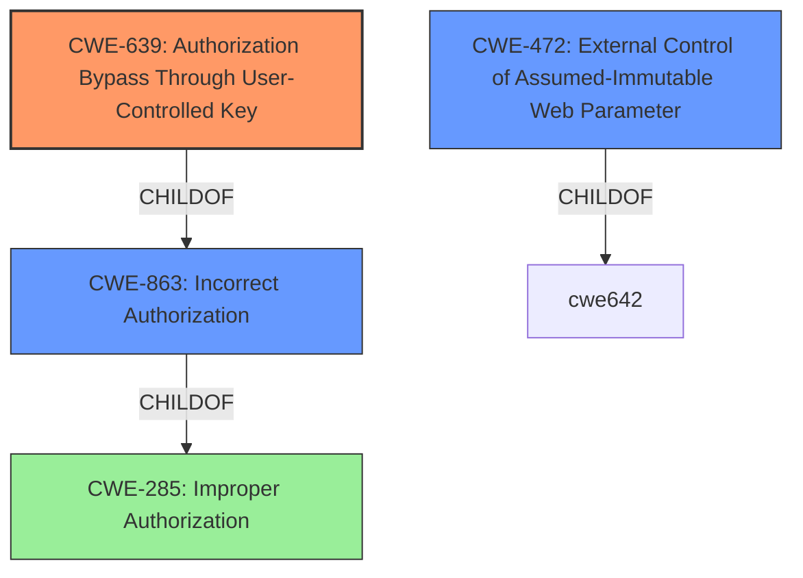

# Enhanced Analysis for CVE-2021-36801

# Summary
| CWE ID    | CWE Name                                                            | Confidence | CWE Abstraction Level | CWE Vulnerability Mapping Label | CWE-Vulnerability Mapping Notes |
| :-------- | :------------------------------------------------------------------ | :--------- | :-------------------- | :------------------------------ | :------------------------------ |
| CWE-639   | Authorization Bypass Through User-Controlled Key                    | 1          | Base                  | Primary                         | Allowed                       |
| CWE-472   | External Control of Assumed-Immutable Web Parameter                 | 0.9        | Base                  | Secondary                       | Allowed                       |
| CWE-863   | Incorrect Authorization                                             | 0.7        | Class                 | Secondary                       | Allowed-with-Review           |

## Evidence and Confidence

*   **Confidence Score:** 0.9
*   **Evidence Strength:** HIGH

## Relationship Analysis
The primary relationship that impacted the decision was the ChildOf relationship, where CWE-639 is a child of CWE-863. This indicates that CWE-639 is a more specific case of incorrect authorization, which aligns with the vulnerability description. CWE-472 is also related, as it addresses the **external control** aspect of the **user-controllable field**.



## Vulnerability Chain
The chain of events starts with the **user-controllable field** (`companies[0]`), leading to **improper authorization checks**, and finally resulting in **authentication bypass** and unauthorized access to data.

## Summary of Analysis
The primary selection of CWE-639 is strongly based on the vulnerability description, which highlights the **user-controllable field** (`companies[0]`) being used to bypass authorization. The "CVE Reference Links Content Summary" explicitly states that the root cause is a lack of proper authorization checks when a user attempts to modify their associated company. This aligns perfectly with CWE-639's description: "The system's authorization functionality does not prevent one user from gaining access to another user's data or record by modifying the key value identifying the data."

The graph relationships further support this selection. CWE-639 is a child of CWE-863 (Incorrect Authorization), indicating that it is a more specific type of authorization failure.

CWE-472 (External Control of Assumed-Immutable Web Parameter) is also relevant because the application assumes that the `companies[0]` parameter is immutable, but it is actually externally controllable. This external control directly leads to the authorization bypass.

I considered other CWEs, such as CWE-79 (Improper Neutralization of Input During Web Page Generation ('Cross-site Scripting')), but it was not applicable because the vulnerability is not related to script injection. CWE-22 (Improper Limitation of a Pathname to a Restricted Directory ('Path Traversal')) was also considered but discarded as the issue does not involve path manipulation. CWE-285 (Improper Authorization) and CWE-863 (Incorrect Authorization) were also considered but ultimately, CWE-639 was chosen as the most specific and fitting CWE.

The selected CWEs are at the optimal level of specificity because they accurately represent the root cause (CWE-639, CWE-472) and the general type of error (CWE-863).

Relevant CWE Information:

# Enhanced Context (25 CWEs)

## CWE-639: Authorization Bypass Through User-Controlled Key
**Abstraction Level**: Base
**Similarity Score**: 0.77
**Source**: dense

**Description**:
The system's authorization functionality does not prevent one user from gaining access to another user's data or record by modifying the key value identifying the data.

**Mapping Guidance**:
- Usage: Allowed
- Rationale: This CWE entry is at the Base level of abstraction, which is a preferred level of abstraction for mapping to the root causes of vulnerabilities.

## CWE-472: External Control of Assumed-Immutable Web Parameter
**Abstraction Level**: Base
**Similarity Score**: 0.76
**Source**: dense

**Description**:
The web application does not sufficiently verify inputs that are assumed to be immutable but are actually externally controllable, such as hidden form fields.

**Mapping Guidance**:
- Usage: Allowed
- Rationale: This CWE entry is at the Base level of abstraction, which is a preferred level of abstraction for mapping to the root causes of vulnerabilities.

## CWE-863: Incorrect Authorization
**Abstraction Level**: Class
**Similarity Score**: 0.75
**Source**: dense

**Description**:
The product performs an authorization check when an actor attempts to access a resource or perform an action, but it does not correctly perform the check.

**Mapping Guidance**:
- Usage: Allowed-with-Review
- Rationale: This CWE entry is a Class and might have Base-level children that would be more appropriate


## CWE Relationship Analysis

Current CWEs represent these abstraction levels: .


### Vulnerability Chain Analysis

**Chain starting from CWE-79:**
- 79 (Improper Neutralization of Input During Web Page Generation ('Cross-site Scripting')) - ROOT


**Chain starting from CWE-285:**
- 285 (Improper Authorization) - ROOT


### CWE Relationship Diagram

```mermaid
graph TD
    classDef primary fill:#f96,stroke:#333,stroke-width:2px
    classDef secondary fill:#69f,stroke:#333
    classDef tertiary fill:#9e9,stroke:#333
```