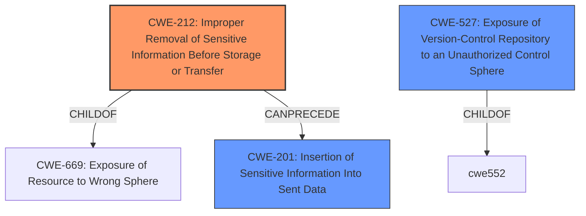

# Analysis for CVE-2021-3681

# Summary
| CWE ID | CWE Name | Confidence | CWE Abstraction Level | CWE Vulnerability Mapping Label | CWE-Vulnerability Mapping Notes |
|---|---|---|---|---|---|
| CWE-212 | Improper Removal of Sensitive Information Before Storage or Transfer | 0.9 | Base | Allowed | Primary CWE |
| CWE-527 | Exposure of Version-Control Repository to an Unauthorized Control Sphere | 0.6 | Variant | Allowed | Secondary Candidate |
| CWE-201 | Insertion of Sensitive Information Into Sent Data | 0.5 | Base | Allowed | Secondary Candidate |

## Evidence and Confidence

*   **Confidence Score:** 0.8
*   **Evidence Strength:** HIGH

## Relationship Analysis
The primary CWE selected is CWE-212 (**Improper Removal of Sensitive Information Before Storage or Transfer**). CWE-212 has hierarchical relationships, being a child of CWE-669, indicating a potential for broader information exposure issues. It also has chain relationships where it can precede CWE-201 (**Insertion of Sensitive Information Into Sent Data**), suggesting that the **improper removal** can lead to the **insertion** of sensitive data in other contexts. This vulnerability fits because the sensitive Ansible Galaxy API key and secrets are being included in the collection's `.tar.gz` file, which is then stored and transferred.

## Vulnerability Chain
The vulnerability chain starts with the **improper exclusion of files** via the build_ignore list, leading to the **inclusion of sensitive information** in the .tar.gz file. This results in the **exposure of sensitive information** to unauthorized actors who can download and inspect the collection.

## Summary of Analysis
The initial analysis correctly identified the core issue as the **improper exclusion of sensitive information** during the build process of Ansible Galaxy Collections. This leads to the packaging and distribution of sensitive data, which can then be accessed by unauthorized actors.

The selection of CWE-212 (**Improper Removal of Sensitive Information Before Storage or Transfer**) as the primary CWE is based on the fact that the vulnerability involves the failure to properly remove sensitive information (API keys, secrets) before the collection is stored and transferred. This aligns directly with the CWE's description and suggested usage.

The evidence supporting this decision is found in the "Vulnerability Description Key Phrases" section, which highlights the **root cause** as the "**improper exclusion of files in build_ignore list**" and the "impact" as the ability to "**view sensitive info including Ansible Galaxy API key and secrets**." The "CVE Reference Links Content Summary" section further reinforces this by noting the "**inclusion of sensitive files**" in the build process and the "**lack of default exclusion**" of sensitive files.

CWE-527 (**Exposure of Version-Control Repository to an Unauthorized Control Sphere**) was considered because the vulnerability involves the inclusion of files that might be related to version control or configuration, but it's not as direct a fit as CWE-212, which focuses on the specific issue of failing to remove sensitive information.

CWE-201 (**Insertion of Sensitive Information Into Sent Data**) was considered, since the sensitive information is ultimately sent out in the collection. However, CWE-212 is a better fit as it directly addresses the **root cause** of the **improper removal** of the sensitive information *before* it is sent out.

The selected CWEs are at the appropriate level of specificity. CWE-212 is a Base-level CWE, representing a fundamental weakness in how sensitive information is handled.
Relevant CWE Information:

# Enhanced Context (25 CWEs)
The following CWEs were identified as potentially relevant to this vulnerability:

## CWE-538: Insertion of Sensitive Information into Externally-Accessible File or Directory
**Abstraction Level**: Base
**Similarity Score**: 0.76
**Source**: dense

**Description**:
The product places sensitive information into files or directories that are accessible to actors who are allowed to have access to the files, but not to the sensitive information.

**Mapping Guidance**:
- Usage: Allowed
- Rationale: This CWE entry is at the Base level of abstraction, which is a preferred level of abstraction for mapping to the root causes of vulnerabilities.

## CWE-226: Sensitive Information in Resource Not Removed Before Reuse
**Abstraction Level**: Base
**Similarity Score**: 0.76
**Source**: dense

**Description**:
The product releases a resource such as memory or a file so that it can be made available for reuse, but it does not clear or "zeroize" the information contained in the resource before the product performs a critical state transition or makes the resource available for reuse by other entities.

**Mapping Guidance**:
- Usage: Allowed
- Rationale: This CWE entry is at the Base level of abstraction, which is a preferred level of abstraction for mapping to the root causes of vulnerabilities.

## CWE-798: Use of Hard-coded Credentials
**Abstraction Level**: Base
**Similarity Score**: 0.76
**Source**: dense

**Description**:
The product contains hard-coded credentials, such as a password or cryptographic key.

**Mapping Guidance**:
- Usage: Allowed
- Rationale: This CWE entry is at the Base level of abstraction, which is a preferred level of abstraction for mapping to the root causes of vulnerabilities.

## CWE-212: Improper Removal of Sensitive Information Before Storage or Transfer
**Abstraction Level**: Base
**Similarity Score**: 0.75
**Source**: dense

**Description**:
The product stores, transfers, or shares a resource that contains sensitive information, but it does not properly remove that information before the product makes the resource available to unauthorized actors.

**Mapping Guidance**:
- Usage: Allowed
- Rationale: This CWE entry is at the Base level of abstraction, which is a preferred level of abstraction for mapping to the root causes of vulnerabilities.

## CWE-1391: Use of Weak Credentials
**Abstraction Level**: Class
**Similarity Score**: 0.75
**Source**: dense

**Description**:
The product uses weak credentials (such as a default key or hard-coded password) that can be calculated, derived, reused, or guessed by an attacker.

**Mapping Guidance**:
- Usage: Allowed-with-Review
- Rationale: This CWE entry is a Class and might have Base-level children that would be more appropriate

## CWE-668: Exposure of Resource to Wrong Sphere
**Abstraction Level**: Class
**Similarity Score**: 0.75
**Source**: dense

**Description**:
The product exposes a resource to the wrong control sphere, providing unintended actors with inappropriate access to the resource.

**Mapping Guidance**:
- Usage: Discouraged
- Rationale: CWE-668 is high-level and is often misused as a catch-all when lower-level CWE IDs might be applicable. It is sometimes used for low-information vulnerability reports [REF-1287]. It is a level-1 Class (i.e., a child of a Pillar). It is not useful for trend analysis.

## CWE-497: Exposure of Sensitive System Information to an Unauthorized Control Sphere
**Abstraction Level**: Base
**Similarity Score**: 0.75
**Source**: dense

**Description**:
The product does not properly prevent sensitive system-level information from being accessed by unauthorized actors who do not have the same level of access to the underlying system as the product does.

**Mapping Guidance**:
- Usage: Allowed
- Rationale: This CWE entry is at the Base level of abstraction, which is a preferred level of abstraction for mapping to the root causes of vulnerabilities.

## CWE-312: Cleartext Storage of Sensitive Information
**Abstraction Level**: Base
**Similarity Score**: 0.75
**Source**: dense

**Description**:
The product stores sensitive information in cleartext within a resource that might be accessible to another control sphere.

**Mapping Guidance**:
- Usage: Allowed
- Rationale: This CWE entry is at the Base level of abstraction, which is a preferred level of abstraction for mapping to the root causes of vulnerabilities.

## CWE-319: Cleartext Transmission of Sensitive Information
**Abstraction Level**: Base
**Similarity Score**: 0.74
**Source**: dense

**Description**:
The product transmits sensitive or security-critical data in cleartext in a communication channel that can be sniffed by unauthorized actors.

**Mapping Guidance**:
-