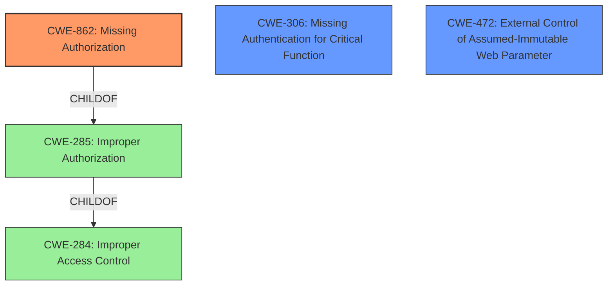

# Raw Analyzer Response for CVE-2021-36888

# Summary
| CWE ID | CWE Name | Confidence | CWE Abstraction Level | CWE Vulnerability Mapping Label | CWE-Vulnerability Mapping Notes |
|---|---|---|---|---|---|
| CWE-862 | Missing Authorization | 1.0 | Class | Primary | Allowed-with-Review |
| CWE-306 | Missing Authentication for Critical Function | 0.9 | Base | Secondary | Allowed |
| CWE-472 | External Control of Assumed-Immutable Web Parameter | 0.7 | Base | Secondary | Allowed |

## Evidence and Confidence

*   **Confidence Score:** 0.9
*   **Evidence Strength:** HIGH

## Relationship Analysis
The primary relationship impacting the decision is that CWE-862 **Missing Authorization** is a parent of CWE-425 **Direct Request ('Forced Browsing')**. Given the description of the vulnerability, it seems that the **missing authorization** check leads to the ability to directly request actions without proper validation. Additionally, CWE-862 is a child of CWE-285 **Improper Authorization**, and CWE-284 **Improper Access Control**, but these are higher-level abstractions.

## Vulnerability Chain
The vulnerability chain starts with the **lack of proper access control** mechanisms. Specifically, **missing authorization** checks, and the ability to control immutable parameters, then allowing unauthenticated arbitrary option updates that lead to a full website compromise.
  - Root Cause: **Missing Authentication/Authorization**
  - Weakness: **Arbitrary Options Update** via externally controlled parameters
  - Impact: Full Website Compromise

## Summary of Analysis
The initial analysis indicated a **broken access control** issue due to a **lack of proper authorization**. The key phrase from the vulnerability description is "**arbitrary options update**," and the root cause is the **missing authorization, authentication, or nonce checks**.

The **CVE Reference Links Content Summary** section explicitly states: "The vulnerability is due to a **Broken Access Control** issue...This means there is a **lack of proper authorization**, authentication, or nonce checks..."

The Retriever Results suggest CWE-352, CWE-306, CWE-790, CWE-862, CWE-425, CWE-472, CWE-471, CWE-1336, CWE-284, CWE-863 as potentially relevant.

CWE-862 **Missing Authorization** is selected as the primary CWE because the **lack of proper authorization** checks is the direct cause of the vulnerability.

CWE-306 **Missing Authentication for Critical Function** is a secondary CWE because the vulnerability is accessible to unauthenticated users, meaning no prior login or access is required, and the functionality is considered critical.

CWE-472 **External Control of Assumed-Immutable Web Parameter** is a secondary CWE because the ability to update arbitrary options suggests that externally controlled parameters, assumed to be immutable, are being modified.

CWE-352 **Cross-Site Request Forgery (CSRF)** was considered but not selected as the primary CWE because the vulnerability is not explicitly related to CSRF, although the ability to update options might be exploitable via CSRF if the appropriate protections were in place.

CWE-790 **Improper Filtering of Special Elements** was considered but not selected as there is no evidence of filtering issues.

CWE-425 **Direct Request ('Forced Browsing')** was considered but not selected as the primary CWE, as the root cause is the **missing authorization**, and direct request is a consequence of this **missing authorization**.

CWE-471 **Modification of Assumed-Immutable Data (MAID)** was considered but the description more closely aligns with web parameters, so CWE-472 is a better fit.

CWE-1336 **Improper Neutralization of Special Elements Used in a Template Engine** was considered but not selected because there is no mention of template engine use in the provided information.

CWE-284 **Improper Access Control** was considered but is too high-level and discouraged for usage.

CWE-863 **Incorrect Authorization** was considered but the description specifies **Missing Authorization**, so this is a better fit.

The selected CWEs are at the optimal level of specificity because they directly address the root causes of the vulnerability based on the available evidence. CWE-862 and CWE-306 represent the **missing authorization** and authentication issues, and CWE-472 describes the ability to manipulate external parameters.