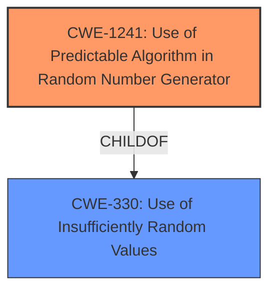

# Analysis Report for CVE-2021-3689

# Vulnerability Analysis Report: CVE-2021-3689

## Description


## Analysis (with Relationship Data)

# Summary
| CWE ID  | CWE Name                                                     | Confidence | CWE Abstraction Level | CWE Vulnerability Mapping Label | CWE-Vulnerability Mapping Notes |
| :------- | :----------------------------------------------------------- | :--------- | :---------------------- | :------------------------------ | :------------------------------ |
| CWE-1241 | Use of Predictable Algorithm in Random Number Generator      | 0.9        | Base                    | Primary                         | Allowed                       |
| CWE-330  | Use of Insufficiently Random Values                          | 0.7        | Class                   | Secondary                       | Discouraged                    |

## Evidence and Confidence

*   **Confidence Score:** 0.9
*   **Evidence Strength:** HIGH

## Relationship Analysis
The primary CWE, CWE-1241, is a base-level CWE that is a child of CWE-330, which is a class-level CWE. Therefore, CWE-1241 is more specific. The vulnerability description directly mentions the **use of a predictable algorithm** in a Random Number Generator, making CWE-1241 the most accurate choice.



## Vulnerability Chain
The vulnerability chain starts with the **use of a predictable algorithm** for random number generation (CWE-1241), which leads to insufficiently random values (CWE-330). This can then lead to various impacts such as security bypass and captcha bypass.

## Summary of Analysis
The initial analysis correctly identifies the **root cause** as the **use of a predictable algorithm**. The evidence from the CVE description confirms that `mt_rand` was used, which is a known predictable algorithm. The selection of CWE-1241 is based on the evidence: "**Root Cause:** The vulnerability stems from the usage of `mt_rand` for generating random values in security-sensitive contexts. This function has a predictable output, making it unsuitable for generating cryptographic keys or similar security-related random numbers."

The retriever results also list CWE-1241 as the top combined result. The relationship analysis also supports the selection of CWE-1241 as the most specific and relevant CWE.

Relevant CWE Information:

# Enhanced Context (25 CWEs)

## CWE-1241: Use of Predictable Algorithm in Random Number Generator
**Abstraction Level**: Base
**Similarity Score**: 0.72
**Source**: dense

**Description**:
The device uses an algorithm that is predictable and generates a pseudo-random number.

**Mapping Guidance**:
- Usage: Allowed
- Rationale: This CWE entry is at the Base level of abstraction, which is a preferred level of abstraction for mapping to the root causes of vulnerabilities.

## CWE-330: Use of Insufficiently Random Values
**Abstraction Level**: Class
**Similarity Score**: 0.77
**Source**: dense

**Description**:
The product uses insufficiently random numbers or values in a security context that depends on unpredictable numbers.

**Mapping Guidance**:
- Usage: Discouraged
- Rationale: This CWE entry is a level-1 Class (i.e., a child of a Pillar). It might have lower-level children that would be more appropriate

CWE-337, CWE-338, CWE-340, CWE-331, CWE-1240, CWE-1391, CWE-1204, CWE-335, CWE-804, CWE-384, CWE-425, CWE-184, CWE-208, CWE-471, CWE-301, CWE-336 and CWE-780 were considered, but are not as directly relevant as CWE-1241 and CWE-330. They represent related but less specific weaknesses, or are impacts rather than the **root cause**. CWE-330 is a valid secondary CWE because the **use of a predictable algorithm** inherently leads to insufficiently random values, but it is less specific than CWE-1241.


## CWE Relationship Analysis

Current CWEs represent these abstraction levels: .


### Vulnerability Chain Analysis

**Chain starting from CWE-335:**
- 335 (Incorrect Usage of Seeds in Pseudo-Random Number Generator (PRNG)) - ROOT


**Chain starting from CWE-804:**
- 804 (Guessable CAPTCHA) - ROOT


### CWE Relationship Diagram

```mermaid
graph TD
    classDef primary fill:#f96,stroke:#333,stroke-width:2px
    classDef secondary fill:#69f,stroke:#333
    classDef tertiary fill:#9e9,stroke:#333
```


*Report generated on 2025-04-02 10:09:16*
