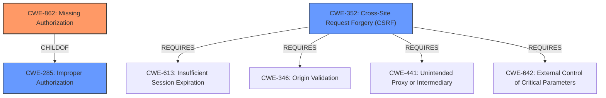

# Raw Analyzer Response for CVE-2021-36909

# Summary
| CWE ID    | CWE Name                           | Confidence | CWE Abstraction Level | CWE Vulnerability Mapping Label | CWE-Vulnerability Mapping Notes |
| --------- | ---------------------------------- | ---------- | --------------------- | ----------------------------- | ------------------------------- |
| CWE-862   | Missing Authorization              | 1          | Class                 | Allowed-with-Review             | Primary CWE                     |
| CWE-352   | Cross-Site Request Forgery (CSRF) | 0.9        | Compound              | Allowed                         | Secondary Candidate             |

## Evidence and Confidence

*   **Confidence Score:** 0.95
*   **Evidence Strength:** HIGH

## Relationship Analysis
The primary CWE selected is CWE-862 (Missing Authorization), which is a Class-level CWE. The vulnerability description clearly indicates that the plugin **fails to perform an authorization check**, allowing any authenticated user to reset the database, regardless of their role. CWE-862 is a child of CWE-285 (Improper Authorization), indicating a hierarchical relationship where the general authorization issue is further specified as a missing check.

CWE-352 (Cross-Site Request Forgery) is a secondary CWE, as the vulnerability description mentions the lack of nonce token verification. CSRF protection is a mechanism to ensure that requests are intentionally made by the user, and its absence contributes to the exploitability of the **missing authorization** vulnerability. CWE-352 requires CWE-346, CWE-441, CWE-642, and CWE-613 which are related to ensuring the request is valid and intentionally made.

## Vulnerability Chain
The vulnerability chain starts with the **missing authorization** check (CWE-862) for database reset functionality. The lack of CSRF protection (CWE-352) further exacerbates the issue. An attacker can then wipe the database leading to a complete website reset and takeover.

## Summary of Analysis
The analysis is based on the vulnerability description and the CVE Reference Links Content Summary. The primary **weakness** is the **missing authorization** check, allowing any authenticated user to reset the database. The supporting evidence is: "Authenticated Database Reset vulnerability in WordPress WP Reset PRO Premium plugin (versions <= 5.98) allows any authenticated user to wipe the entire database regardless of their authorization."

The CVE Reference Links Content Summary provides:
*   "The vulnerability stems from a lack of proper authorization and nonce token checks in the WP Reset PRO plugin."
*   "Broken Access Control: Any authenticated user, regardless of their role or permissions (including subscriber role), could trigger the database wipe functionality."

The graph relationships show that CWE-862 is a child of CWE-285, indicating a more specific type of improper authorization. CWE-352 is a compound CWE that requires other CWEs to be present, indicating a related but distinct weakness.

CWE-862 is the optimal level of specificity as it directly addresses the **missing authorization** check. While CWE-285 is a parent CWE, it is too general. CWE-862 accurately reflects the root cause of the vulnerability.

Relevant CWE Information:

# Enhanced Context (25 CWEs)
The following CWEs were identified as potentially relevant to this vulnerability:

## CWE-472: External Control of Assumed-Immutable Web Parameter
**Abstraction Level**: Base
**Similarity Score**: 0.79
**Source**: dense

**Description**:
The web application does not sufficiently verify inputs that are assumed to be immutable but are actually externally controllable, such as hidden form fields.

**Mapping Guidance**:
- Usage: Allowed
- Rationale: This CWE entry is at the Base level of abstraction, which is a preferred level of abstraction for mapping to the root causes of vulnerabilities.

**Why Not Used:** The primary issue is not related to trusting external parameters, but rather the complete lack of authorization checks. Therefore, CWE-472 is not the most appropriate choice.

## CWE-639: Authorization Bypass Through User-Controlled Key
**Abstraction Level**: Base
**Similarity Score**: 0.78
**Source**: dense

**Description**:
The system's authorization functionality does not prevent one user from gaining access to another user's data or record by modifying the key value identifying the data.

**Mapping Guidance**:
- Usage: Allowed
- Rationale: This CWE entry is at the Base level of abstraction, which is a preferred level of abstraction for mapping to the root causes of vulnerabilities.

**Why Not Used:** The vulnerability is not about bypassing authorization by modifying a key. It's about the absence of any authorization check at all.

## CWE-807: Reliance on Untrusted Inputs in a Security Decision
**Abstraction Level**: Base
**Similarity Score**: 0.77
**Source**: dense

**Description**:
The product uses a protection mechanism that relies on the existence or values of an input, but the input can be modified by an untrusted actor in a way that bypasses the protection mechanism.

**Mapping Guidance**:
- Usage: Allowed
- Rationale: This CWE entry is at the Base level of abstraction, which is a preferred level of abstraction for mapping to the root causes of vulnerabilities.

**Why Not Used:** The vulnerability doesn't rely on untrusted inputs for a security decision. It completely lacks a security decision in the form of an authorization check.

## CWE-425: Direct Request ('Forced Browsing')
**Abstraction Level**: Base
**Similarity Score**: 0.77
**Source**: dense

**Description**:
The web application does not adequately enforce appropriate authorization on all restricted URLs, scripts, or files.

**Mapping Guidance**:
- Usage: Allowed
- Rationale: This CWE entry is at the Base level of abstraction, which is a preferred level of abstraction for mapping to the root causes of vulnerabilities.

**Why Not Used:** While related, CWE-425 is more about accessing restricted resources directly, while the core issue here is the **missing authorization** check before performing a sensitive action.

## CWE-1289: Improper Validation of Unsafe Equivalence in Input
**Abstraction Level**: Base
**Similarity Score**: 0.76
**Source**: dense

**Description**:
The product receives an input value that is used as a resource identifier or other type of reference, but it does not validate or incorrectly validates that the input is equivalent to a potentially-unsafe value.

**Mapping Guidance**:
- Usage: Allowed
- Rationale: This CWE entry is at the Base level of abstraction, which is a preferred level of abstraction for mapping to the root causes of vulnerabilities.

**Why Not Used:** The vulnerability doesn't involve validating input equivalence. It is primarily an authorization issue.

## CWE-184: Incomplete List of Disallowed Inputs
**Abstraction Level**: Base
**Similarity Score**: 0.76
**Source**: dense

**Description**:
The product implements a protection mechanism that relies on a list of inputs (or properties of inputs) that are not allowed by policy or otherwise require other action to neutralize before additional processing takes place, but the list is incomplete.

**Mapping Guidance**:
- Usage: Allowed
- Rationale: This CWE entry is at the Base level of abstraction, which is a preferred level of abstraction for mapping to the root causes of vulnerabilities.

**Why Not Used:** There is no evidence of a list of disallowed inputs being incomplete. The main issue is the **absence of an authorization check**.

## CWE-183: Permissive List of Allowed Inputs
**Abstraction Level**: Base
**Similarity Score**: 0.76
**Source**: dense

**Description**:
The product implements a protection mechanism that relies on a list of inputs (or properties of inputs) that are explicitly allowed by policy because the inputs are assumed to be safe, but the list is too permissive - that is, it allows an input that is unsafe, leading to resultant weaknesses.

**Mapping Guidance**:
- Usage: Allowed
- Rationale: This CWE entry is at the Base level of abstraction, which is a preferred level of abstraction for mapping to the root causes of vulnerabilities.

**Why Not Used:** There is no evidence of a permissive list of allowed