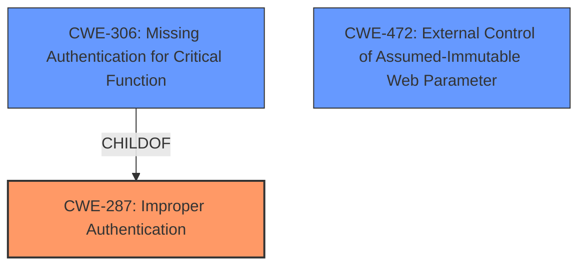

# Analysis for CVE-2021-36921

# Summary
| CWE ID | CWE Name | Confidence | CWE Abstraction Level | CWE Vulnerability Mapping Label | CWE-Vulnerability Mapping Notes |
|---|---|---|---|---|---|
| CWE-287 | Improper Authentication | 0.9 | Class | Discouraged | Consider children or descendants, beginning with CWE-1390: Weak Authentication or CWE-306: Missing Authentication for Critical Function. |
| CWE-306 | Missing Authentication for Critical Function | 0.7 | Base | Allowed | Acceptable-Use |
| CWE-472 | External Control of Assumed-Immutable Web Parameter | 0.6 | Base | Allowed | Acceptable-Use |

## Evidence and Confidence

*   **Confidence Score:** 0.8
*   **Evidence Strength:** HIGH

## Relationship Analysis
The primary CWE is CWE-287, which is a Class-level CWE. The retriever suggests using child CWEs, such as CWE-306. CWE-306 (Missing Authentication for Critical Function) is a more specific Base-level CWE and child of CWE-287. CWE-472 (External Control of Assumed-Immutable Web Parameter) is also a Base-level CWE, but it is not directly related to CWE-287 or CWE-306 in the hierarchy.

## Vulnerability Chain
The vulnerability chain starts with the **Improper Authentication** (CWE-287), which allows an attacker to gain administrative access by modifying the response to an authentication check request.

## Summary of Analysis
The initial assessment, based on the provided evidence, points towards **Improper Authentication** (CWE-287) as the primary weakness. The "Vulnerability Description Key Phrases" section explicitly mentions "**Improper Authentication**" as the root cause. The "CVE Reference Links Content Summary" confirms that the vulnerability stems from a flaw in the authentication mechanism, where an attacker can bypass the authentication process by tampering with the response of the authentication check request.

The retriever results also suggest CWE-287 as the top candidate. However, the mapping guidance for CWE-287 discourages its use and suggests considering its children, such as CWE-306 (Missing Authentication for Critical Function).

CWE-306 is considered because the vulnerability involves a missing authentication step that can be bypassed by modifying the authentication response. This can be seen as a specific case of **Improper Authentication** (CWE-287).

CWE-472 is considered because the attacker is modifying the response to the authentication check request, which can be seen as an externally controlled assumed-immutable web parameter.

Based on the evidence and the mapping guidance, CWE-287 is chosen as the primary CWE, but with the caveat that a more specific CWE might be applicable. CWE-306 and CWE-472 are considered as secondary CWEs.

The final selection is at the optimal level of specificity, given the available information. While CWE-287 is a Class-level CWE, it accurately represents the general nature of the vulnerability. CWE-306 and CWE-472 add more details.

Relevant CWE Information:

# Enhanced Context (25 CWEs)
The following CWEs were identified as potentially relevant to this vulnerability:

## CWE-807: Reliance on Untrusted Inputs in a Security Decision
**Abstraction Level**: Base
The product uses a protection mechanism that relies on the existence or values of an input, but the input can be modified by an untrusted actor in a way that bypasses the protection mechanism.

## CWE-1390: Weak Authentication
**Abstraction Level**: Class
The product uses an authentication mechanism to restrict access to specific users or identities, but the mechanism does not sufficiently prove that the claimed identity is correct.

## CWE-303: Incorrect Implementation of Authentication Algorithm
**Abstraction Level**: Base
The requirements for the product dictate the use of an established authentication algorithm, but the implementation of the algorithm is incorrect.

## CWE-274: Improper Handling of Insufficient Privileges
**Abstraction Level**: Base
The product does not handle or incorrectly handles when it has insufficient privileges to perform an operation, leading to resultant weaknesses.

## CWE-302: Authentication Bypass by Assumed-Immutable Data
**Abstraction Level**: Base
The authentication scheme or implementation uses key data elements that are assumed to be immutable, but can be controlled or modified by the attacker.

## CWE-668: Exposure of Resource to Wrong Sphere
**Abstraction Level**: Class
The product exposes a resource to the wrong control sphere, providing unintended actors with inappropriate access to the resource.

## CWE-1220: Insufficient Granularity of Access Control
**Abstraction Level**: Base
The product implements access controls via a policy or other feature with the intention to disable or restrict accesses (reads and/or writes) to assets in a system from untrusted agents. However, implemented access controls lack required granularity, which renders the control policy too broad because it allows accesses from unauthorized agents to the security-sensitive assets.

## CWE-657: Violation of Secure Design Principles
**Abstraction Level**: Class
The product violates well-established principles for secure design.

## CWE-653: Improper Isolation or Compartmentalization
**Abstraction Level**: Class
The product does not properly compartmentalize or isolate functionality, processes, or resources that require different privilege levels, rights, or permissions.

## CWE-280: Improper Handling of Insufficient Permissions or Privileges 
**Abstraction Level**: Base
The product does not handle or incorrectly handles when it has insufficient privileges to access resources or functionality as specified by their permissions. This may cause it to follow unexpected code paths that may leave the product in an invalid state.

## CWE-798: Use of Hard-coded Credentials
**Abstraction Level**: Base
The product contains hard-coded credentials, such as a password or cryptographic key.

## CWE-259: Use of Hard-coded Password
**Abstraction Level**: Variant
The product contains a hard-coded password, which it uses for its own inbound authentication or for outbound communication to external components.

## CWE-472: External Control of Assumed-Immutable Web Parameter
**Abstraction Level**: Base
The web application does not sufficiently verify inputs that are assumed to be immutable but are actually externally controllable, such as hidden form fields.

## CWE-1249: Application-Level Admin Tool with Inconsistent View of Underlying Operating System
**Abstraction Level**: Base
The product provides an application for administrators to manage parts of the underlying operating system, but the application does not accurately identify all of the relevant entities or resources that exist in the OS; that is, the application's model of the OS's state is inconsistent with the OS's actual state.

## CWE-1390: Weak Authentication
**Abstraction Level**: Class
The product uses an authentication mechanism to restrict access to specific users or identities, but the mechanism does not sufficiently prove that the claimed identity is correct.

## CWE-321: Use of Hard-coded Cryptographic Key
**Abstraction Level**: variant
CWE-321: Use of Hard-coded Cryptographic Key

## CWE-259: Use of Hard-coded Password
**Abstraction Level**: variant
CWE-259: Use of Hard-coded Password

## CWE-257: Storing Passwords in a Recoverable Format
**Abstraction Level**: base
CWE-257: Storing Passwords in a Recoverable Format

## CWE-420: Unprotected Alternate Channel
**Abstraction Level**: base
CWE-420: Unprotected Alternate Channel

## CWE-322: Key Exchange without Entity Authentication
**Abstraction Level**: base
CWE-322: Key Exchange without Entity Authentication

## CWE-425: Direct Request ('Forced Browsing')
**Abstraction Level**: base
CWE-425: Direct Request ('Forced Browsing')

## CWE-471: Modification of Assumed-Immutable Data (MAID)
**Abstraction Level**: base
CWE-471: Modification of Assumed-Immutable Data (MAID)

## CWE-350: Reliance on Reverse DNS Resolution for a Security-Critical Action
**Abstraction Level**: variant
CWE-350: Reliance on Reverse DNS Resolution for a Security-Critical Action

## CWE-798: Use of Hard-coded Credentials
**Abstraction Level**: Base
The product contains hard-coded credentials, such as a password or cryptographic key.

## CWE-288: Authentication Bypass Using an Alternate Path or Channel
**Abstraction Level**: Base
The product requires authentication, but the product has an alternate path or channel that does not require authentication.

## CWE-2