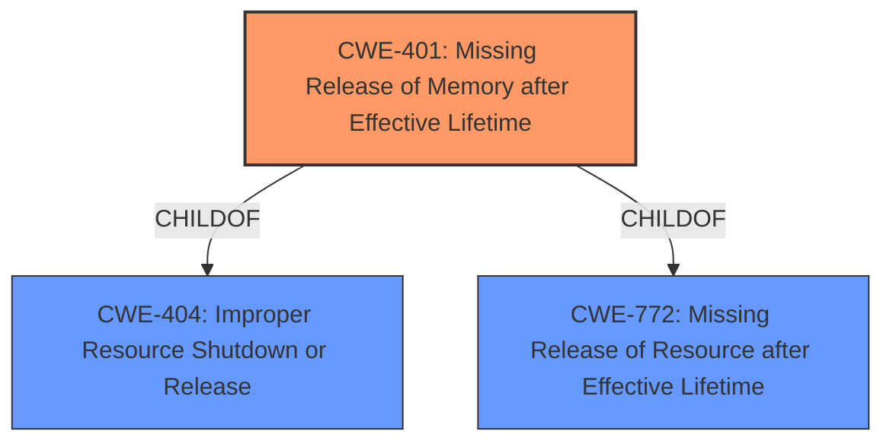

# Analysis Report for CVE-2021-36993

# Vulnerability Analysis Report: CVE-2021-36993

## Description


## Analysis (with Relationship Data)

# Summary
| CWE ID | CWE Name | Confidence | CWE Abstraction Level | CWE Vulnerability Mapping Label | CWE-Vulnerability Mapping Notes |
|---|---|---|---|---|---|
| CWE-401 | Missing Release of Memory after Effective Lifetime | 1.0 | Variant | Allowed | Primary CWE |

## Evidence and Confidence

*   **Confidence Score:** 1.0
*   **Evidence Strength:** HIGH

## Relationship Analysis
The analysis is based on a parent-child hierarchical relationship, where CWE-401 is a variant.
- Parent-child hierarchical relationships: CWE-401 is a Variant of CWE-404 (Improper Resource Shutdown or Release) and CWE-772 (Missing Release of Resource after Effective Lifetime)
- Abstraction levels influenced the selection: Choosing the Variant CWE-401 provides a more specific characterization of the **memory leak** than its Class-level parents.



## Vulnerability Chain
The vulnerability chain here is direct and simple:

1.  **Root Cause:** **Missing Release of Memory** (CWE-401)
2.  **Impact:** Service availability is affected due to resource exhaustion.

## Summary of Analysis
The primary focus is on identifying the root cause of the vulnerability based on the description and reference links. The description explicitly mentions "**memory leaks**" and the reference links confirm this as the root cause.

-   The assessment is heavily based on the provided evidence, particularly the "Vulnerability Description Key Phrases" and "CVE Reference Links Content Summary". The key phrase "**weakness: memory leaks**" and the reference to "Memory leaks" as the "Root cause of vulnerability" directly support the selection of a CWE related to memory leaks.

-   The graph relationships reinforce the selection, as CWE-401 is a child of CWE-404, which represents a more general class of resource management issues. However, CWE-401 specifically addresses the **missing release of memory**, making it a more accurate and specific fit.

-   The selection of CWE-401 is at the optimal level of specificity because it directly corresponds to the identified weakness (**memory leak**). While CWE-404 is a parent CWE, it is more generic and does not capture the specific nature of the vulnerability as precisely as CWE-401.

Relevant CWE Information:

# Enhanced Context (25 CWEs)
The following CWEs were identified as potentially relevant to this vulnerability:

## CWE-401: Missing Release of Memory after Effective Lifetime
**Abstraction Level**: Variant
**Similarity Score**: 0.800
**Source**: alternate_terms

**Description**:
The product does not sufficiently track and release allocated memory after it has been used, which slowly consumes remaining memory.

**Mapping Guidance**:
- Usage: Allowed
- Rationale: This CWE entry is at the Variant level of abstraction, which is a preferred level of abstraction for mapping to the root causes of vulnerabilities.

## Considered but not used:

*   **CWE-125: Out-of-bounds Read**: While memory corruption is a potential impact of memory management issues, the description focuses on the **leak** itself, not an out-of-bounds access.
*   **CWE-131: Incorrect Calculation of Buffer Size**: This is not explicitly mentioned or implied in the description. There's no indication that the buffer size calculation is incorrect.
*   **CWE-362: Concurrent Execution using Shared Resource with Improper Synchronization**: Concurrency issues are not mentioned in the description.
*   **CWE-119: Improper Restriction of Operations within the Bounds of a Memory Buffer**: Similar to CWE-125, this is a potential impact but not the root cause described.
*   **CWE-909: Missing Initialization of Resource**: While a missing initialization could lead to a memory leak, the description explicitly states a **missing release**, making CWE-401 a more direct fit.
*   **CWE-823: Use of Out-of-range Pointer Offset**: This is not related to the described vulnerability.
*   **CWE-20: Improper Input Validation**: Input validation issues are not mentioned.
*   **CWE-248: Uncaught Exception**: Exceptions are not mentioned as part of the root cause.
*   **CWE-252: Unchecked Return Value**: Return values are not mentioned as part of the root cause.


## CWE Relationship Analysis

Current CWEs represent these abstraction levels: .


### Vulnerability Chain Analysis

**Chain starting from CWE-823:**
- 823 (Use of Out-of-range Pointer Offset) - ROOT


**Chain starting from CWE-248:**
- 248 (Uncaught Exception) - ROOT


### CWE Relationship Diagram

```mermaid
graph TD
    classDef primary fill:#f96,stroke:#333,stroke-width:2px
    classDef secondary fill:#69f,stroke:#333
    classDef tertiary fill:#9e9,stroke:#333
```


*Report generated on 2025-04-02 09:42:33*
