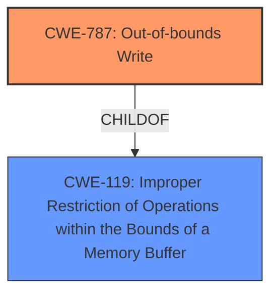

# Enhanced Analysis for CVE-2021-37002

# Summary
| CWE ID | CWE Name | Confidence | CWE Abstraction Level | CWE Vulnerability Mapping Label | CWE-Vulnerability Mapping Notes |
|---|---|---|---|---|---|
| CWE-787 | Out-of-bounds Write | 1.0 | Base | Allowed | Primary CWE |

## Evidence and Confidence

*   **Confidence Score:** 1.0
*   **Evidence Strength:** HIGH

## Relationship Analysis
The primary relationship that influenced the decision was the ChildOf relationship between CWE-787 and CWE-119. CWE-787 is a more specific case of CWE-119, which is an "Improper Restriction of Operations within the Bounds of a Memory Buffer." Since the description explicitly mentions an "out-of-bounds access" that leads to writing, CWE-787 is a more accurate and specific classification than its parent.



## Vulnerability Chain
The vulnerability chain for this description is straightforward.

1.  The root cause is a **memory out-of-bounds access**.
2.  The impact is the potential execution of malicious code.

The description focuses on the direct consequence of writing outside the intended memory region.

## Summary of Analysis
The initial analysis of the vulnerability description indicated a memory safety issue where data is written past the boundary of a buffer. The key phrase **"Memory out-of-bounds access"** from the vulnerability description, combined with the CVE Reference Links Content Summary stating the **"Root Cause of Vulnerability: Memory out-of-bounds access"**, provided strong evidence.

The Retriever Results further supported this direction, with CWE-787 appearing as a relevant option. The Complete CWE Specifications for CWE-787 confirmed that it involves writing data past the end or before the beginning of the intended buffer, aligning perfectly with the vulnerability description.

The relationship analysis highlighted that CWE-787 is a child of CWE-119, making it a more specific and appropriate choice. Given the clear evidence and the recommendation to use the most specific CWE available, CWE-787 was selected with high confidence.

The selection is based on the provided evidence, explicitly stating the vulnerability is due to **"Memory out-of-bounds access"**. This is further reinforced by the CVE Reference Links Content Summary confirming the root cause.

Relevant CWE Information:

# Enhanced Context (25 CWEs)
The following CWEs were identified as potentially relevant to this vulnerability:

## CWE-131: Incorrect Calculation of Buffer Size
**Abstraction Level**: Base
**Similarity Score**: 0.77
**Source**: dense

**Description**:
The product does not correctly calculate the size to be used when allocating a buffer, which could lead to a buffer overflow.

**Mapping Guidance**:
- Usage: Allowed
- Rationale: This CWE entry is at the Base level of abstraction, which is a preferred level of abstraction for mapping to the root causes of vulnerabilities.

## CWE-125: Out-of-bounds Read
**Abstraction Level**: Base
**Similarity Score**: 0.76
**Source**: dense

**Description**:
The product reads data past the end, or before the beginning, of the intended buffer.

**Mapping Guidance**:
- Usage: Allowed
- Rationale: This CWE entry is at the Base level of abstraction, which is a preferred level of abstraction for mapping to the root causes of vulnerabilities.

## CWE-119: Improper Restriction of Operations within the Bounds of a Memory Buffer
**Abstraction Level**: Class
**Similarity Score**: 7229.69
**Source**: sparse

**Description**:
The product performs operations on a memory buffer, but it reads from or writes to a memory location outside the buffer's intended boundary. This may result in read or write operations on unexpected memory locations that could be linked to other variables, data structures, or internal program data.

**Mapping Guidance**:
- Usage: Discouraged
- Rationale: CWE-119 is commonly misused in low-information vulnerability reports when lower-level CWEs could be used instead, or when more details about the vulnerability are available.

## CWE-787: Out-of-bounds Write
**Abstraction Level**: base
**Similarity Score**: 4.33
**Source**: graph

**Description**:
CWE-787: Out-of-bounds Write

**Mapping Guidance**:
- Usage: Allowed
- Rationale: This CWE entry is at the Base level of abstraction, which is a preferred level of abstraction for mapping to the root causes of vulnerabilities.

**Relationships**:
- CANFOLLOW -> CWE-825
- CANFOLLOW -> CWE-824
- CANFOLLOW -> CWE-823
- CANFOLLOW -> CWE-822
- PARENTOF -> CWE-124

CWE-131, Incorrect Calculation of Buffer Size: While this could potentially lead to an out-of-bounds write, the description doesn't mention an incorrect calculation, so this is not the primary weakness.

CWE-125, Out-of-bounds Read: The vulnerability description specifically mentions "Memory out-of-bounds access" which could involve reading, but the provided summaries indicate that the access leads to execution of malicious code which is more closely associated with writing.

CWE-119, Improper Restriction of Operations within the Bounds of a Memory Buffer: This is a more general class of weakness. While applicable, CWE-787 provides a more specific classification as it directly identifies the out-of-bounds write.

CWE-823, Use of Out-of-range Pointer Offset: While possible, the description does not explicitly mention pointer arithmetic or offsets. Therefore, CWE-787 is a better fit based on the information provided.


## CWE Relationship Analysis

Current CWEs represent these abstraction levels: .


### Vulnerability Chain Analysis

**Chain starting from CWE-823:**
- 823 (Use of Out-of-range Pointer Offset) - ROOT


**Chain starting from CWE-787:**
- 787 (Out-of-bounds Write) - ROOT


### CWE Relationship Diagram

```mermaid
graph TD
    classDef primary fill:#f96,stroke:#333,stroke-width:2px
    classDef secondary fill:#69f,stroke:#333
    classDef tertiary fill:#9e9,stroke:#333
```