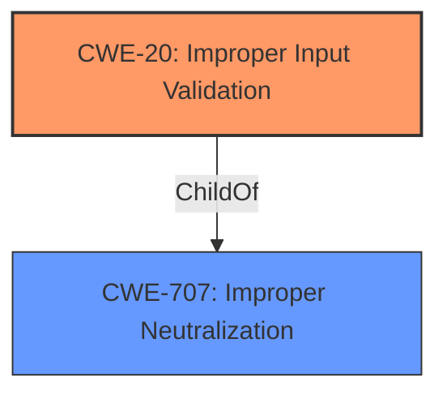

# Analysis Report for CVE-2021-37004

# Vulnerability Analysis Report: CVE-2021-37004

## Description


## Analysis (with Relationship Data)

# Summary
| CWE ID | CWE Name | Confidence | CWE Abstraction Level | CWE Vulnerability Mapping Label | CWE-Vulnerability Mapping Notes |
|---|---|---|---|---|---|
| CWE-20 | Improper Input Validation | 0.75 | Class | Primary | Discouraged |

## Evidence and Confidence

*   **Confidence Score:** 0.75
*   **Evidence Strength:** MEDIUM

## Relationship Analysis
The primary relationship that influenced the decision was the ChildOf relationship, with CWE-20 as a child of CWE-707. However, the general nature of CWE-20 and its frequent misuse weighed against its selection, as it is a Class level CWE and lacks specificity. The retriever results offered several potential Base and Variant level CWEs related to input validation.



## Vulnerability Chain
The vulnerability chain starts with **Improper Input Validation**, leading to a kernel crash.

## Summary of Analysis
The initial assessment strongly considers CWE-20 due to the explicit mention of "**Improper Input Validation**" in the vulnerability description. However, CWE-20 is a high-level Class CWE, and the mapping guidance discourages its use when more specific CWEs are available. The retriever results provide several potentially more specific CWEs related to input validation, such as CWE-1284, CWE-125, CWE-131, CWE-1286, and CWE-1285.
Given the limited information and the direct mention of "**Improper Input Validation**", CWE-20 is chosen, but with lower confidence and the acknowledgment that a more detailed analysis might reveal a more specific weakness.
The selection of CWE-20 is based on the available evidence, which is the "**Improper Input Validation**" description.

Relevant CWE Information:

# Enhanced Context (25 CWEs)
The following CWEs were identified as potentially relevant to this vulnerability:

## CWE-1289: Improper Validation of Unsafe Equivalence in Input
**Abstraction Level**: Base
**Similarity Score**: 0.76
**Source**: dense

**Description**:
The product receives an input value that is used as a resource identifier or other type of reference, but it does not validate or incorrectly validates that the input is equivalent to a potentially-unsafe value.

**Mapping Guidance**:
- Usage: Allowed
- Rationale: This CWE entry is at the Base level of abstraction, which is a preferred level of abstraction for mapping to the root causes of vulnerabilities.

## CWE-703: Improper Check or Handling of Exceptional Conditions
... (omitted for brevity)

## CWE-754: Improper Check for Unusual or Exceptional Conditions
... (omitted for brevity)

## CWE-191: Integer Underflow (Wrap or Wraparound)
... (omitted for brevity)

## CWE-252: Unchecked Return Value
... (omitted for brevity)

## CWE-129: Improper Validation of Array Index
... (omitted for brevity)

## CWE-606: Unchecked Input for Loop Condition
... (omitted for brevity)

## CWE-131: Incorrect Calculation of Buffer Size
... (omitted for brevity)

## CWE-404: Improper Resource Shutdown or Release
... (omitted for brevity)

## CWE-667: Improper Locking
... (omitted for brevity)

## CWE-190: Integer Overflow or Wraparound
... (omitted for brevity)

## CWE-1284: Improper Validation of Specified Quantity in Input
... (omitted for brevity)

## CWE-125: Out-of-bounds Read
... (omitted for brevity)

## CWE-839: Numeric Range Comparison Without Minimum Check
... (omitted for brevity)

## CWE-191: Integer Underflow (Wrap or Wraparound)
... (omitted for brevity)

## CWE-41: Improper Resolution of Path Equivalence
... (omitted for brevity)

## CWE-22: Improper Limitation of a Pathname to a Restricted Directory ('Path Traversal')
... (omitted for brevity)

## CWE-770: Allocation of Resources Without Limits or Throttling
... (omitted for brevity)

## CWE-73: External Control of File Name or Path
... (omitted for brevity)

## CWE-190: Integer Overflow or Wraparound
... (omitted for brevity)

## CWE-1284: Improper Validation of Specified Quantity in Input
... (omitted for brevity)

## CWE-787: Out-of-bounds Write
... (omitted for brevity)

## CWE-823: Use of Out-of-range Pointer Offset
... (omitted for brevity)

## CWE-839: Numeric Range Comparison Without Minimum Check
... (omitted for brevity)

## CWE-789: Memory Allocation with Excessive Size Value
... (omitted for brevity)

Current Input:
## Vulnerability Description
There is a **Improper Input Validation** vulnerability in Huawei Smartphone.Successful exploitation of this vulnerability will cause kernel crash.

### Vulnerability Description Key Phrases
- **rootcause:** **Improper Input Validation**
- **impact:** kernel crash
- **product:** Huawei Smartphone

### CWE for similar CVE Descriptions
### Primary CWE Match
CWE-20

#### Top CWEs
- CWE-20 (Count: 71)
- CWE-NVD-noinfo (Count: 46)
- CWE-787 (Count: 26)

## Retriever Results

### Top Combined Results

| Rank | CWE ID | Name | Abstraction | Usage  | Retrievers | Individual Scores |
|------|--------|------|-------------|-------|------------|-------------------|
| 1 | 20 | Improper Input Validation | Class | Discouraged | sparse | 0.151 |
| 2 | 1284 | Improper Validation of Specified Quantity in Input | Base | Allowed | sparse | 0.136 |
| 3 | 125 | Out-of-bounds Read | Base | Allowed | sparse | 0.135 |
| 4 | 131 | Incorrect Calculation of Buffer Size | Base | Allowed | sparse | 0.133 |
| 5 | 1286 | Improper Validation of Syntactic Correctness of Input | Base | Allowed | sparse | 0.128 |
| 6 | 1285 | Improper Validation of Specified Index, Position, or Offset in Input | Base | Allowed | dense | 0.555 |
| 7 | 129 | Improper Validation of Array Index | Variant | Allowed | graph | 0.002 |
| 8 | 190 | Integer Overflow or Wraparound | Base | Allowed | sparse | 0.127 |
| 9 | 233 | Improper Handling of Parameters | Base | Allowed | sparse | 0.127 |
| 10 | 248 | Uncaught Exception | Base | Allowed | sparse | 0.126 |

# Complete CWE Specifications

## CWE-20: Improper Input Validation
**Abstraction:** Class
**Status:** Stable

### Description
The product receives input or data, but it does
        not validate or incorrectly validates that the input has the
        properties that are required to process the data safely and
        correctly.

### Extended Description

Input validation is a frequently-used technique for checking potentially dangerous inputs in order to ensure that the inputs are safe for processing within the code, or when communicating with other components. When software does not validate input properly, an attacker is able to craft the input in a form that is not expected by the rest of the application. This will lead to parts of the system receiving unintended input, which may result in altered control flow, arbitrary control of a resource, or arbitrary code execution.

Input validation is not the only technique for processing input, however. Other techniques attempt to transform potentially-dangerous input into something safe, such as filtering (CWE-790) - which attempts to remove dangerous inputs - or encoding/escaping (CWE-116), which attempts to ensure that the input is not misinterpreted when it is included in output to another component. Other techniques exist as well (see CWE-138 for more examples.)

Input validation can be applied to:

  - raw data - strings, numbers, parameters, file contents, etc.

  - metadata - information about the raw data, such as headers or size

Data can be simple or structured. Structured data can be composed of many nested layers, composed of combinations of metadata and raw data, with other simple or structured data.

Many properties of raw data or metadata may need to be validated upon entry into the code, such as:

  - specified quantities such as size, length, frequency, price


## CWE Relationship Analysis

Current CWEs represent these abstraction levels: .


### Vulnerability Chain Analysis

**Chain starting from CWE-754:**
- 754 (Improper Check for Unusual or Exceptional Conditions) - ROOT


**Chain starting from CWE-839:**
- 839 (Numeric Range Comparison Without Minimum Check) - ROOT


### CWE Relationship Diagram

```mermaid
graph TD
    classDef primary fill:#f96,stroke:#333,stroke-width:2px
    classDef secondary fill:#69f,stroke:#333
    classDef tertiary fill:#9e9,stroke:#333
```


*Report generated on 2025-04-02 02:40:35*
