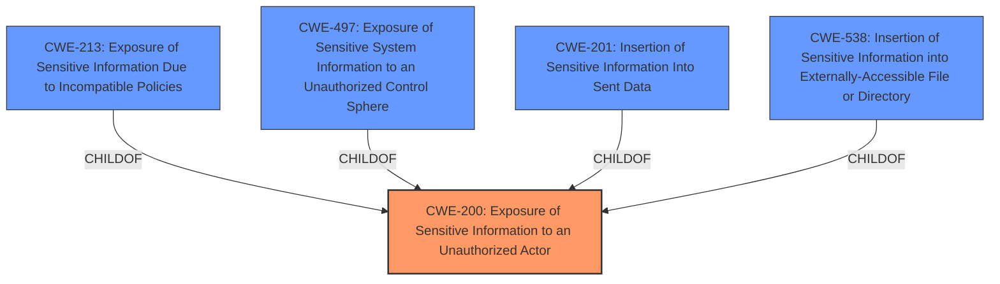

# Raw Analyzer Response for CVE-2021-37010

# Summary
| CWE ID | CWE Name | Confidence | CWE Abstraction Level | CWE Vulnerability Mapping Label | CWE-Vulnerability Mapping Notes |
|---|---|---|---|---|---|
| CWE-200 | Exposure of Sensitive Information to an Unauthorized Actor | 0.75 | Class | Allowed | The vulnerability results in exposure of sensitive information to an unauthorized actor. |

## Evidence and Confidence

*   **Confidence Score:** 0.75
*   **Evidence Strength:** MEDIUM

## Relationship Analysis
The primary CWE identified is CWE-200, which is a Class-level CWE. While more specific CWEs exist as children of CWE-200, the provided information does not give enough details to narrow it down further. The relationships of CWE-200 to other CWEs, such as CWE-201, CWE-538, and CWE-497, were considered, but the description lacks the specificity to justify using any of those more specific CWEs.

## Vulnerability Chain
The vulnerability chain is relatively straightforward.

1.  A **WEAKNESS** leads to
2.  Exposure of Sensitive Information to an Unauthorized Actor, which is the **IMPACT**.

## Summary of Analysis
The initial analysis focused on the **impact** phrase "Exposure of Sensitive Information to an Unauthorized Actor". The description itself only contains the type of **impact** from the vulnerability, however, the **Vulnerability Description Key Phrases** section repeats the same phrase as the **impact**. The **Retriever Results** list CWE-200 "Exposure of Sensitive Information to an Unauthorized Actor" as the top hit.

The CWE-200 entry is a Class-level CWE, and the mapping guidance discourages its use as it represents a technical impact rather than a root cause. However, in this case, given the limited information, it is the most appropriate choice. The vulnerability description provides insufficient information to identify the root cause of the exposure. Therefore, while ideally a more specific, Base-level CWE would be preferred, the available evidence only supports mapping to the Class-level CWE-200.

Other CWEs considered include CWE-213, CWE-497, CWE-201, and CWE-538, all children of CWE-200. However, the description does not contain the necessary details to justify using these more specific CWEs.

Relevant CWE Information:

# Enhanced Context (25 CWEs)

## CWE-497: Exposure of Sensitive System Information to an Unauthorized Control Sphere
**Abstraction Level**: Base
**Similarity Score**: 0.79
**Source**: dense

**Description**:
The product does not properly prevent sensitive system-level information from being accessed by unauthorized actors who do not have the same level of access to the underlying system as the product does.

**Mapping Guidance**:
- Usage: Allowed
- Rationale: This CWE entry is at the Base level of abstraction, which is a preferred level of abstraction for mapping to the root causes of vulnerabilities.
**Why Not Used:** This is a more specific case of information exposure related to system-level information. The provided description doesn't give any information to support this.

## CWE-213: Exposure of Sensitive Information Due to Incompatible Policies
**Abstraction Level**: Base
**Similarity Score**: 0.78
**Source**: dense

**Description**:
The product's intended functionality exposes information to certain actors in accordance with the developer's security policy, but this information is regarded as sensitive according to the intended security policies of other stakeholders such as the product's administrator, users, or others whose information is being processed.

**Mapping Guidance**:
- Usage: Allowed
- Rationale: This CWE entry is at the Base level of abstraction, which is a preferred level of abstraction for mapping to the root causes of vulnerabilities.
**Why Not Used:** This is a more specific case of information exposure related to incompatible policies. The provided description doesn't give any information to support this.

## CWE-226: Sensitive Information in Resource Not Removed Before Reuse
**Abstraction Level**: Base
**Similarity Score**: 0.78
**Source**: dense

**Description**:
The product releases a resource such as memory or a file so that it can be made available for reuse, but it does not clear or "zeroize" the information contained in the resource before the product performs a critical state transition or makes the resource available for reuse by other entities.

**Mapping Guidance**:
- Usage: Allowed
- Rationale: This CWE entry is at the Base level of abstraction, which is a preferred level of abstraction for mapping to the root causes of vulnerabilities.
**Why Not Used:** This CWE is related to the reuse of resources without clearing sensitive information. There is no information to support this case.

## CWE-538: Insertion of Sensitive Information into Externally-Accessible File or Directory
**Abstraction Level**: Base
**Similarity Score**: 0.77
**Source**: dense

**Description**:
The product places sensitive information into files or directories that are accessible to actors who are allowed to have access to the files, but not to the sensitive information.

**Mapping Guidance**:
- Usage: Allowed
- Rationale: This CWE entry is at the Base level of abstraction, which is a preferred level of abstraction for mapping to the root causes of vulnerabilities.
**Why Not Used:** The description does not include information to determine if the insertion happens into external accessible files.

## CWE-668: Exposure of Resource to Wrong Sphere
**Abstraction Level**: Class
**Similarity Score**: 0.77
**Source**: dense

**Description**:
The product exposes a resource to the wrong control sphere, providing unintended actors with inappropriate access to the resource.

**Mapping Guidance**:
- Usage: Discouraged
- Rationale: CWE-668 is high-level and is often misused as a catch-all when lower-level CWE IDs might be applicable. It is sometimes used for low-information vulnerability reports [REF-1287]. It is a level-1 Class (i.e., a child of a Pillar). It is not useful for trend analysis.
**Why Not Used:** The CWE-200 is a more specific Class than CWE-668.

## CWE-212: Improper Removal of Sensitive Information Before Storage or Transfer
**Abstraction Level**: Base
**Similarity Score**: 0.75
**Source**: dense

**Description**:
The product stores, transfers, or shares a resource that contains sensitive information, but it does not properly remove that information before the product makes the resource available to unauthorized actors.

**Mapping Guidance**:
- Usage: Allowed
- Rationale: This CWE entry is at the Base level of abstraction, which is a preferred level of abstraction for mapping to the root causes of vulnerabilities.
**Why Not Used:** This is a more specific case of information exposure related to improper removal of sensitive information. The provided description doesn't give any information to support this.

## CWE-653: Improper Isolation or Compartmentalization
**Abstraction Level**: Class
**Similarity Score**: 0.75
**Source**: dense

**Description**:
The product does not properly compartmentalize or isolate functionality, processes, or resources that require different privilege levels, rights, or permissions.

**Mapping Guidance**:
- Usage: Allowed
- Rationale: This CWE entry is at the Base level of abstraction, which is a preferred level of abstraction for mapping to the root causes of vulnerabilities.
**Why Not Used:** This CWE focuses on issues with isolation, while the vulnerability is about information exposure.

## CWE-404: Improper Resource Shutdown or Release
**Abstraction Level**: Class
**Similarity Score**: 0.74
**Source**: dense

**Description**:
The product does not release or incorrectly releases a resource before it is made available for re-use.

**Mapping Guidance**:
- Usage: Allowed-with-Review
- Rationale: This CWE entry is a Class and might have Base-level children that would be more appropriate
**Why Not Used:** This CWE is related to resource management issues and isn't applicable here.

## CWE-552: Files or Directories Accessible to External Parties
**Abstraction Level**: Base
**Similarity Score**: