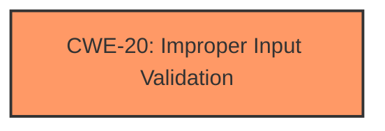

# Enhanced Analysis for CVE-2021-37025

# Summary
| CWE ID | CWE Name | Confidence | CWE Abstraction Level | CWE Vulnerability Mapping Label | CWE-Vulnerability Mapping Notes |
|---|---|---|---|---|---|
| CWE-20 | Improper Input Validation | 0.75 | Class | Primary | Discouraged |

## Evidence and Confidence

*   **Confidence Score:** 0.75
*   **Evidence Strength:** MEDIUM

## Relationship Analysis
The primary CWE is CWE-20, which is a Class-level CWE. Several other CWEs were considered including more specific Base and Variant level CWEs. However, the evidence provided only indicates a general **Improper Input Validation** issue without specifying which type of input validation is missing. Because of this lack of detail, it is difficult to assign a more specific CWE with high confidence.



## Vulnerability Chain
The vulnerability chain starts with **Improper Input Validation** (CWE-20), which leads to a kernel crash.
  - **Root Cause:** **Improper Input Validation** (CWE-20)
  - **Impact:** kernel crash

## Summary of Analysis
The initial analysis identified CWE-20 as the primary candidate due to the explicit mention of **Improper Input Validation** in the vulnerability description. While the Retriever Results provided more specific CWEs related to input validation, such as CWE-1284 (Improper Validation of Specified Quantity in Input) and CWE-1285 (Improper Validation of Specified Index, Position, or Offset in Input), there isn't enough information to determine the specific type of **Improper Input Validation**. Therefore, sticking with the broader CWE-20 is more appropriate, even though it is discouraged by MITRE. My assessment is based on the provided evidence. The vulnerability description explicitly states "**Improper Input Validation**" as the root cause, justifying the selection of CWE-20. Since the description lacks specific details about the type of **Improper Input Validation**, a more specific CWE cannot be selected with reasonable confidence.

Relevant CWE Information:

# Enhanced Context (25 CWEs)

## CWE-20: Improper Input Validation
**Abstraction:** Class
**Status:** Stable

### Description
The product receives input or data, but it does
        not validate or incorrectly validates that the input has the
        properties that are required to process the data safely and
        correctly.

### Extended Description


Input validation is a frequently-used technique for checking potentially dangerous inputs in order to ensure that the inputs are safe for processing within the code, or when communicating with other components. When software does not validate input properly, an attacker is able to craft the input in a form that is not expected by the rest of the application. This will lead to parts of the system receiving unintended input, which may result in altered control flow, arbitrary control of a resource, or arbitrary code execution.

### Mapping Guidance
**Usage:** Discouraged
**Rationale:** CWE-20 is commonly misused in low-information vulnerability reports when lower-level CWEs could be used instead, or when more details about the vulnerability are available [REF-1287]. It is not useful for trend analysis. It is also a level-1 Class (i.e., a child of a Pillar).
**Comments:** Consider lower-level children such as Improper Use of Validation Framework (CWE-1173) or improper validation involving specific types or properties of input such as Specified Quantity (CWE-1284); Specified Index, Position, or Offset (CWE-1285); Syntactic Correctness (CWE-1286); Specified Type (CWE-1287); Consistency within Input (CWE-1288); or Unsafe Equivalence (CWE-1289).
**Reasons:**
- Frequent Misuse

### Observed Examples
- **CVE-2024-37032:** Large language model (LLM) management tool does not validate the format of a digest value (CWE-1287) from a private, untrusted model registry, enabling relative path traversal (CWE-23), a.k.a. Probllama
- **CVE-2022-45918:** Chain: a learning management tool debugger uses external input to locate previous session logs (CWE-73) and does not properly validate the given path (CWE-20), allowing for filesystem path traversal using "../" sequences (CWE-24)
- **CVE-2021-30860:** Chain: improper input validation (CWE-20) leads to integer overflow (CWE-190) in mobile OS, as exploited in the wild per CISA KEV.

### Other Considered CWEs
- CWE-1284 (Improper Validation of Specified Quantity in Input), CWE-1285 (Improper Validation of Specified Index, Position, or Offset in Input), CWE-1286 (Improper Validation of Syntactic Correctness of Input), CWE-129 (Improper Validation of Array Index), CWE-190 (Integer Overflow or Wraparound), CWE-233 (Improper Handling of Parameters), CWE-248 (Uncaught Exception): These CWEs were considered but not used because the provided vulnerability description does not give enough information to determine which specific type of input validation is missing or incorrect.


## CWE Relationship Analysis

Current CWEs represent these abstraction levels: .


### Vulnerability Chain Analysis

**Chain starting from CWE-248:**
- 248 (Uncaught Exception) - ROOT


**Chain starting from CWE-1287:**
- 1287 (Improper Validation of Specified Type of Input) - ROOT


### CWE Relationship Diagram

```mermaid
graph TD
    classDef primary fill:#f96,stroke:#333,stroke-width:2px
    classDef secondary fill:#69f,stroke:#333
    classDef tertiary fill:#9e9,stroke:#333
```