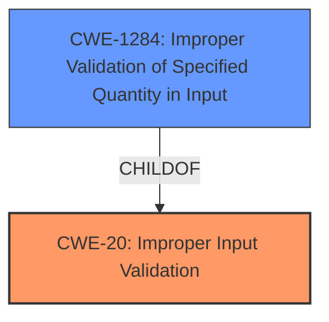

# Analysis Report for CVE-2021-37026

# Vulnerability Analysis Report: CVE-2021-37026

## Description


## Analysis (with Relationship Data)

# Summary
| CWE ID | CWE Name | Confidence | CWE Abstraction Level | CWE Vulnerability Mapping Label | CWE-Vulnerability Mapping Notes |
|---|---|---|---|---|---|
| CWE-20 | Improper Input Validation | 0.7 | Class | Primary | Discouraged |
| CWE-1284 | Improper Validation of Specified Quantity in Input | 0.6 | Base | Secondary Candidate | Allowed |

## Evidence and Confidence

*   **Confidence Score:** 0.7
*   **Evidence Strength:** MEDIUM

## Relationship Analysis
The primary CWE selected is CWE-20, which is a Class-level weakness. While it's discouraged to map directly to Class-level CWEs, the evidence is somewhat limited, making it a reasonable starting point. CWE-20 has several children, including CWE-1284, which is a Base-level weakness and a possible candidate. CWE-1284 is related to quantities specified in input, which could be relevant if the kernel crash is caused by an improperly validated size or length.



## Vulnerability Chain
The vulnerability chain is relatively simple: **Improper Input Validation** leads to a kernel crash. Without more information, it is difficult to pinpoint a more specific root cause or subsequent weakness.

## Summary of Analysis
The analysis is primarily based on the provided vulnerability description, which indicates a general **Improper Input Validation** issue. The "Vulnerability Description Key Phrases" section explicitly identifies "**Improper Input Validation**" as the **rootcause**.
The primary CWE match from similar CVE descriptions is also CWE-20.

While CWE-20 is a Class-level CWE and is generally discouraged, the lack of specific details about the nature of the input or the validation process makes it difficult to select a more specific Base or Variant level CWE. However, CWE-1284 is a strong secondary candidate.

The decision to select CWE-20 is based on the direct evidence from the vulnerability description. The confidence level is 0.7, reflecting the limited detail.

Relevant CWE Information:

# Enhanced Context (25 CWEs)
The following CWEs were identified as potentially relevant to this vulnerability:

## CWE-20: Improper Input Validation
**Abstraction:** Class
**Status:** Stable

### Description
The product receives input or data, but it does
        not validate or incorrectly validates that the input has the
        properties that are required to process the data safely and
        correctly.

## CWE-1284: Improper Validation of Specified Quantity in Input
**Abstraction:** Base
**Status:** Incomplete

### Description
The product receives input that is expected to specify a quantity (such as size or length), but it does not validate or incorrectly validates that the quantity has the required properties.


## CWE Relationship Analysis

Current CWEs represent these abstraction levels: .


### Vulnerability Chain Analysis

**Chain starting from CWE-20:**
- 20 (Improper Input Validation) - ROOT


**Chain starting from CWE-1284:**
- 1284 (Improper Validation of Specified Quantity in Input) - ROOT


### CWE Relationship Diagram

```mermaid
graph TD
    classDef primary fill:#f96,stroke:#333,stroke-width:2px
    classDef secondary fill:#69f,stroke:#333
    classDef tertiary fill:#9e9,stroke:#333
```


*Report generated on 2025-04-02 02:29:24*
