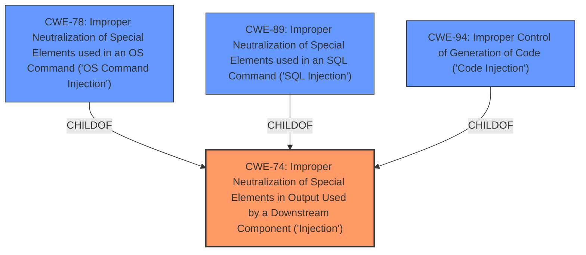

# Enhanced Analysis for CVE-2021-37033

# Summary
| CWE ID  | CWE Name                                                                                                 | Confidence | CWE Abstraction Level | CWE Vulnerability Mapping Label | CWE-Vulnerability Mapping Notes |
| :-------- | :--------------------------------------------------------------------------------------------------------- | :--------- | :---------------------- | :------------------------------ | :-------------------------------- |
| CWE-74    | Improper Neutralization of Special Elements in Output Used by a Downstream Component ('Injection') | 0.7        | Class                   | Primary                         | Allowed-with-Review               |

## Evidence and Confidence

*   **Confidence Score:** 0.7
*   **Evidence Strength:** MEDIUM

## Relationship Analysis
The primary CWE selected is CWE-74, which is a Class-level CWE. While it has child CWEs that are more specific (e.g., CWE-78, CWE-89, CWE-94), the available information lacks the specifics to narrow down to one of these more specific types of injection.



## Vulnerability Chain
The chain of vulnerability starts with the **injection vulnerability**, which can lead to the impact of affecting service availability.

## Summary of Analysis
The initial analysis pointed towards an **injection vulnerability**. The evidence suggests an **injection attack** vulnerability that affects service availability. The Retriever Results listed several potential CWEs, including CWE-78, CWE-94, and CWE-74.

CWE-74 (Improper Neutralization of Special Elements in Output Used by a Downstream Component ('Injection')) is chosen because the description indicates a general **injection attack** without specifying the exact type of injection (e.g., OS Command Injection, SQL Injection, Code Injection). CWE-74 is a Class-level CWE that encompasses various injection types. The advisory states there is an "Injection attack vulnerability".

The final selection of CWE-74 is based on the available evidence and the desire to be as specific as possible without overstating the details known about the vulnerability. This approach aligns with the principle of selecting the most detailed CWE that accurately reflects the weakness based on the evidence.

Relevant CWE Information:

# Enhanced Context (25 CWEs)
The following CWEs were identified as potentially relevant to this vulnerability:

## CWE-74: Improper Neutralization of Special Elements in Output Used by a Downstream Component ('Injection')
**Abstraction Level**: Class
**Similarity Score**: 0.75
**Source**: dense

**Description**:
The product constructs all or part of a command, data structure, or record using externally-influenced input from an upstream component, but it does not neutralize or incorrectly neutralizes special elements that could modify how it is parsed or interpreted when it is sent to a downstream component.

**Mapping Guidance**:
- Usage: Discouraged
- Rationale: CWE-74 is high-level and often misused when lower-level weaknesses are more appropriate.

## CWE-94: Improper Control of Generation of Code ('Code Injection')
**Abstraction Level**: Base
**Similarity Score**: 4.33
**Source**: graph

**Description**:
CWE-94: Improper Control of Generation of Code ('Code Injection')

**Mapping Guidance**:
- Usage: Allowed-with-Review
- Rationale: This entry is frequently misused for vulnerabilities with a technical impact of "code execution," which does not by itself indicate a root cause weakness, since dozens of weaknesses can enable code execution.

## CWE-78: Improper Neutralization of Special Elements used in an OS Command ('OS Command Injection')
**Abstraction Level**: Base
**Similarity Score**: 5.03
**Source**: graph

**Description**:
CWE-78: Improper Neutralization of Special Elements used in an OS Command ('OS Command Injection')

**Mapping Guidance**:
- Usage: Allowed
- Rationale: This CWE entry is at the Base level of abstraction, which is a preferred level of abstraction for mapping to the root causes of vulnerabilities.

CWEs considered but not used:

*   **CWE-78 (Improper Neutralization of Special Elements used in an OS Command ('OS Command Injection')) and CWE-94 (Improper Control of Generation of Code ('Code Injection'))**: While these are related to injection, there is no evidence to suggest that the injection is specifically related to OS commands or code. Therefore, these are too specific.
*   **CWE-20 (Improper Input Validation)**: While input validation is often related to injection vulnerabilities, the description specifically mentions "**Injection attack**", making CWE-74 a more direct and appropriate match.
*   **CWE-131 (Incorrect Calculation of Buffer Size), CWE-125 (Out-of-bounds Read), CWE-248 (Uncaught Exception), CWE-456 (Missing Initialization of a Variable), and CWE-502 (Deserialization of Untrusted Data)**: These CWEs are not directly related to the described **injection attack** vulnerability.


## CWE Relationship Analysis

Current CWEs represent these abstraction levels: .


### Vulnerability Chain Analysis

**Chain starting from CWE-248:**
- 248 (Uncaught Exception) - ROOT


**Chain starting from CWE-502:**
- 502 (Deserialization of Untrusted Data) - ROOT


### CWE Relationship Diagram

```mermaid
graph TD
    classDef primary fill:#f96,stroke:#333,stroke-width:2px
    classDef secondary fill:#69f,stroke:#333
    classDef tertiary fill:#9e9,stroke:#333
```