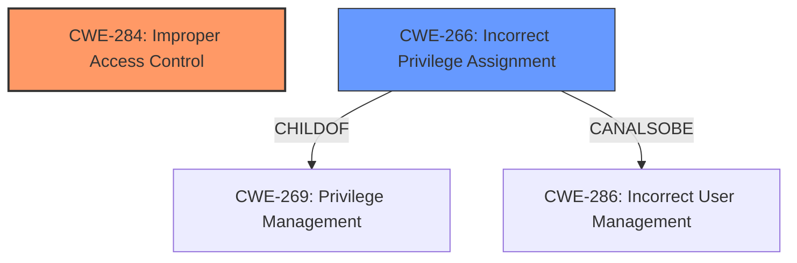

# Analysis for CVE-2021-37038

# Summary
| CWE ID | CWE Name | Confidence | CWE Abstraction Level | CWE Vulnerability Mapping Label | CWE-Vulnerability Mapping Notes |
|---|---|---|---|---|---|
| CWE-284 | Improper Access Control | 0.9 | Pillar | Discouraged | The vulnerability description key phrases includes "improper access control" |
| CWE-266 | Incorrect Privilege Assignment | 0.7 | Base | Allowed | The vulnerability involves incorrect assignment of privilege. |

## Evidence and Confidence

*   **Confidence Score:** 0.8
*   **Evidence Strength:** HIGH

## Relationship Analysis
The primary CWE is CWE-284, which is a Pillar and is a general term for the various mechanisms that restrict which users can access which resources. CWE-266 is a child of CWE-269 (Privilege Management) and can also be related to CWE-286 (Incorrect User Management), both related to privilege management issues. CWE-266 is more specific than CWE-284.

## Vulnerability Chain
The vulnerability chain starts with an **improper access control** (**WEAKNESS**) issue, which can lead to service confidentiality being affected.

## Summary of Analysis
The initial assessment identifies CWE-284 as the primary weakness, given the explicit mention of "**improper access control**" in both the vulnerability description and the CVE Reference Links Content Summary. However, CWE-284 is a high-level Pillar, and the provided context suggests a more specific issue related to privilege management. Therefore, CWE-266 (Incorrect Privilege Assignment), a Base-level CWE, is added as a secondary candidate because the root cause appears to be related to incorrect assignment of privilege which is creating an unintended sphere of control for that actor.

The decision to include CWE-266 is based on the evidence suggesting a privilege management issue and the goal of selecting a more specific CWE. The relationship analysis confirms that CWE-266 is related to privilege management concepts and provides a finer-grained classification than CWE-284.

Relevant CWE Information:

# Enhanced Context (25 CWEs)

## CWE-653: Improper Isolation or Compartmentalization
**Abstraction Level**: Class
**Similarity Score**: 0.76
**Source**: dense
Did not select because the description does not fit an isolation issue.

## CWE-274: Improper Handling of Insufficient Privileges
**Abstraction Level**: Base
**Similarity Score**: 0.76
**Source**: dense
Did not select because the description does not say there are insufficient privileges.

## CWE-266: Incorrect Privilege Assignment
**Abstraction Level**: Base
**Similarity Score**: 0.76
**Source**: dense
Selected because the description says the vulnerability includes "improper access control".

## CWE-280: Improper Handling of Insufficient Permissions or Privileges
**Abstraction Level**: Base
**Similarity Score**: 0.75
**Source**: dense
Did not select because the description does not say there are insufficient permissions.

## CWE-1220: Insufficient Granularity of Access Control
**Abstraction Level**: Base
**Similarity Score**: 0.75
**Source**: dense
Did not select because the description does not provide sufficient evidence to indicate that the access control granularity is the issue.

## CWE-1289: Improper Validation of Unsafe Equivalence in Input
**Abstraction Level**: Base
**Similarity Score**: 0.74
**Source**: dense
Did not select because there is no description of input validation issues.

## CWE-807: Reliance on Untrusted Inputs in a Security Decision
**Abstraction Level**: Base
**Similarity Score**: 0.74
**Source**: dense
Did not select because there is no description of untrusted inputs in security decisions.

## CWE-267: Privilege Defined With Unsafe Actions
**Abstraction Level**: Base
**Similarity Score**: 0.73
**Source**: dense
Did not select because there is no description of unsafe actions.

## CWE-664: Improper Control of a Resource Through its Lifetime
**Abstraction Level**: Pillar
**Similarity Score**: 0.73
**Source**: dense
Did not select because the description does not include information about resource control.

## CWE-667: Improper Locking
**Abstraction Level**: Class
**Similarity Score**: 0.73
**Source**: dense
Did not select because the description does not include information about locking.

## CWE-125: Out-of-bounds Read
**Abstraction Level**: Base
**Similarity Score**: 6180.19
**Source**: sparse
Did not select because there is no description of out-of-bounds read issues.

## CWE-863: Incorrect Authorization
**Abstraction Level**: Class
**Similarity Score**: 6109.53
**Source**: sparse
Did not select because there is no description of incorrect authorization issues.

## CWE-639: Authorization Bypass Through User-Controlled Key
**Abstraction Level**: Base
**Similarity Score**: 6099.63
**Source**: sparse
Did not select because there is no description of authorization bypass via user-controlled key.

## CWE-22: Improper Limitation of a Pathname to a Restricted Directory ('Path Traversal')
**Abstraction Level**: Base
**Similarity Score**: 6075.78
**Source**: sparse
Did not select because there is no description of path traversal issues.

## CWE-1284: Improper Validation of Specified Quantity in Input
**Abstraction Level**: Base
**Similarity Score**: 6048.42
**Source**: sparse
Did not select because there is no description of improper validation of specified quantity in input.

## CWE-41: Improper Resolution of Path Equivalence
**Abstraction Level**: base
**Similarity Score**: 5.03
**Source**: graph
Did not select because there is no description of path equivalence issues.

## CWE-131: Incorrect Calculation of Buffer Size
**Abstraction Level**: base
**Similarity Score**: 4.33
**Source**: graph
Did not select because there is no description of buffer size calculation issues.

## CWE-1257: Improper Access Control Applied to Mirrored or Aliased Memory Regions
**Abstraction Level**: base
**Similarity Score**: 4.33
**Source**: graph
Did not select because there is no description of aliased memory region issues.

## CWE-190: Integer Overflow or Wraparound
**Abstraction Level**: base
**Similarity Score**: 4.33
**Source**: graph
Did not select because there is no description of integer overflow or wraparound issues.

## CWE-22: Improper Limitation of a Pathname to a Restricted Directory ('Path Traversal')
**Abstraction Level**: base
**Similarity Score**: 4.33
**Source**: graph
Did not select because there is no description of path traversal issues.

## CWE-770: Allocation of Resources Without Limits or Throttling
**Abstraction Level**: base
**Similarity Score**: 4.33
**Source**: graph
Did not select because there is no description of resource allocation issues.

## CWE-73: External Control of File Name or Path
**Abstraction Level**: base
**Similarity Score**: 4.33
**Source**: graph
Did not select because there is no description of external control of file name or path issues.

## CWE-1284: Improper Validation of Specified Quantity in Input
**Abstraction Level**: base
**Similarity Score**: 4.33
**Source**: graph
Did not select because there is no description of specified quantity issues.

## CWE-125: Out-of-bounds Read
**Abstraction Level**: base
**Similarity Score**: 3.89
**Source**: graph
Did not select because there is no description of out-of-bounds read issues.

## CWE-789: Memory Allocation with Excessive Size Value
**Abstraction Level**: variant
**Similarity Score**: 3.88
**Source**: graph
Did not select because there is no description of memory allocation issues.