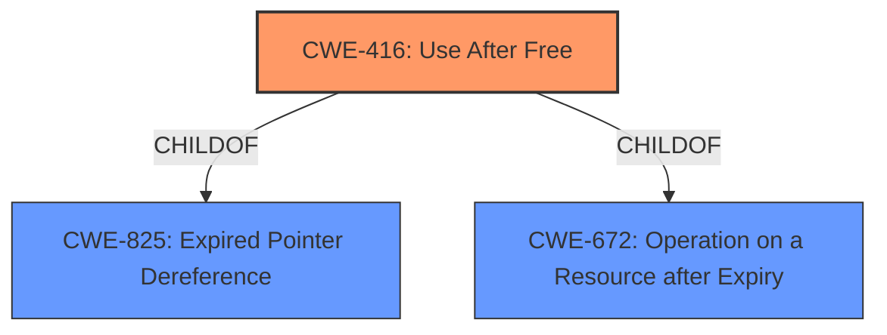

# Raw Analyzer Response for CVE-2021-37045

# Summary
| CWE ID | CWE Name | Confidence | CWE Abstraction Level | CWE Vulnerability Mapping Label | CWE-Vulnerability Mapping Notes |
|---|---|---|---|---|---|
| CWE-416 | Use After Free | 1.0 | Variant | Allowed | Primary CWE |

## Evidence and Confidence

*   **Confidence Score:** 1.0
*   **Evidence Strength:** HIGH

## Relationship Analysis
The primary relationship that influenced the decision was the direct match of the vulnerability description to **CWE-416 (Use After Free)**. **CWE-416** is a variant of **CWE-825 (Expired Pointer Dereference)** and **CWE-672 (Operation on a Resource after Expiry)**. The vulnerability description explicitly mentions a "UAF" vulnerability, making **CWE-416** the most specific and appropriate choice.

## Vulnerability Chain
The vulnerability chain starts with the **improper handling of memory**, leading to a **Use After Free (CWE-416)** condition. The impact includes device restart and potential kernel-mode code execution.

## Summary of Analysis
The analysis is based on the provided evidence, which explicitly states the presence of a "UAF" vulnerability in the Huawei Smartphone. The "**weakness**" key phrase directly confirms this.

> There is an **UAF** vulnerability in Huawei Smartphone.

The CVE Reference Links Content Summary further validates this:

> "root_cause": "Use-after-free (UAF) vulnerability"
> "weaknesses": ["Use-after-free"]

The **Retriever Results** also lists **CWE-416 (Use After Free)** as the top combined result with a score of 1.0, reinforcing the selection.

The selection of **CWE-416** is at the optimal level of specificity because it directly addresses the **Use After Free** condition described in the vulnerability. It is a Variant-level CWE, which is preferred for root cause mappings.

Relevant CWE Information:

# Enhanced Context (25 CWEs)
The following CWEs were identified as potentially relevant to this vulnerability:

## CWE-1289: Improper Validation of Unsafe Equivalence in Input
**Abstraction Level**: Base
**Similarity Score**: 0.74
**Source**: dense
Not considered because the description mentions nothing about validating input.

## CWE-668: Exposure of Resource to Wrong Sphere
**Abstraction Level**: Class
**Similarity Score**: 0.74
**Source**: dense
Not considered because this is a higher level "Class" CWE and **CWE-416** is much more specific.

## CWE-404: Improper Resource Shutdown or Release
**Abstraction Level**: Class
**Similarity Score**: 0.74
**Source**: dense
Not considered because this is related to resources not being released. The key issue is use of memory after it has been freed.

## CWE-703: Improper Check or Handling of Exceptional Conditions
**Abstraction Level**: Pillar
**Similarity Score**: 0.74
**Source**: dense
Not considered because this is a very high level "Pillar" CWE and **CWE-416** is much more specific.

## CWE-754: Improper Check for Unusual or Exceptional Conditions
**Abstraction Level**: Class
**Similarity Score**: 0.74
**Source**: dense
Not considered because this is a higher level "Class" CWE and **CWE-416** is much more specific.

## CWE-664: Improper Control of a Resource Through its Lifetime
**Abstraction Level**: Pillar
**Similarity Score**: 0.74
**Source**: dense
Not considered because this is a very high level "Pillar" CWE and **CWE-416** is much more specific.

## CWE-41: Improper Resolution of Path Equivalence
**Abstraction Level**: Base
**Similarity Score**: 0.74
**Source**: dense
Not considered because the description mentions nothing about file paths.

## CWE-667: Improper Locking
**Abstraction Level**: Class
**Similarity Score**: 0.73
**Source**: dense
Not considered because the description mentions nothing about locking.

## CWE-73: External Control of File Name or Path
**Abstraction Level**: Base
**Similarity Score**: 0.73
**Source**: dense
Not considered because the description mentions nothing about file paths.

## CWE-807: Reliance on Untrusted Inputs in a Security Decision
**Abstraction Level**: Base
**Similarity Score**: 0.73
**Source**: dense
Not considered because the description mentions nothing about reliance on input in security decision.

## CWE-190: Integer Overflow or Wraparound
**Abstraction Level**: Base
**Similarity Score**: 6022.48
**Source**: sparse
Not considered because the description mentions nothing about integer overflow.

## CWE-1284: Improper Validation of Specified Quantity in Input
**Abstraction Level**: Base
**Similarity Score**: 6016.36
**Source**: sparse
Not considered because the description mentions nothing about validating specified quantities.

## CWE-125: Out-of-bounds Read
**Abstraction Level**: Base
**Similarity Score**: 5960.62
**Source**: sparse
Not considered because the vulnerability description specifies **Use After Free** rather than an out-of-bounds read.

## CWE-119: Improper Restriction of Operations within the Bounds of a Memory Buffer
**Abstraction Level**: Class
**Similarity Score**: 5916.48
**Source**: sparse
Not considered because the vulnerability description specifies **Use After Free** which is more specific.

## CWE-789: Memory Allocation with Excessive Size Value
**Abstraction Level**: Variant
**Similarity Score**: 5762.11
**Source**: sparse
Not considered because the description mentions nothing about memory allocation.

## CWE-123: Write-what-where Condition
**Abstraction Level**: base
**Similarity Score**: 4.82
**Source**: graph
Not considered because **CWE-416** is more specific.

## CWE-120: Buffer Copy without Checking Size of Input ('Classic Buffer Overflow')
**Abstraction Level**: base
**Similarity Score**: 4.82
**Source**: graph
Not considered because the vulnerability description specifies **Use After Free** rather than a buffer overflow.

## CWE-825: Expired Pointer Dereference
**Abstraction Level**: base
**Similarity Score**: 4.33
**Source**: graph
Not considered, because **CWE-416** is a child of **CWE-825** and is more specific.

## CWE-787: Out-of-bounds Write
**Abstraction Level**: base
**Similarity Score**: 4.33
**Source**: graph
Not considered because the vulnerability description specifies **Use After Free** rather than an out-of-bounds write.

## CWE-22: Improper Limitation of a Pathname to a Restricted Directory ('Path Traversal')
**Abstraction Level**: base
**Similarity Score**: 4.33
**Source**: graph
Not considered because the description mentions nothing about file paths.

## CWE-770: Allocation of Resources Without Limits or Throttling
**Abstraction Level**: base
**Similarity Score**: 4.33
**Source**: graph
Not considered because the description mentions nothing about resource allocation.