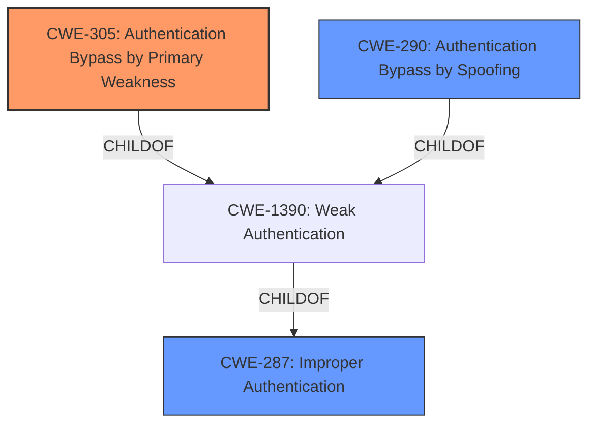

# Raw Analyzer Response for CVE-2021-37054

# Summary
| CWE ID | CWE Name | Confidence | CWE Abstraction Level | CWE Vulnerability Mapping Label | CWE-Vulnerability Mapping Notes |
|---|---|---|---|---|---|
| CWE-305 | Authentication Bypass by Primary Weakness | 0.9 | Base | Allowed | Primary CWE |
| CWE-290 | Authentication Bypass by Spoofing | 0.7 | Base | Allowed | Secondary Candidate |
| CWE-287 | Improper Authentication | 0.5 | Class | Discouraged | Secondary Candidate |

## Evidence and Confidence

*   **Confidence Score:** 0.8
*   **Evidence Strength:** MEDIUM

## Relationship Analysis
The primary relationship impacting the decision is that CWE-305 (Authentication Bypass by Primary Weakness) is a child of CWE-1390 (Weak Authentication), which in turn is a child of CWE-287 (Improper Authentication). However, CWE-305 is a more specific Base level CWE that better describes the vulnerability than its parents. CWE-290 (Authentication Bypass by Spoofing) is also a child of CWE-1390 and a peer of CWE-305, representing an alternative but related classification.

## Vulnerability Chain
The vulnerability chain starts with the **authentication bypass** **weakness**, which leads to identity spoofing and ultimately affects service confidentiality. The exact mechanism of the bypass is not detailed, making it difficult to pinpoint the root cause with complete certainty.

## Summary of Analysis
The initial analysis identified several potential CWEs, including CWE-287 (Improper Authentication), CWE-305 (Authentication Bypass by Primary Weakness), and CWE-290 (Authentication Bypass by Spoofing).

The evidence supporting the classification is primarily based on the "Vulnerability Description Key Phrases" and the "CVE Reference Links Content Summary," which both highlight the "**authentication bypass**" and "identity spoofing" aspects of the vulnerability.

The selection of CWE-305 as the primary CWE is based on the fact that it is a Base level CWE that directly addresses the **authentication bypass** due to a primary weakness. While the specific nature of the primary weakness is not detailed, the description aligns well with the concept of an **authentication bypass** stemming from another flaw. CWE-290 is considered as a secondary candidate because identity spoofing is mentioned in the description.

CWE-287 is a Class-level CWE, and the mapping guidance discourages its use when more specific CWEs are available. Given the availability of CWE-305 and CWE-290, which are more specific, CWE-287 is not the optimal choice.

The selected CWEs are at the appropriate level of specificity, with CWE-305 being a Base level CWE.

Relevant CWE Information:

# Enhanced Context (25 CWEs)
The following CWEs were identified as potentially relevant to this vulnerability:

## CWE-305: Authentication Bypass by Primary Weakness
**Abstraction Level**: Base
**Similarity Score**: 0.80
**Source**: dense

**Description**:
The authentication algorithm is sound, but the implemented mechanism can be bypassed as the result of a separate weakness that is primary to the authentication error.

**Mapping Guidance**:
- Usage: Allowed
- Rationale: This CWE entry is at the Base level of abstraction, which is a preferred level of abstraction for mapping to the root causes of vulnerabilities.

## CWE-290: Authentication Bypass by Spoofing
**Abstraction Level**: Base
**Similarity Score**: 0.78
**Source**: dense

**Description**:
This attack-focused weakness is caused by incorrectly implemented authentication schemes that are subject to spoofing attacks.

**Mapping Guidance**:
- Usage: Allowed
- Rationale: This CWE entry is at the Base level of abstraction, which is a preferred level of abstraction for mapping to the root causes of vulnerabilities.

## CWE-287: Improper Authentication
**Abstraction Level**: Class
**Similarity Score**: 3720.34
**Source**: sparse

**Description**:
When an actor claims to have a given identity, the product does not prove or insufficiently proves that the claim is correct.

**Mapping Guidance:**
- Usage: Discouraged
- Rationale: This CWE entry might be misused when lower-level CWE entries are likely to be applicable. It is a level-1 Class (i.e., a child of a Pillar).
**Comments:** Consider children or descendants, beginning with CWE-1390: Weak Authentication or CWE-306: Missing Authentication for Critical Function.

## Technical Explanation for Each Selected CWE:

### CWE-305: Authentication Bypass by Primary Weakness
-   **How the vulnerability's details match the CWE's characteristics:** The vulnerability description explicitly mentions "**authentication bypass**". CWE-305 describes a scenario where the **authentication** mechanism is bypassed due to a separate, primary **weakness**.
-   **Security implications and potential impact:** This **weakness** allows an attacker to bypass the intended **authentication** process, potentially gaining unauthorized access to sensitive resources or functionalities. The impact, as stated in the description, is that "successful exploitation of this vulnerability may affect service confidentiality."
-   **Parent-child relationships or chain patterns:** CWE-305 is a child of CWE-1390 (Weak Authentication), indicating that the bypass is a result of some form of insufficient **authentication** mechanism.
-   **Whether the weakness is primary or secondary in the vulnerability:** CWE-305 is considered the primary **weakness** in this scenario, as it directly addresses the **authentication bypass**.
-   **How the official MITRE mapping guidance influenced your decision:** The MITRE mapping guidance for CWE-305 allows its usage and considers it to be at the Base level of abstraction, which is preferred.

### CWE-290: Authentication Bypass by Spoofing
-   **How the vulnerability's details match the CWE's characteristics:** The vulnerability description mentions "Identity spoofing", which directly relates to CWE-290 (Authentication Bypass by Spoofing).
-   **Security implications and potential impact:** Attackers can impersonate legitimate users or entities, leading to unauthorized access, data breaches, or other malicious activities.
-   **Parent-child relationships or chain patterns:** CWE-290 is a child of CWE-1390 (Weak Authentication) and CWE-287 (Improper Authentication), indicating that the spoofing is a result of a flawed authentication process.
-   **Whether the weakness is primary or secondary in the vulnerability:** CWE-290 is considered a secondary weakness, as it describes the specific mechanism ("spoofing") used to bypass the authentication.
-   **How the official MITRE mapping guidance influenced your decision:** The MITRE mapping guidance for CWE-290 allows its usage and considers it to be at the Base level of abstraction, which is preferred.

### CWE-287: Improper Authentication
-   **How the vulnerability's details match the CWE's characteristics:** The vulnerability description mentions "**authentication bypass**," which is a general indicator of **improper authentication**.
-   **Security implications and potential impact:** Attackers can gain unauthorized access to the system or application, potentially leading to data breaches, service disruption, or other malicious activities.
-   **Parent-child relationships or chain patterns:** CWE-287 is a parent of CWE-1390 (Weak Authentication), suggesting a more general **authentication** problem.
-   **Whether the weakness is primary or secondary in the vulnerability:** CWE-287 is considered a secondary weakness, as it is a more general category, and the description allows for more specific classifications like CWE-305 and CWE-290.
-   **How the official MITRE mapping guidance influenced your decision:** The MITRE mapping guidance for CWE-287 discourages its usage when more specific CWEs are available.

## CWEs Considered But Not Used:

-   CWE-131: Incorrect Calculation of Buffer Size, CWE-248: Uncaught Exception, CWE-311: Missing Encryption of Sensitive Data, CWE-15: External Control of System or Configuration Setting, CWE-613: Insufficient Session Expiration, and CWE-125: Out-of-bounds Read were considered but ultimately deemed less relevant because the vulnerability description focuses on **authentication bypass** and identity spoofing, without any mention of buffer sizes, exceptions, encryption, external control