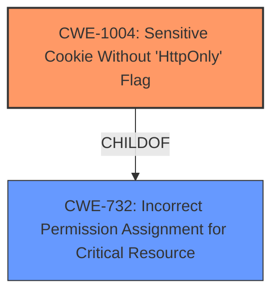

# Raw Analyzer Response for CVE-2021-3706

# Summary
| CWE ID | CWE Name | Confidence | CWE Abstraction Level | CWE Vulnerability Mapping Label | CWE-Vulnerability Mapping Notes |
|---|---|---|---|---|---|
| CWE-1004 | Sensitive Cookie Without 'HttpOnly' Flag | 1.0 | Variant | Allowed | Primary CWE. The cookie storing sensitive information lacks the HttpOnly flag. |
| CWE-732 | Incorrect Permission Assignment for Critical Resource | 0.5 | Base | Allowed | The cookie is a critical resource and the HttpOnly flag is a permission. |

## Evidence and Confidence

*   **Confidence Score:** 1.0
*   **Evidence Strength:** HIGH

## Relationship Analysis
- CWE-1004 (Variant) is a child of CWE-732 (Base).
- CWE-1004 directly addresses the specific issue of a sensitive cookie lacking the HttpOnly flag. While CWE-732 is a broader category about incorrect permission assignments, CWE-1004 is a more precise fit for the described vulnerability, although it may be too specific, and therefore, also mapping to the parent.

## Vulnerability Chain
The vulnerability chain starts with the **omission of the HttpOnly flag** when setting a cookie containing sensitive information (persistentlogin). This allows client-side scripts to access the cookie, potentially leading to **XSS attacks** where an attacker can steal the cookie. If successful, the attacker can then use the stolen cookie for **session hijacking** and gain unauthorized access to the web application and sensitive user data.

## Summary of Analysis
The initial assessment focused on identifying the most specific CWE that accurately reflects the vulnerability. The primary focus was on the **missing HttpOnly flag** for a sensitive cookie.

The evidence from the CVE Reference Links Content Summary is:
*   "The vulnerability lies in the `scripts/pi-hole/php/password.php` file where the `persistentlogin` cookie was being set without the `HttpOnly` flag."
*   "The primary weakness was the absence of the `HttpOnly` flag when setting the `persistentlogin` cookie. This made the cookie accessible to JavaScript running on the client's browser."

Based on this evidence, CWE-1004 (Sensitive Cookie Without 'HttpOnly' Flag) was chosen as the primary CWE, as it directly addresses the vulnerability.

The relationship graph shows that CWE-1004 is a child of CWE-732 (Incorrect Permission Assignment for Critical Resource). CWE-732 is a more general weakness, as it describes incorrect permission assignments for critical resources. In this case, the cookie is the critical resource, and the HttpOnly flag can be considered a permission that restricts access from client-side scripts. While CWE-1004 is a more specific variant, CWE-732 provides a broader context for the vulnerability.

The decision to include CWE-732 as a secondary CWE is to provide a more comprehensive understanding of the vulnerability. While CWE-1004 accurately describes the immediate issue, CWE-732 highlights the underlying problem of incorrect permission assignment.

The selected CWEs are at the optimal level of specificity because CWE-1004 directly addresses the vulnerability, and CWE-732 provides a broader context without being too generic.

Relevant CWE Information:

# Enhanced Context (25 CWEs)
The following CWEs were identified as potentially relevant to this vulnerability:

## CWE-1004: Sensitive Cookie Without 'HttpOnly' Flag
**Abstraction:** Variant
**Status:** Incomplete

### Description
The product uses a cookie to store sensitive information, but the cookie is not marked with the HttpOnly flag.

### Extended Description
The HttpOnly flag directs compatible browsers to prevent client-side script from accessing cookies. Including the HttpOnly flag in the Set-Cookie HTTP response header helps mitigate the risk associated with Cross-Site Scripting (XSS) where an attacker's script code might attempt to read the contents of a cookie and exfiltrate information obtained. When set, browsers that support the flag will not reveal the contents of the cookie to a third party via client-side script executed via XSS.

### Alternative Terms
None

### Relationships
ChildOf -> CWE-732

### Mapping Guidance
**Usage:** Allowed
**Rationale:** This CWE entry is at the Variant level of abstraction, which is a preferred level of abstraction for mapping to the root causes of vulnerabilities.
**Comments:** Carefully read both the name and description to ensure that this mapping is an appropriate fit. Do not try to 'force' a mapping to a lower-level Base/Variant simply to comply with this preferred level of abstraction.
**Reasons:**
- Acceptable-Use

### Observed Examples
- **CVE-2022-24045:** Web application for a room automation system has client-side Javascript that sets a sensitive cookie without the HTTPOnly security attribute, allowing the cookie to be accessed.
- **CVE-2014-3852:** CMS written in Python does not include the HTTPOnly flag in a Set-Cookie header, allowing remote attackers to obtain potentially sensitive information via script access to this cookie.
- **CVE-2015-4138:** Appliance for managing encrypted communications does not use HttpOnly flag.

CWE-614 (Sensitive Cookie in HTTPS Session Without 'Secure' Attribute), CWE-312 (Cleartext Storage of Sensitive Information), CWE-319 (Cleartext Transmission of Sensitive Information), and other CWEs related to cleartext storage or transmission of sensitive information were considered but deemed less relevant. The vulnerability is primarily about the **missing HttpOnly flag**, not the storage or transmission of the cookie itself. While the cookie's content might be sensitive, the immediate issue is the lack of protection against client-side script access.
CWE-79 (Improper Neutralization of Input During Web Page Generation ('Cross-site Scripting')) was considered, but the root cause is the **missing HttpOnly flag** which would then enable the XSS.