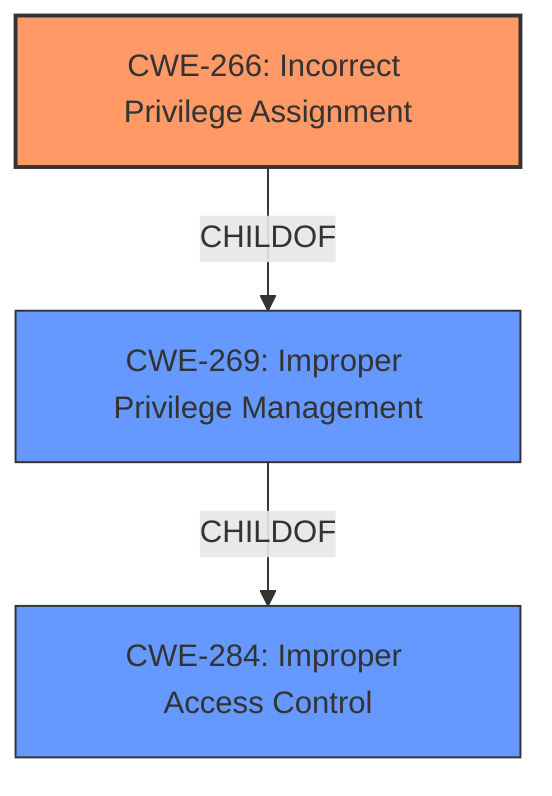

# Enhanced Analysis for CVE-2021-37091

# Summary
| CWE ID | CWE Name | Confidence | CWE Abstraction Level | CWE Vulnerability Mapping Label | CWE-Vulnerability Mapping Notes |
|---|---|---|---|---|---|
| CWE-266 | Incorrect Privilege Assignment | 0.8 | Base | Allowed | Primary CWE |
| CWE-285 | Improper Authorization | 0.5 | Class | Discouraged | Secondary Candidate |
| CWE-284 | Improper Access Control | 0.4 | Pillar | Discouraged | Secondary Candidate |

## Evidence and Confidence

*   **Confidence Score:** 0.8
*   **Evidence Strength:** MEDIUM

## Relationship Analysis
The primary CWE selected is CWE-266 (Incorrect Privilege Assignment), which is a Base level CWE. It is related to CWE-269 (Improper Privilege Management), a Class level CWE, as its child. CWE-269 is a child of CWE-284 (Improper Access Control), which is a Pillar level CWE. The relationship indicates a hierarchy of access control related weaknesses, from general access control issues to specific privilege assignment problems.



## Vulnerability Chain
The vulnerability chain involves a **Permissions, Privileges, and Access Controls vulnerability** which can be classified as **Incorrect Privilege Assignment** (CWE-266). The impact is that **confidentiality** is affected.
- Root Cause: **Incorrect Privilege Assignment** (CWE-266)
- Impact: Confidentiality affected

## Summary of Analysis
The initial analysis identified a vulnerability related to "Permissions, Privileges, and Access Controls" in a Huawei Smartphone, leading to affected confidentiality.

The retriever results pointed to several CWEs, with CWE-266 (Incorrect Privilege Assignment) and CWE-269 (Improper Privilege Management) having the highest scores. However, CWE-269 is a Class level CWE and is often misused, therefore, based on the provided description, CWE-266 (Incorrect Privilege Assignment) at the Base level is more appropriate as it directly addresses the **incorrect** assignment of privileges.

The graph relationships show that CWE-266 is a child of CWE-269, which is a child of CWE-284. This hierarchy helps to understand the context of the vulnerability within the broader scope of access control issues.

The evidence for selecting CWE-266 is based on the phrase "**Permissions, Privileges, and Access Controls vulnerability**" from the vulnerability description key phrases. This suggests that the vulnerability lies in how privileges are assigned, which is precisely what CWE-266 addresses.

Other CWEs considered but not selected:

*   CWE-285 (Improper Authorization): Although authorization issues can be related to privilege management, the description explicitly mentions "Permissions, Privileges", suggesting that the core issue is with the assignment of privileges rather than the authorization process itself.
*   CWE-284 (Improper Access Control): This is a high-level Pillar CWE and less specific than CWE-266.
*   CWE-131 (Incorrect Calculation of Buffer Size): This CWE is not relevant as the vulnerability description does not mention anything about buffer sizes or memory allocation.
*   CWE-248 (Uncaught Exception): This CWE is not relevant as the vulnerability description does not mention anything about exceptions.
*   CWE-732 (Incorrect Permission Assignment for Critical Resource): This is similar to CWE-266 but focuses on permissions for critical resources. The description does not provide enough information to determine if the vulnerability involves specifically critical resources.
*   CWE-94 (Improper Control of Generation of Code ('Code Injection')): This CWE is not relevant as the vulnerability description does not mention anything about code injection.
*   CWE-20 (Improper Input Validation): This is a general input validation issue, and the description does not directly indicate an input validation problem.

CWE-266 is at the optimal level of specificity as it directly addresses the **incorrect** assignment of privileges, which is supported by the evidence from the vulnerability description.


## CWE Relationship Analysis

Current CWEs represent these abstraction levels: .


### Vulnerability Chain Analysis

**Chain starting from CWE-248:**
- 248 (Uncaught Exception) - ROOT


**Chain starting from CWE-732:**
- 732 (Incorrect Permission Assignment for Critical Resource) - ROOT


### CWE Relationship Diagram

```mermaid
graph TD
    classDef primary fill:#f96,stroke:#333,stroke-width:2px
    classDef secondary fill:#69f,stroke:#333
    classDef tertiary fill:#9e9,stroke:#333
```