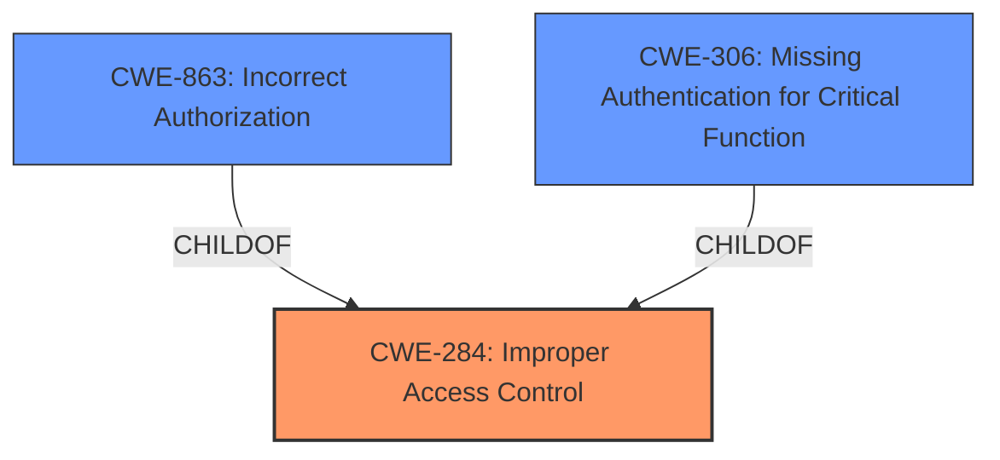

# Analysis for CVE-2021-37101

# Summary
| CWE ID | CWE Name | Confidence | CWE Abstraction Level | CWE Vulnerability Mapping Label | CWE-Vulnerability Mapping Notes |
|---|---|---|---|---|---|
| CWE-284 | Improper Access Control | 0.75 | Pillar | Primary | Discouraged. High level, consider descendants |
| CWE-863 | Incorrect Authorization | 0.65 | Class | Secondary | Allowed-with-Review. Might have Base-level children that would be more appropriate |
| CWE-306 | Missing Authentication for Critical Function | 0.5 | Base | Secondary | Allowed. Requires physical access. |

## Evidence and Confidence

*   **Confidence Score:** 0.7
*   **Evidence Strength:** MEDIUM

## Relationship Analysis
The primary relationship influencing my decision is the hierarchical structure with **CWE-284 (Improper Access Control)** as a high-level Pillar, having **CWE-863 (Incorrect Authorization)** and **CWE-306 (Missing Authentication for Critical Function)** as children at the Class and Base levels, respectively. **CWE-284** is too general, while **CWE-863** and **CWE-306** offer more specific classifications, with **CWE-306** being more granular.

## Vulnerability Chain
The vulnerability chain involves the following:
1.  **Root Cause:** **Improper authorization management**.
2.  **Weakness:** Lack of proper authorization checks.
3.  **Impact:** Arbitrary code execution.
4.  **Attack Vector:** Physical access to the device and implanting malicious code.

## Summary of Analysis
Initially, the description points to **improper authorization management**. The content summary of the CVE reference links confirms this as the root cause, along with the lack of proper authorization checks. The retriever results suggest **CWE-284 (Improper Access Control)**, **CWE-863 (Incorrect Authorization)**, and **CWE-306 (Missing Authentication for Critical Function)**.

The description "**improper authorization mangement**" matches **CWE-284 (Improper Access Control)**. However, the MITRE mapping guidance discourages the use of **CWE-284** because it is too high-level and suggests considering more specific descendants.

**CWE-863 (Incorrect Authorization)** is a child of **CWE-284**, providing a more specific classification. However, the requirement for physical access to the device and implanting malicious code suggests that **CWE-306 (Missing Authentication for Critical Function)** could also be applicable, as it highlights the absence of authentication for critical functions, especially given the physical access vector. The vulnerability necessitates physical access to implant malicious code, indicating a lack of authentication for that specific action.

The phrase "**improper authorization mangement**" directly points to an authorization issue. The evidence indicates that the system **fails to properly authorize** actions, allowing for arbitrary code execution. Considering the physical access requirement, there's a potential lack of authentication for critical functions, but the core issue appears to be that even with potential physical access, the authorization mechanisms are **improper**, allowing malicious code implantation.

Therefore, **CWE-284** is the most applicable, although discouraged. **CWE-863** and **CWE-306** are secondary candidates that are more specific, but require more evidence.

Relevant CWE Information:

# Enhanced Context (25 CWEs)
The following CWEs were identified as potentially relevant to this vulnerability:

## CWE-807: Reliance on Untrusted Inputs in a Security Decision
**Abstraction Level**: Base
**Similarity Score**: 0.75
**Source**: dense

**Description**:
The product uses a protection mechanism that relies on the existence or values of an input, but the input can be modified by an untrusted actor in a way that bypasses the protection mechanism.

**Mapping Guidance**:
- Usage: Allowed
- Rationale: This CWE entry is at the Base level of abstraction, which is a preferred level of abstraction for mapping to the root causes of vulnerabilities.

## CWE-1289: Improper Validation of Unsafe Equivalence in Input
**Abstraction Level**: Base
**Similarity Score**: 0.75
**Source**: dense

**Description**:
The product receives an input value that is used as a resource identifier or other type of reference, but it does not validate or incorrectly validates that the input is equivalent to a potentially-unsafe value.

**Mapping Guidance**:
- Usage: Allowed
- Rationale: This CWE entry is at the Base level of abstraction, which is a preferred level of abstraction for mapping to the root causes of vulnerabilities.

## CWE-274: Improper Handling of Insufficient Privileges
**Abstraction Level**: Base
**Similarity Score**: 0.74
**Source**: dense

**Description**:
The product does not handle or incorrectly handles when it has insufficient privileges to perform an operation, leading to resultant weaknesses.

**Mapping Guidance**:
- Usage: Discouraged
- Rationale: This CWE entry could be deprecated in a future version of CWE.

## CWE-639: Authorization Bypass Through User-Controlled Key
**Abstraction Level**: Base
**Similarity Score**: 0.74
**Source**: dense

**Description**:
The system's authorization functionality does not prevent one user from gaining access to another user's data or record by modifying the key value identifying the data.

**Mapping Guidance**:
- Usage: Allowed
- Rationale: This CWE entry is at the Base level of abstraction, which is a preferred level of abstraction for mapping to the root causes of vulnerabilities.

## CWE-41: Improper Resolution of Path Equivalence
**Abstraction Level**: Base
**Similarity Score**: 0.74
**Source**: dense

**Description**:
The product is vulnerable to file system contents disclosure through path equivalence. Path equivalence involves the use of special characters in file and directory names. The associated manipulations are intended to generate multiple names for the same object.

**Mapping Guidance**:
- Usage: Allowed
- Rationale: This CWE entry is at the Base level of abstraction, which is a preferred level of abstraction for mapping to the root causes of vulnerabilities.

## CWE-183: Permissive List of Allowed Inputs
**Abstraction Level**: Base
**Similarity Score**: 0.73
**Source**: dense

**Description**:
The product implements a protection mechanism that relies on a list of inputs (or properties of inputs) that are explicitly allowed by policy because the inputs are assumed to be safe, but the list is too permissive - that is, it allows an input that is unsafe, leading to resultant weaknesses.

**Mapping Guidance**:
- Usage: Allowed
- Rationale: This CWE entry is at the Base level of abstraction, which is a preferred level of abstraction for mapping to the root causes of vulnerabilities.

## CWE-668: Exposure of Resource to Wrong Sphere
**Abstraction Level**: Class
**Similarity Score**: 0.73
**Source**: dense

**Description**:
The product exposes a resource to the wrong control sphere, providing unintended actors with inappropriate access to the resource.

**Mapping Guidance**:
- Usage: Discouraged
- Rationale: CWE-668 is high-level and is often misused as a catch-all when lower-level CWE IDs might be applicable. It is sometimes used for low-information vulnerability reports [REF-1287]. It is a level-1 Class (i.e., a child of a Pillar). It is not useful for trend analysis.

## CWE-280: Improper Handling of Insufficient Permissions or Privileges 
**Abstraction Level**: Base
**Similarity Score**: 0.73
**Source**: dense

**Description**:
The product does not handle or incorrectly handles when it has insufficient privileges to access resources or functionality as specified by their permissions. This may cause it to follow unexpected code paths that may leave the product in an invalid state.

**Mapping Guidance**:
- Usage: Allowed
- Rationale: This CWE entry is at the Base level of abstraction, which is a preferred level of abstraction for mapping to the root causes of vulnerabilities.

## CWE-1220: Insufficient Granularity of Access Control
**Abstraction Level**: Base
**Similarity Score**: 0.73
**Source**: dense

**Description**:
The product implements access controls via a policy or other feature with the intention to disable or restrict accesses (reads and/or writes) to assets in a system from untrusted agents. However, implemented access controls lack required granularity, which renders the control policy too broad because it allows