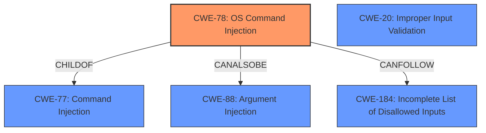

# Raw Analyzer Response for CVE-2021-37106

# Summary
| CWE ID | CWE Name | Confidence | CWE Abstraction Level | CWE Vulnerability Mapping Label | CWE-Vulnerability Mapping Notes |
|---|---|---|---|---|---|
| CWE-78 | Improper Neutralization of Special Elements used in an OS Command ('OS Command Injection') | 1.0 | Base | Allowed | Primary CWE |
| CWE-20 | Improper Input Validation | 0.7 | Class | Discouraged | Secondary Candidate |
| CWE-184 | Incomplete List of Disallowed Inputs | 0.6 | Base | Allowed | Secondary Candidate |

## Evidence and Confidence

*   **Confidence Score:** 0.9
*   **Evidence Strength:** HIGH

## Relationship Analysis
The primary CWE is CWE-78, which is a Base level weakness and a child of CWE-77. CWE-77 is a Class level weakness, which is a parent of CWE-78. CWE-78 is also related to CWE-88 (Improper Neutralization of Argument Delimiters in a Command) via CanAlsoBe, suggesting a potential alternative classification. CWE-20 is a Class level weakness, parent of CWE-1284, CWE-1285, CWE-1286, CWE-1287, CWE-1288, and CWE-1289, and can precede CWE-22, CWE-41, CWE-74, CWE-119, and CWE-770 in a vulnerability chain. CWE-184 is a Base level weakness, and can precede CWE-79, CWE-78, CWE-434, and CWE-98 in a vulnerability chain.

## Vulnerability Chain
The vulnerability chain starts with insufficient input validation, potentially followed by an incomplete list of disallowed inputs, leading to OS command injection, and finally, command execution.
  - **Root Cause:** Insufficient input validation, potentially an incomplete list of disallowed inputs
  - **Weakness:** OS Command Injection
  - **Impact:** Command Execution

## Summary of Analysis
The primary weakness is clearly **command injection**. The software **constructs part of a command using external special input from users, but the software does not sufficiently validate the user input.** This allows an attacker to inject certain commands to the system, leading to command execution.

Based on the vulnerability description and CVE Reference Links Content Summary, the root cause is the insufficient validation of user input, which leads to the ability to inject OS commands.

The Retriever Results also supports this assessment, with CWE-77 and CWE-78 being the top candidates. The alternate term listed for CWE-77 is "Command injection: an attack-oriented phrase for this weakness. Note: often used when 'OS command injection' (CWE-78) was intended." The mapping guidance for CWE-77 is ALLOWED-WITH-REVIEW because "CWE-77 is often misused when OS command injection (CWE-78) was intended instead."

The Retriever Results lists CWE-78 as the second highest match. However, the vulnerability description specifically states that the injected commands are OS commands. Therefore, CWE-78 (Improper Neutralization of Special Elements used in an OS Command) is the most appropriate choice. The mapping guidance for CWE-78 is ALLOWED, and it is a Base level of abstraction, which is preferred.

CWE-20 (Improper Input Validation) is a Class level weakness and a potential contributing factor, but it is too general to be the primary CWE. It is also DISCOURAGED "CWE-20 is commonly misused in low-information vulnerability reports when lower-level CWEs could be used instead, or when more details about the vulnerability are available." However, it is included as a secondary candidate, since the description mentions that **the software does not sufficiently validate the user input.**

CWE-184 (Incomplete List of Disallowed Inputs) is also a Base level weakness and a potential contributing factor. If the input validation relies on a denylist, and that denylist is incomplete, then this CWE would also apply. However, since there is no explicit mention of a denylist, this CWE is included as a secondary candidate with a lower confidence.

CWE-88 (Improper Neutralization of Argument Delimiters in a Command) was considered, since it is related to CWE-78 via CanAlsoBe. However, there is no mention of argument delimiters in the vulnerability description. Therefore, CWE-88 is not selected.

CWE-94 (Improper Control of Generation of Code ('Code Injection')) was considered, but it is less appropriate than CWE-78 because the vulnerability specifically involves OS commands, not general code generation. Also, the "Mapping Guidance" for CWE-94 is "Allowed-with-Review" because "This entry is frequently misused for vulnerabilities with a technical impact of 'code execution,' which does not by itself indicate a root cause weakness, since dozens of weaknesses can enable code execution."

The selected CWEs are at the optimal level of specificity because they accurately represent the root cause and nature of the vulnerability, based on the provided evidence.

Relevant CWE Information:

# Enhanced Context (25 CWEs)
The following CWEs were identified as potentially relevant to this vulnerability:

## CWE-74: Improper Neutralization of Special Elements in Output Used by a Downstream Component ('Injection')
**Abstraction Level**: Class
**Similarity Score**: 0.76
**Source**: dense

**Description**:
The product constructs all or part of a command, data structure, or record using externally-influenced input from an upstream component, but it does not neutralize or incorrectly neutralizes special elements that could modify how it is parsed or interpreted when it is sent to a downstream component.

**Mapping Guidance**:
- Usage: Discouraged
- Rationale: CWE-74 is high-level and often misused when lower-level weaknesses are more appropriate.

## CWE-184: Incomplete List of Disallowed Inputs
**Abstraction Level**: Base
**Similarity Score**: 0.76
**Source**: dense

**Description**:
The product implements a protection mechanism that relies on a list of inputs (or properties of inputs) that are not allowed by policy or otherwise require other action to neutralize before additional processing takes place, but the list is incomplete.

**Mapping Guidance**:
- Usage: Allowed
- Rationale: This CWE entry is at the Base level of abstraction, which is a preferred level of abstraction for mapping to the root causes of vulnerabilities.

## CWE-88: Improper Neutralization of Argument Delimiters in a Command ('Argument Injection')
**Abstraction Level**: Base
**Similarity Score**: 0.75
**Source**: dense

**Description**:
The product constructs a string for a command to be executed by a separate component
in another control sphere, but it does not properly delimit the
intended arguments, options, or switches within that command string.

**Mapping Guidance**:
- Usage: Allowed
- Rationale: This CWE entry is at the Base level of abstraction, which is a preferred level of abstraction for mapping to the root causes of vulnerabilities.

## CWE-138: Improper Neutralization of Special Elements
**Abstraction Level**: Class
**Similarity Score**: 0.74
**Source**: dense

**Description**:
The product receives input from an upstream component, but it does not neutralize or incorrectly neutralizes special elements that could be interpreted as control elements or syntactic markers when they are sent to a downstream component.

**Mapping Guidance**:
- Usage: Discouraged
- Rationale: This CWE entry is a level-1 Class (i.e., a child of a Pillar). It might have lower-level children that would be more appropriate

## CWE-73: External Control of File Name or Path
**Abstraction Level**: Base
**Similarity Score**: 0.74
**Source**: dense

**Description**:
The product allows user input to control or influence paths or file names that are used in filesystem operations.

**Mapping Guidance**:
- Usage: Allowed
- Rationale: This CWE entry is at the Base level of abstraction, which is a preferred level of abstraction for mapping to the root causes of vulnerabilities.

## CWE-1289: Improper Validation of Unsafe Equivalence in Input
**Abstraction Level**: Base
**Similarity Score**: 0.74
**Source**: dense

**Description**:
The product receives an input value that is used as a resource identifier