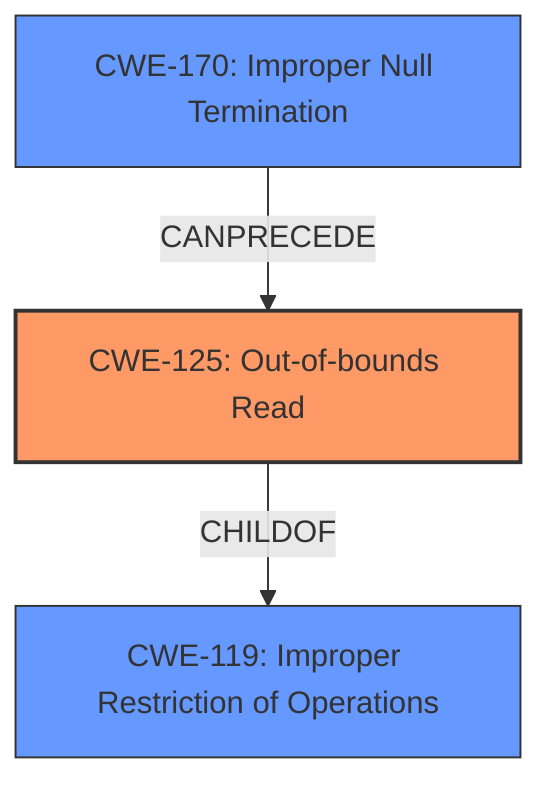

# Enhanced Analysis for CVE-2021-3712

# Summary
| CWE ID | CWE Name | Confidence | CWE Abstraction Level | CWE Vulnerability Mapping Label | CWE-Vulnerability Mapping Notes |
|---|---|---|---|---|---|
| CWE-125 | Out-of-bounds Read | 0.9 | Base | Allowed | Primary CWE |
| CWE-170 | Improper Null Termination | 0.7 | Base | Allowed | Secondary CWE |

## Evidence and Confidence

*   **Confidence Score:** 0.8
*   **Evidence Strength:** HIGH

## Relationship Analysis
The primary weakness is an out-of-bounds read (CWE-125) stemming from the **assumption of NUL termination** when handling ASN.1 strings in OpenSSL. Although ASN.1 strings should be null-terminated, direct construction of ASN1_STRING structures may result in missing NUL termination, leading to read operations beyond the intended buffer size. CWE-125 is a child of CWE-119 (Improper Restriction of Operations within the Bounds of a Memory Buffer), providing a more specific classification. CWE-170 (Improper Null Termination) is a related issue, as the lack of null termination directly contributes to the out-of-bounds read. CWE-170 can precede CWE-125.



## Vulnerability Chain
The vulnerability chain starts with direct construction of ASN1_STRING structures without proper null termination (CWE-170). This leads to the **assumption of NUL termination** by OpenSSL functions that process ASN.1 data, ultimately resulting in an out-of-bounds read (CWE-125) when these functions attempt to read beyond the intended buffer. The impact is a potential crash (DoS) or disclosure of private memory contents.

## Summary of Analysis
The analysis indicates that the primary weakness is an out-of-bounds read (CWE-125) caused by the **assumption of NUL termination** of ASN.1 strings. The evidence includes: "Where an application requests an ASN.1 structure to be printed, and where that ASN.1 structure contains ASN1_STRINGs that have been directly constructed by the application without NUL terminating the data field, then a read **buffer overrun** can occur." The vulnerability description and CVE reference links explicitly mention the possibility of read buffer overruns. The retriever results also list CWE-125 as a high-scoring candidate.

CWE-125 is chosen because it accurately describes the **buffer overrun** caused by reading beyond the buffer boundary. CWE-170 is a contributing factor, but CWE-125 represents the more direct cause of the vulnerability.

CWE-119 was considered but not selected as the primary CWE, because the description for CWE-119 says "CWE-119 is commonly misused in low-information vulnerability reports when lower-level CWEs could be used instead" and the instructions say to "Look at CWE-119's children and consider mappings to CWEs such as CWE-787: Out-of-bounds Write, CWE-125: Out-of-bounds Read, or others".

CWE-1284 (Improper Validation of Specified Quantity in Input) was also considered, given that the **assumption of NUL termination** could be framed as a failure to validate the length of the ASN.1 string. However, the core issue is not the validation of the *specified* length, but rather the incorrect **assumption of NUL termination**, leading to the out-of-bounds read.

CWE-476 (NULL Pointer Dereference) was considered but not selected because it does not fit the vulnerability's description.

The selected CWEs are at the optimal level of specificity, with CWE-125 capturing the direct cause of the vulnerability and CWE-170 highlighting the contributing factor of improper null termination.
Relevant CWE Information:

# Enhanced Context (25 CWEs)
The following CWEs were identified as potentially relevant to this vulnerability:

## CWE-191: Integer Underflow (Wrap or Wraparound)
**Abstraction Level**: Base
**Similarity Score**: 0.80
**Source**: dense

**Description**:
The product subtracts one value from another, such that the result is less than the minimum allowable integer value, which produces a value that is not equal to the correct result.

**Mapping Guidance**:
- Usage: Allowed
- Rationale: This CWE entry is at the Base level of abstraction, which is a preferred level of abstraction for mapping to the root causes of vulnerabilities.


## CWE-197: Numeric Truncation Error
**Abstraction Level**: Base
**Similarity Score**: 0.79
**Source**: dense

**Description**:
Truncation errors occur when a primitive is cast to a primitive of a smaller size and data is lost in the conversion.

**Mapping Guidance**:
- Usage: Allowed
- Rationale: This CWE entry is at the Base level of abstraction, which is a preferred level of abstraction for mapping to the root causes of vulnerabilities.


## CWE-190: Integer Overflow or Wraparound
**Abstraction Level**: Base
**Similarity Score**: 0.77
**Source**: dense

**Description**:
The product performs a calculation that can
         produce an integer overflow or wraparound when the logic
         assumes that the resulting value will always be larger than
         the original value. This occurs when an integer value is
         incremented to a value that is too large to store in the
         associated representation. When this occurs, the value may
         become a very small or negative number.

**Mapping Guidance**:
- Usage: Allowed
- Rationale: This CWE entry is at the Base level of abstraction, which is a preferred level of abstraction for mapping to the root causes of vulnerabilities.


## CWE-131: Incorrect Calculation of Buffer Size
**Abstraction Level**: Base
**Similarity Score**: 0.77
**Source**: dense

**Description**:
The product does not correctly calculate the size to be used when allocating a buffer, which could lead to a buffer overflow.

**Mapping Guidance**:
- Usage: Allowed
- Rationale: This CWE entry is at the Base level of abstraction, which is a preferred level of abstraction for mapping to the root causes of vulnerabilities.


## CWE-125: Out-of-bounds Read
**Abstraction Level**: Base
**Similarity Score**: 0.76
**Source**: dense

**Description**:
The product reads data past the end, or before the beginning, of the intended buffer.

**Mapping Guidance**:
- Usage: Allowed
- Rationale: This CWE entry is at the Base level of abstraction, which is a preferred level of abstraction for mapping to the root causes of vulnerabilities.


## CWE-681: Incorrect Conversion between Numeric Types
**Abstraction Level**: Base
**Similarity Score**: 0.76
**Source**: dense

**Description**:
When converting from one data type to another, such as long to integer, data can be omitted or translated in a way that produces unexpected values. If the resulting values are used in a sensitive context, then dangerous behaviors may occur.

**Mapping Guidance**:
- Usage: Allowed
- Rationale: This CWE entry is at the Base level of abstraction, which is a preferred level of abstraction for mapping to the root causes of vulnerabilities.


## CWE-193: Off-by-one Error
**Abstraction Level**: Base
**Similarity Score**: 0.76
**Source**: dense

**Description**:
A product calculates or uses an incorrect maximum or minimum value that is 1 more, or 1 less, than the correct value.

**Mapping Guidance**:
- Usage: Allowed
- Rationale: This CWE entry is at the Base level of abstraction, which is a preferred level of abstraction for mapping to the root causes of vulnerabilities.


## CWE-126: Buffer Over-read
**Abstraction Level**: Variant
**Similarity Score**: 0.75
**Source**: dense

**Description**:
The product reads from a buffer using buffer access mechanisms such as indexes or pointers that reference memory locations after the targeted buffer.

**Mapping Guidance**:
- Usage: Allowed
- Rationale: This CWE entry is at the Variant level of abstraction, which is a preferred level of abstraction for mapping to the root causes of vulnerabilities.


## CWE-124: Buffer Underwrite ('Buffer Underflow')
**Abstraction Level**: Base
**Similarity Score**: 0.75
**Source**: dense

**Description**:
The product writes to a buffer using an index or pointer that references a memory location prior to the beginning of the buffer.

**Mapping Guidance**:
- Usage: Allowed


## CWE Relationship Analysis

Current CWEs represent these abstraction levels: .


### Vulnerability Chain Analysis

**Chain starting from CWE-476:**
- 476 (NULL Pointer Dereference) - ROOT


**Chain starting from CWE-787:**
- 787 (Out-of-bounds Write) - ROOT


### CWE Relationship Diagram

```mermaid
graph TD
    classDef primary fill:#f96,stroke:#333,stroke-width:2px
    classDef secondary fill:#69f,stroke:#333
    classDef tertiary fill:#9e9,stroke:#333
```