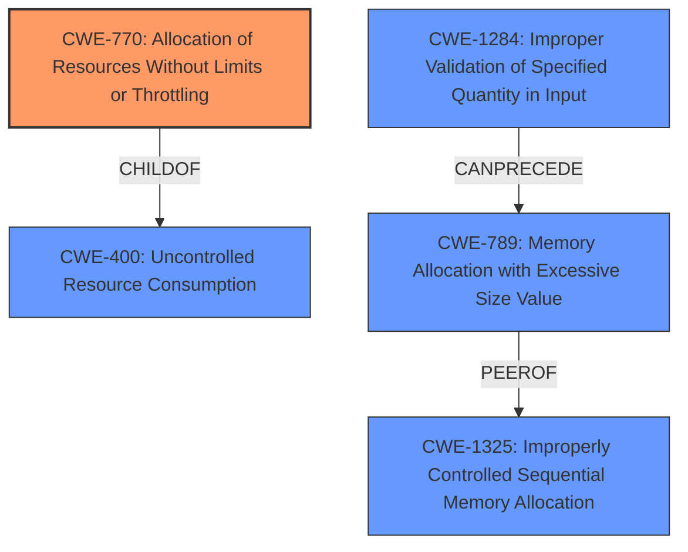

# Analysis for CVE-2021-37137

# Summary
| CWE ID | CWE Name | Confidence | CWE Abstraction Level | CWE Vulnerability Mapping Label | CWE-Vulnerability Mapping Notes |
|---|---|---|---|---|---|
| CWE-770 | Allocation of Resources Without Limits or Throttling | 0.9 | Base | Allowed | Primary CWE |
| CWE-789 | Memory Allocation with Excessive Size Value | 0.8 | Variant | Allowed | Secondary Candidate |
| CWE-400 | Uncontrolled Resource Consumption | 0.6 | Class | Discouraged | Secondary Candidate |

## Evidence and Confidence

*   **Confidence Score:** 0.8
*   **Evidence Strength:** HIGH

## Relationship Analysis
The primary relationship influencing the choice was the hierarchical structure. CWE-770 (Base) is a child of CWE-400 (Class), making it a more specific and appropriate choice. CWE-789 is a peer of CWE-1325, both being related to memory allocation issues. The "CanPrecede" relationship between CWE-1284 and CWE-789 suggests a potential chain where improper input validation leads to excessive memory allocation.

## Vulnerability Chain
The vulnerability chain starts with the **lack of chunk length restriction** in the Snappy frame decoder and the buffering of skippable chunks, leading to **excessive memory usage**. This can be triggered by malicious input that decompresses to a large size or by sending a huge skippable chunk. A potential prerequisite could be CWE-1284 (Improper Validation of Specified Quantity in Input), although this is not explicitly stated. The final impact is a Denial-of-Service (DoS) attack due to excessive memory consumption.

## Summary of Analysis
The initial analysis focused on the **excessive memory usage** caused by the Snappy frame decoder's **lack of chunk length restriction**. The Retriever results suggested CWE-789 (Memory Allocation with Excessive Size Value) and CWE-1284 (Improper Validation of Specified Quantity in Input) as potential candidates. However, after reviewing the complete CWE specifications and considering the vulnerability description, CWE-770 (Allocation of Resources Without Limits or Throttling) emerged as the most appropriate primary CWE.

The vulnerability description states that the Snappy frame decoder "doesn't restrict the chunk length which may lead to **excessive memory usage**." The CVE Reference Links Content Summary confirms this, stating that the "Snappy frame decoder function in Netty lacks proper chunk length restriction and buffering of skippable chunks," leading to "excessive memory allocation." This directly aligns with the description of CWE-770, which states: "The product allocates a reusable resource or group of resources on behalf of an actor without imposing any restrictions on the size or number of resources that can be allocated, in violation of the intended security policy for that actor."

CWE-789 was considered due to its high similarity score and relevance to memory allocation issues. However, it focuses more on the size value being untrusted, whereas CWE-770 focuses on the **lack of restrictions**. While CWE-789 is a valid secondary concern, CWE-770 better captures the root cause.

CWE-400 (Uncontrolled Resource Consumption) was also considered, but it's a Class-level CWE and generally discouraged when more specific CWEs are available. CWE-770 is a child of CWE-400 and provides a more precise description of the vulnerability.

Therefore, the final decision is to classify this vulnerability as CWE-770 (Allocation of Resources Without Limits or Throttling), with CWE-789 (Memory Allocation with Excessive Size Value) as a secondary candidate, as the decoder does not properly impose restrictions on the size of chunks being allocated. This selection is based on the evidence from the vulnerability description, the relationships between CWEs, and the MITRE mapping guidance. The chosen CWEs are at the optimal level of specificity, with CWE-770 being a Base-level CWE and CWE-789 a Variant.

Relevant CWE Information:

# Enhanced Context (25 CWEs)
The following CWEs were identified as potentially relevant to this vulnerability:

## CWE-405: Asymmetric Resource Consumption (Amplification)
**Abstraction Level**: Class
**Similarity Score**: 0.76
**Source**: dense

**Description**:
The product does not properly control situations in which an adversary can cause the product to consume or produce excessive resources without requiring the adversary to invest equivalent work or otherwise prove authorization, i.e., the adversary's influence is "asymmetric."

**Mapping Guidance**:
- Usage: Allowed-with-Review
- Rationale: This CWE entry is a Class and might have Base-level children that would be more appropriate

## CWE-789: Memory Allocation with Excessive Size Value
**Abstraction Level**: Variant
**Similarity Score**: 0.76
**Source**: dense

**Description**:
The product allocates memory based on an untrusted, large size value, but it does not ensure that the size is within expected limits, allowing arbitrary amounts of memory to be allocated.

**Mapping Guidance**:
- Usage: Allowed
- Rationale: This CWE entry is at the Variant level of abstraction, which is a preferred level of abstraction for mapping to the root causes of vulnerabilities.

## CWE-1325: Improperly Controlled Sequential Memory Allocation
**Abstraction Level**: Base
**Similarity Score**: 0.74
**Source**: dense

**Description**:
The product manages a group of objects or resources and performs a separate memory allocation for each object, but it does not properly limit the total amount of memory that is consumed by all of the combined objects.

**Mapping Guidance**:
- Usage: Allowed
- Rationale: This CWE entry is at the Base level of abstraction, which is a preferred level of abstraction for mapping to the root causes of vulnerabilities.

## CWE-226: Sensitive Information in Resource Not Removed Before Reuse
**Abstraction Level**: Base
**Similarity Score**: 0.73
**Source**: dense

**Description**:
The product releases a resource such as memory or a file so that it can be made available for reuse, but it does not clear or "zeroize" the information contained in the resource before the product performs a critical state transition or makes the resource available for reuse by other entities.

**Mapping Guidance**:
- Usage: Allowed
- Rationale: This CWE entry is at the Base level of abstraction, which is a preferred level of abstraction for mapping to the root causes of vulnerabilities.

## CWE-404: Improper Resource Shutdown or Release
**Abstraction Level**: Class
**Similarity Score**: 0.73
**Source**: dense

**Description**:
The product does not release or incorrectly releases a resource before it is made available for re-use.

**Mapping Guidance**:
- Usage: Allowed-with-Review
- Rationale: This CWE entry is a Class and might have Base-level children that would be more appropriate

## CWE-407: Inefficient Algorithmic Complexity
**Abstraction Level**: Class
**Similarity Score**: 0.73
**Source**: dense

**Description**:
An algorithm in a product has an inefficient worst-case computational complexity that may be detrimental to system performance and can be triggered by an attacker, typically using crafted manipulations that ensure that the worst case is being reached.

**Mapping Guidance**:
- Usage: Allowed-with-Review
- Rationale: This CWE entry is a Class and might have Base-level children that would be more appropriate

## CWE-131: Incorrect Calculation of Buffer Size
**Abstraction Level**: Base
**Similarity Score**: 0.73
**Source**: dense

**Description**:
The product does not correctly calculate the size to be used when allocating a buffer, which could lead to a buffer overflow.

**Mapping Guidance**:
- Usage: Allowed
- Rationale: This CWE entry is at the Base level of abstraction, which is a preferred level of abstraction for mapping to the root causes of vulnerabilities.

## CWE-125: Out-of-bounds Read
**Abstraction Level**: Base
**Similarity Score**: 0.72
**Source**: dense

**Description**:
The product reads data past the end, or before the beginning, of the intended buffer.