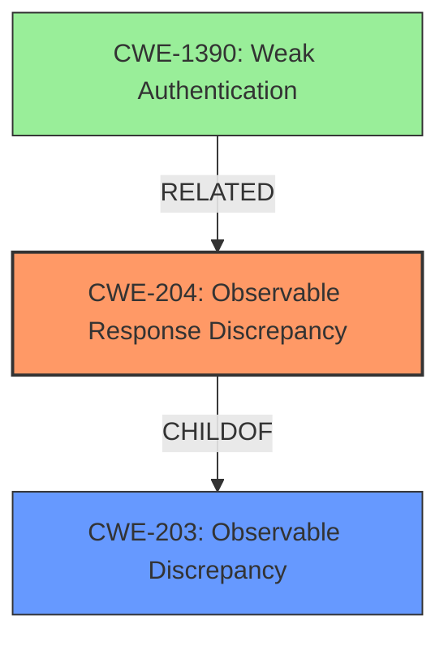

# Raw Analyzer Response for CVE-2021-37151

# Summary
| CWE ID | CWE Name | Confidence | CWE Abstraction Level | CWE Vulnerability Mapping Label | CWE-Vulnerability Mapping Notes |
|---|---|---|---|---|---|
| CWE-204 | Observable Response Discrepancy | 0.9 | Base | Allowed | Primary CWE. The vulnerability reveals whether a username is valid based on the length of the API response, which aligns with the definition of an observable response discrepancy.|
| CWE-203 | Observable Discrepancy | 0.7 | Base | Allowed | Secondary CWE. This is a more general CWE that encompasses observable differences. |
| CWE-1390 | Weak Authentication | 0.5 | Class | Allowed-with-Review | Secondary CWE. The vulnerability can lead to weak authentication by allowing attackers to enumerate valid usernames, making brute-force attacks easier.|

## Evidence and Confidence

*   **Confidence Score:** 0.9
*   **Evidence Strength:** MEDIUM

## Relationship Analysis
The primary CWE is CWE-204, which is a specific type of observable discrepancy. CWE-203 is a parent of CWE-204, representing a more general class of vulnerabilities. CWE-1390 is a class-level CWE related to weak authentication, which can be a consequence of the information leakage.

## Vulnerability Chain
The chain of events is as follows:
1.  **Root Cause:** The application **reveals whether the username is valid** based on the API response length (CWE-204).
2.  **Weakness:** The system **reveals whether the username is valid**, leading to potential username enumeration.
3.  **Impact:** Attackers can enumerate usernames of valid application users, which can be used for brute-force and dictionary attacks to discover account information.

## Summary of Analysis
The initial analysis focused on identifying the most specific CWE that describes the **weakness**, which is that the system **reveals whether the username is valid** based on the response. CWE-204, "Observable Response Discrepancy," is the best fit because it specifically addresses the scenario where different responses reveal internal state information. The vulnerability description explicitly states that the API response length differentiates between a valid user and an invalid one, directly aligning with CWE-204.

CWE-203 is a more general form of observable discrepancy, and while applicable, CWE-204 is more specific and therefore preferred. CWE-1390, "Weak Authentication," is a related issue but represents a higher-level consequence of the information leakage rather than the root cause.

The relationship graph highlights the hierarchical connection between CWE-204 and CWE-203, with CWE-204 being a specific type of CWE-203. The selection of CWE-204 is based on its precise match to the vulnerability description, providing the optimal level of specificity. The evidence for this assessment comes directly from the vulnerability description: "In certain authentication policy configurations with MFA, the API response length can be used to differentiate between a valid user and an invalid one (aka Username Enumeration)."

CWE-208 (Observable Timing Discrepancy) was considered but not selected because the primary observable difference is in the response length, not the timing. While timing could potentially be a factor, the description focuses on the length difference.

CWE-209 (Generation of Error Message Containing Sensitive Information) was also considered, but it doesn't precisely fit because the information is revealed through a discrepancy in response length rather than a specific error message.

CWE-1391 (Use of Weak Credentials) and CWE-798 (Use of Hard-coded Credentials) were not selected because the vulnerability doesn't involve weak or hard-coded credentials directly. The issue stems from the information leakage during the authentication process.