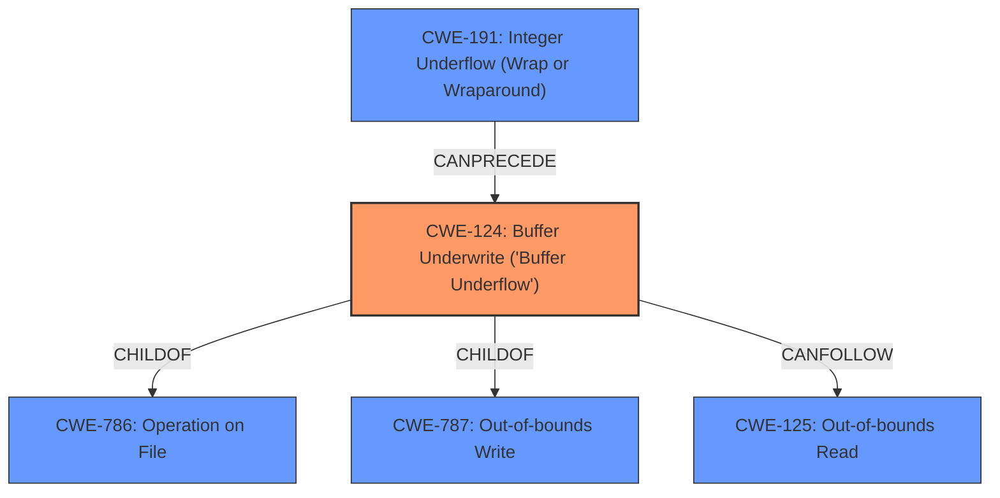

# Analysis Report for CVE-2021-37162

# Vulnerability Analysis Report: CVE-2021-37162

## Description


## Analysis (with Relationship Data)

# Summary
| CWE ID  | CWE Name                                                        | Confidence | CWE Abstraction Level | CWE Vulnerability Mapping Label | CWE-Vulnerability Mapping Notes |
| :-------- | :-------------------------------------------------------------- | :---------- | :-------------------- | :------------------------------ | :----------------------------- |
| CWE-124 | Buffer Underwrite ('Buffer Underflow')                      | 0.9         | Base                  | Primary                         | Allowed                        |
| CWE-191 | Integer Underflow (Wrap or Wraparound)                      | 0.7         | Base                  | Secondary                       | Allowed                        |
| CWE-125 | Out-of-bounds Read                                            | 0.6         | Base                  | Secondary                       | Allowed                        |

## Evidence and Confidence

*   **Confidence Score:** 0.8
*   **Evidence Strength:** HIGH

## Relationship Analysis
The primary relationship is between **CWE-124 (Buffer Underwrite)** and its parents, **CWE-786 (Operation on File) and CWE-787 (Out-of-bounds Write)**. While CWE-787 might seem relevant, the vulnerability is specifically a **buffer underflow**, making CWE-124 more accurate. **CWE-191 (Integer Underflow)** and **CWE-125 (Out-of-bounds Read)** are related as potential contributing factors or consequences. **CWE-191** could lead to calculating an incorrect buffer size, and **CWE-125** could be a result of a buffer underwrite.



## Vulnerability Chain
The chain of events starts with a malformed UDP message, leading to a **CWE-124 (Buffer Underwrite)**. Potentially, an **CWE-191 (Integer Underflow)** could contribute to the incorrect calculation of the buffer index, which leads to **CWE-124**. As a consequence of the **buffer underflow**, an **CWE-125 (Out-of-bounds Read)** can happen which results in remote code execution.

## Summary of Analysis
The primary weakness is a **CWE-124 (Buffer Underwrite)**, as explicitly stated in the vulnerability description: "If an attacker sends a malformed UDP message, a **buffer underflow** occurs". The retriever results also list **CWE-124** as the top match. The "CVE Reference Links Content Summary" further validates this by detailing a buffer overflow in the `sccProcessMsg` function.

The evidence supports classifying this as a **CWE-124 (Buffer Underwrite)** because the root cause is writing to a buffer using an index or pointer that references a memory location prior to the beginning of the buffer.

**CWE-191 (Integer Underflow)** is considered a secondary CWE because an integer underflow might lead to the buffer underwrite.

**CWE-125 (Out-of-bounds Read)** is also considered as a secondary CWE because this could be a possible effect after the **buffer underwrite**.

Other CWEs such as **CWE-119 (Improper Restriction of Operations within the Bounds of a Memory Buffer)** were considered but deemed too general, as the specific weakness is a **buffer underflow**. Similarly, while **CWE-787 (Out-of-bounds Write)** is related, it's not as precise as **CWE-124**.

The selected CWEs are at the optimal level of specificity, as they directly address the root cause (**buffer underwrite**) and possible contributing factors (**integer underflow**) and consequences (**out-of-bounds read**).

Relevant CWE Information:

# Enhanced Context (25 CWEs)
The following CWEs were identified as potentially relevant to this vulnerability:

## CWE-191: Integer Underflow (Wrap or Wraparound)
**Abstraction Level**: Base
**Similarity Score**: 0.79
**Source**: dense

**Description**:
The product subtracts one value from another, such that the result is less than the minimum allowable integer value, which produces a value that is not equal to the correct result.

**Mapping Guidance**:
- Usage: Allowed
- Rationale: This CWE entry is at the Base level of abstraction, which is a preferred level of abstraction for mapping to the root causes of vulnerabilities.

## CWE-131: Incorrect Calculation of Buffer Size
**Abstraction Level**: Base
**Similarity Score**: 0.79
**Source**: dense

**Description**:
The product does not correctly calculate the size to be used when allocating a buffer, which could lead to a buffer overflow.

**Mapping Guidance**:
- Usage: Allowed
- Rationale: This CWE entry is at the Base level of abstraction, which is a preferred level of abstraction for mapping to the root causes of vulnerabilities.

## CWE-124: Buffer Underwrite ('Buffer Underflow')
**Abstraction Level**: Base
**Similarity Score**: 0.79
**Source**: dense

**Description**:
The product writes to a buffer using an index or pointer that references a memory location prior to the beginning of the buffer.

**Mapping Guidance**:
- Usage: Allowed
- Rationale: This CWE entry is at the Base level of abstraction, which is a preferred level of abstraction for mapping to the root causes of vulnerabilities.

## CWE-805: Buffer Access with Incorrect Length Value
**Abstraction Level**: Base
**Similarity Score**: 0.78
**Source**: dense

**Description**:
The product uses a sequential operation to read or write a buffer, but it uses an incorrect length value that causes it to access memory that is outside of the bounds of the buffer.

**Mapping Guidance**:
- Usage: Allowed
- Rationale: This CWE entry is at the Base level of abstraction, which is a preferred level of abstraction for mapping to the root causes of vulnerabilities.

## CWE-126: Buffer Over-read
**Abstraction Level**: Variant
**Similarity Score**: 0.78
**Source**: dense

**Description**:
The product reads from a buffer using buffer access mechanisms such as indexes or pointers that reference memory locations after the targeted buffer.

**Mapping Guidance**:
- Usage: Allowed
- Rationale: This CWE entry is at the Variant level of abstraction, which is a preferred level of abstraction for mapping to the root causes of vulnerabilities.

## CWE-680: Integer Overflow to Buffer Overflow
**Abstraction Level**: Compound
**Similarity Score**: 0.77
**Source**: dense

**Description**:
The product performs a calculation to determine how much memory to allocate, but an integer overflow can occur that causes less memory to be allocated than expected, leading to a buffer overflow.

**Mapping Guidance**:
- Usage: Discouraged
- Rationale: This CWE entry is a named chain, which combines multiple weaknesses.

## CWE-193: Off-by-one Error
**Abstraction Level**: Base
**Similarity Score**: 0.77
**Source**: dense

**Description**:
A product calculates or uses an incorrect maximum or minimum value that is 1 more, or 1 less, than the correct value.

**Mapping Guidance**:
- Usage: Allowed
- Rationale: This CWE entry is at the Base level of abstraction, which is a preferred level of abstraction for mapping to the root causes of vulnerabilities.

## CWE-119: Improper Restriction of Operations within the Bounds of a Memory Buffer
**Abstraction Level**: Class
**Similarity Score**: 0.77
**Source**: dense

**Description**:
The product performs operations on a memory buffer, but it reads from or writes to a memory location outside the buffer's intended boundary. This may result in read or write operations on unexpected memory locations that could be linked to other variables, data structures, or internal program data.

**Mapping Guidance**:
- Usage: Discouraged
- Rationale: CWE-119 is commonly misused in low-information vulnerability reports when lower-level CWEs could be used instead, or when more details about the vulnerability are available.

## CWE-190: Integer Overflow or Wraparound
**Abstraction Level**: Base
**Similarity Score**: 0.76
**Source**: dense

**Description**:
The product performs a calculation that can
         produce an integer


## CWE Relationship Analysis

Current CWEs represent these abstraction levels: .


### Vulnerability Chain Analysis

**Chain starting from CWE-787:**
- 787 (Out-of-bounds Write) - ROOT


**Chain starting from CWE-680:**
- 680 (Integer Overflow to Buffer Overflow) - ROOT


### CWE Relationship Diagram

```mermaid
graph TD
    classDef primary fill:#f96,stroke:#333,stroke-width:2px
    classDef secondary fill:#69f,stroke:#333
    classDef tertiary fill:#9e9,stroke:#333
```


*Report generated on 2025-04-01 19:08:05*
