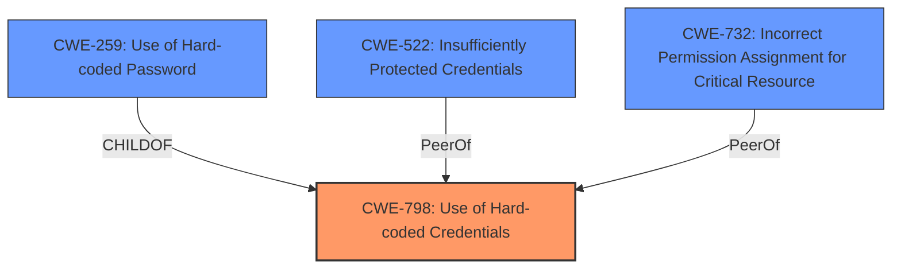

# Analysis for CVE-2021-37163

# Summary
| CWE ID | CWE Name | Confidence | CWE Abstraction Level | CWE Vulnerability Mapping Label | CWE-Vulnerability Mapping Notes |
|---|---|---|---|---|---|
| CWE-798 | Use of Hard-coded Credentials | 1.0 | Base | Primary | Allowed |
| CWE-259 | Use of Hard-coded Password | 0.9 | Variant | Secondary | Allowed |
| CWE-522 | Insufficiently Protected Credentials | 0.7 | Class | Secondary | Allowed-with-Review |
| CWE-732 | Incorrect Permission Assignment for Critical Resource | 0.6 | Class | Secondary | Allowed-with-Review |

## Evidence and Confidence

*   **Confidence Score:** 0.9
*   **Evidence Strength:** HIGH

## Relationship Analysis
The primary weakness is the **use of hardcoded credentials**, which directly leads to **insecure permissions**. The **hardcoded password** is a specific type of **hardcoded credential**. The relationship between CWE-798 and CWE-259 is that of a parent (Base) and child (Variant), respectively. CWE-798 is a broader category that includes the use of any **hardcoded credentials**, while CWE-259 specifically addresses the **use of hardcoded passwords**. CWE-522 represents that the credentials are not sufficiently protected. CWE-732 is relevant because the **insecure permissions** are incorrectly assigned to the user accounts.

## Vulnerability Chain
The chain of weaknesses starts with the **use of hardcoded credentials (CWE-798)**, specifically **hardcoded passwords (CWE-259)**. This leads to **insufficiently protected credentials (CWE-522)**, which then allows for **incorrect permission assignments for critical resources (CWE-732)**. The final impact is unauthorized access to the system.

## Summary of Analysis
The initial assessment focused on the **insecure permissions** issue. However, a closer examination of the vulnerability description and CVE reference links revealed that the root cause is the **use of hardcoded credentials**.

The vulnerability description states: "An **insecure permissions** issue was discovered... The device has two user accounts with passwords that are hardcoded."

The CVE Reference Links Content Summary states: "The HMI3 Control Panel in the Swisslog Healthcare Nexus system has two user accounts with **hardcoded**, default passwords. This allows unauthorized access to the system's Telnet server."

The graph relationships influenced the selection by highlighting the connection between the **hardcoded credentials** and the resulting **insecure permissions**.

The selected CWEs are at the optimal level of specificity because they accurately represent the root cause and contributing factors of the vulnerability. CWE-798 is the primary root cause, while CWE-259, CWE-522, and CWE-732 provide additional context.

Relevant CWE Information:

*   **CWE-798: Use of Hard-coded Credentials**
    *   This is the primary CWE because the vulnerability stems from the use of **hard-coded credentials**. The CVE description explicitly mentions "two user accounts with **hardcoded** passwords."
    *   The CWE description matches the vulnerability: "The product contains **hard-coded credentials**, such as a password or cryptographic key."
    *   This CWE is at the Base level of abstraction, which is the preferred level.
    *   Mapping Guidance: Allowed.

*   **CWE-259: Use of Hard-coded Password**
    *   This is a secondary CWE because it is a specific type of **hard-coded credential**.
    *   The CWE description matches the vulnerability: "The product contains a **hard-coded password**, which it uses for its own inbound authentication or for outbound communication to external components."
    *   This CWE is at the Variant level of abstraction, which is the preferred level when applicable.
     *   Mapping Guidance: Allowed.

*   **CWE-522: Insufficiently Protected Credentials**
    *   This is a secondary CWE because the use of **hardcoded** credentials means that they are not sufficiently protected.
    *   The CWE description matches the vulnerability: "The product transmits or stores authentication credentials, but it uses an insecure method that is susceptible to unauthorized interception and/or retrieval."
    *   This CWE is at the Class level of abstraction.
    *   Mapping Guidance: Allowed-with-Review.

*   **CWE-732: Incorrect Permission Assignment for Critical Resource**
    *   This is a secondary CWE because the **insecure permissions** are incorrectly assigned to the user accounts with **hardcoded** passwords.
    *   The CWE description matches the vulnerability: "The product specifies permissions for a security-critical resource in a way that allows that resource to be read or modified by unintended actors."
    *   This CWE is at the Class level of abstraction.
    *   Mapping Guidance: Allowed-with-Review. The usage notes warn about potential misuses of this CWE. However, the description provided in the vulnerability report suggests that default accounts were created and configured with **hardcoded** credentials, which is inline with incorrect permission assignment for critical resources.

*   **CWE-124: Buffer Underwrite ('Buffer Underflow')**
    *   This CWE was considered but not selected because it is not relevant to the vulnerability description. There is no mention of buffer underwrites or underflows.

*   **CWE-193: Off-by-one Error**
    *   This CWE was considered but not selected because it is not relevant to the vulnerability description. There is no mention of off-by-one errors.