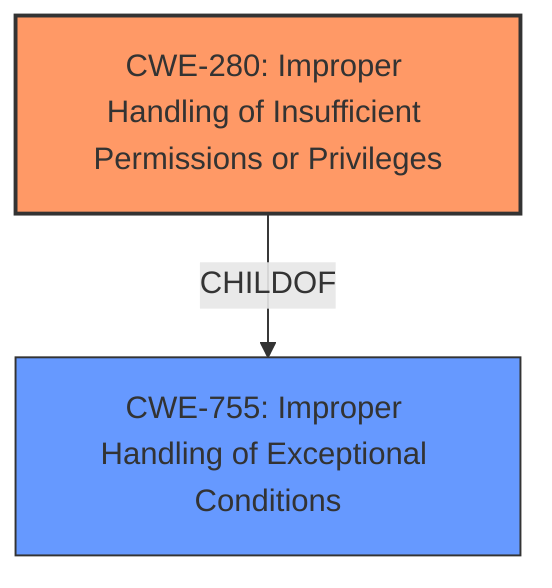

# Analysis Report for CVE-2021-37175

# Vulnerability Analysis Report: CVE-2021-37175

## Description


## Analysis (with Relationship Data)

# Summary
| CWE ID | CWE Name | Confidence | CWE Abstraction Level | CWE Vulnerability Mapping Label | CWE-Vulnerability Mapping Notes |
|---|---|---|---|---|---|
| CWE-280 | Improper Handling of Insufficient Permissions or Privileges | 1.0 | Base | Allowed | Primary CWE |

## Evidence and Confidence

*   **Confidence Score:** 1.0
*   **Evidence Strength:** HIGH

## Relationship Analysis
The primary CWE identified is CWE-280 (Improper Handling of Insufficient Permissions or Privileges), which is a Base level CWE. It is a child of CWE-755 (Improper Handling of Exceptional Conditions). There are no direct chain relationships evident in the description. The choice of CWE-280 is based on the vulnerability description explicitly stating **"improper permission handling"** as the root cause. The other CWEs considered, such as CWE-269, are higher level (Class) and do not provide a more accurate representation of the weakness.



## Vulnerability Chain
The vulnerability chain is relatively simple:
1.  **Root Cause:** **Improper permission handling** (CWE-280) leads to...
2.  **Impact:** An attacker gaining access to an overview of the complete file system on the affected devices.

## Summary of Analysis
The initial analysis strongly supports the selection of CWE-280 as the primary CWE. The vulnerability description and CVE Reference Links Content Summary clearly state that the root cause is **"improper permission handling."** This aligns perfectly with the description of CWE-280, which focuses on **"improper handling of insufficient permissions or privileges."**

The retriever results also support this selection, with CWE-280 being the top combined result. The retriever results indicate that the affected devices do not properly handle permissions to traverse the file system.

The relationship analysis shows that CWE-280 is a base-level CWE, which is the preferred level of abstraction. The mapping guidance for CWE-280 allows its use.

The other CWEs considered, such as CWE-269 (Improper Privilege Management) and CWE-770 (Allocation of Resources Without Limits or Throttling), are not as directly relevant to the described vulnerability. While privilege management is related to permissions, CWE-269 is a more general class of weakness, and CWE-280 provides a more precise description of the issue.

Therefore, based on the available evidence and the CWE specifications, CWE-280 is the most appropriate CWE for this vulnerability. It is at the optimal level of specificity and accurately reflects the root cause of the vulnerability.

Relevant CWE Information:
- CWE-280: Improper Handling of Insufficient Permissions or Privileges
- CWE-269: Improper Privilege Management
- CWE-770: Allocation of Resources Without Limits or Throttling
- CWE-94: Improper Control of Generation of Code ('Code Injection')
- CWE-208: Observable Timing Discrepancy
- CWE-326: Inadequate Encryption Strength
- CWE-78: Improper Neutralization of Special Elements used in an OS Command ('OS Command Injection')
- CWE-20: Improper Input Validation
- CWE-116: Improper Encoding or Escaping of Output
- CWE-401: Missing Release of Memory after Effective Lifetime


## CWE Relationship Analysis

Current CWEs represent these abstraction levels: .


### Vulnerability Chain Analysis

**Chain starting from CWE-20:**
- 20 (Improper Input Validation) - ROOT


**Chain starting from CWE-770:**
- 770 (Allocation of Resources Without Limits or Throttling) - ROOT


### CWE Relationship Diagram

```mermaid
graph TD
    classDef primary fill:#f96,stroke:#333,stroke-width:2px
    classDef secondary fill:#69f,stroke:#333
    classDef tertiary fill:#9e9,stroke:#333
```


*Report generated on 2025-04-01 22:05:44*
