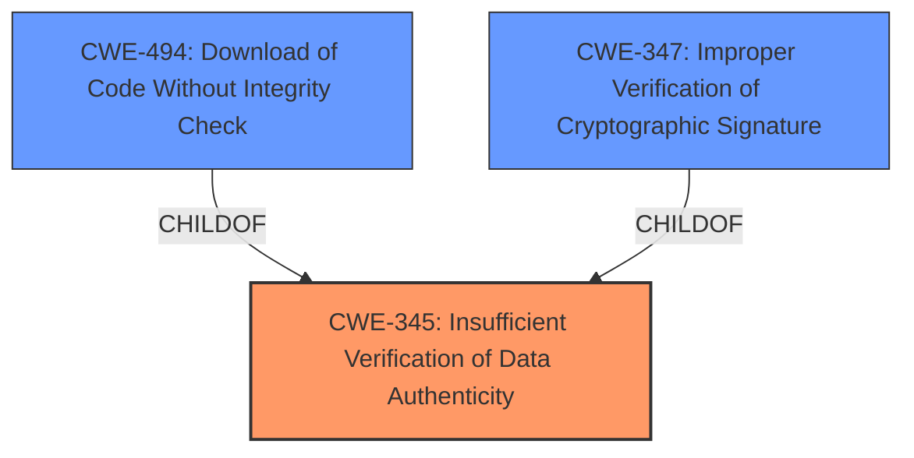

# Enhanced Analysis for CVE-2021-37188

# Summary
| CWE ID | CWE Name | Confidence | CWE Abstraction Level | CWE Vulnerability Mapping Label | CWE-Vulnerability Mapping Notes |
|---|---|---|---|---|---|
| CWE-345 | Insufficient Verification of Data Authenticity | 0.9 | Class | Primary | Allowed-with-Review: Could have lower-level children. |
| CWE-494 | Download of Code Without Integrity Check | 0.7 | Base | Secondary | Allowed |
| CWE-347 | Improper Verification of Cryptographic Signature | 0.6 | Base | Secondary | Allowed |

## Evidence and Confidence

*   **Confidence Score:** 0.8
*   **Evidence Strength:** HIGH

## Relationship Analysis
The primary CWE is CWE-345, which is a class-level CWE. The Retriever Results suggest more specific Base CWEs like CWE-494 and CWE-347. The vulnerability involves a **lack of verification** of the firmware's authenticity, which aligns with the description of CWE-345. The chain relationships highlight the flow: **insufficient verification** leading to potential code execution. The parent-child relationship between CWE-345 and its children was also considered, as it guided me towards more specific options.



## Vulnerability Chain
The vulnerability chain starts with the **bootloader not verifying firmware authenticity**, which leads to the ability to load customized firmware, ultimately changing the gateway's behavior.

Root Cause: **bootloader does not verify firmware authenticity** (CWE-345)
Weakness: **Lack of Data Integrity Checking** (CWE-494, CWE-347)
Impact: Change gateway behavior (compromise of confidentiality, integrity, and availability)

## Summary of Analysis
The initial analysis pointed towards CWE-345 due to the **lack of verification**. However, after considering the Retriever Results and the specific details in the CVE reference links content summary, the analysis was refined to also include CWE-494 and CWE-347.

The final decision is primarily based on the following evidence:

*   Vulnerability Description Key Phrases: "**bootloader does not verify firmware authenticity**"
*   CVE Reference Links Content Summary: "**Lack of Data Integrity Checking:** The primary weakness is that the firmware update process doesn't verify the integrity of the firmware image. This means that a modified or malicious firmware image could be installed on the device."

CWE-345: Insufficient Verification of Data Authenticity is selected as the primary CWE because it directly reflects the **root cause** described in the vulnerability description: the **bootloader's failure to verify firmware authenticity**.

CWE-494: Download of Code Without Integrity Check and CWE-347: Improper Verification of Cryptographic Signature are considered secondary CWEs because they describe the specific mechanism and technology at play. While the **lack of verification** is the primary issue, the fact that the code is downloaded and executed without integrity checks (CWE-494) and that cryptographic signatures are not properly verified (CWE-347) provides additional context.

The selected CWEs are at the optimal level of specificity. While CWE-345 is a Class, it accurately captures the overall weakness. The additional CWEs provide more detailed information about the technical aspects of the vulnerability.

Relevant CWE Information:

# Enhanced Context (25 CWEs)
The following CWEs were identified as potentially relevant to this vulnerability:

## CWE-345: Insufficient Verification of Data Authenticity
**Abstraction Level**: Class
**Similarity Score**: 0.80
**Source**: dense

**Description**:
The product does not sufficiently verify the origin or authenticity of data, in a way that causes it to accept invalid data.

**Mapping Guidance**:
- Usage: Discouraged
- Rationale: This CWE entry is a level-1 Class (i.e., a child of a Pillar). It might have lower-level children that would be more appropriate

## CWE-494: Download of Code Without Integrity Check
**Abstraction Level**: Base
**Similarity Score**: 4.33
**Source**: graph

**Description**:
CWE-494: Download of Code Without Integrity Check

**Mapping Guidance**:
- Usage: Allowed
- Rationale: This CWE entry is at the Base level of abstraction, which is a preferred level of abstraction for mapping to the root causes of vulnerabilities.

## CWE-347: Improper Verification of Cryptographic Signature
**Abstraction Level**: Base
**Similarity Score**: 6255.94
**Source**: sparse

**Description**:
The product does not verify, or incorrectly verifies, the cryptographic signature for data.

**Mapping Guidance**:
- Usage: Allowed
- Rationale: This CWE entry is at the Base level of abstraction, which is a preferred level of abstraction for mapping to the root causes of vulnerabilities.

## Other CWEs Considered but Not Used:

*   CWE-295: Improper Certificate Validation - While certificate validation is related to data authenticity, the description focuses on certificates, which are not explicitly mentioned in the vulnerability description. Therefore, it is not directly applicable.
*   CWE-327: Use of a Broken or Risky Cryptographic Algorithm - The description mentions a proprietary encryption system, but it doesn't explicitly state that the algorithm is broken or risky. The main issue is the **lack of integrity checking**, not necessarily the algorithm itself.
*   CWE-306: Missing Authentication for Critical Function - The description mentions an "authenticated attacker," which implies that authentication is present, but the firmware update process is vulnerable. Therefore, this CWE is not applicable.
*   CWE-78: Improper Neutralization of Special Elements used in an OS Command ('OS Command Injection') - While the attacker can change the gateway's behavior, it's not achieved through OS command injection. It's through loading a completely customized firmware.
*   CWE-287: Improper Authentication - The description mentions an "authenticated attacker," so authentication exists, even if it's bypassed or insufficient in some way.
*   CWE-20: Improper Input Validation - This is too general. The specific issue is with firmware verification, not general input validation.
*   CWE-300: Channel Accessible by Non-Endpoint - This CWE is related to man-in-the-middle attacks. There is no specific evidence of this attack vector.


## CWE Relationship Analysis

Current CWEs represent these abstraction levels: .


### Vulnerability Chain Analysis

**Chain starting from CWE-494:**
- 494 (Download of Code Without Integrity Check) - ROOT


**Chain starting from CWE-306:**
- 306 (Missing Authentication for Critical Function) - ROOT


### CWE Relationship Diagram

```mermaid
graph TD
    classDef primary fill:#f96,stroke:#333,stroke-width:2px
    classDef secondary fill:#69f,stroke:#333
    classDef tertiary fill:#9e9,stroke:#333
```