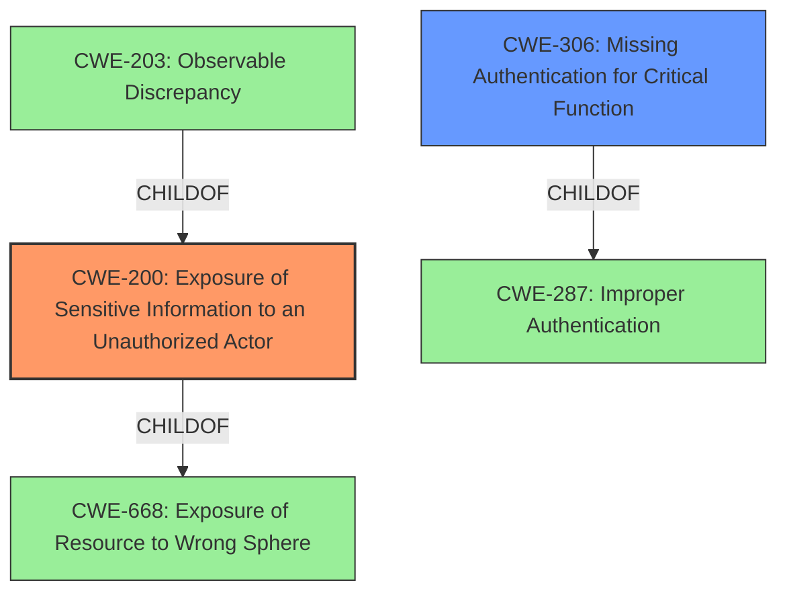

# Analysis Report for CVE-2021-37190

# Vulnerability Analysis Report: CVE-2021-37190

## Description


## Analysis (with Relationship Data)

# Summary
| CWE ID | CWE Name | Confidence | CWE Abstraction Level | CWE Vulnerability Mapping Label | CWE-Vulnerability Mapping Notes |
|---|---|---|---|---|---|
| CWE-200 | Exposure of Sensitive Information to an Unauthorized Actor | 0.9 | Class | Primary | Discouraged |
| CWE-306 | Missing Authentication for Critical Function | 0.6 | Base | Secondary | Allowed |

## Evidence and Confidence

*   **Confidence Score:** 0.75
*   **Evidence Strength:** MEDIUM

## Relationship Analysis
The primary relationship is that CWE-200 [Exposure of Sensitive Information to an Unauthorized Actor] is a child of CWE-668 [Exposure of Resource to Wrong Sphere]. CWE-203 [Observable Discrepancy] is also a child of CWE-200, representing a more specific form of information exposure. CWE-306 [Missing Authentication for Critical Function] is a child of CWE-287 [Improper Authentication], indicating that the function lacks any authentication mechanism. These hierarchical relationships help refine the selection, favoring CWE-200 due to its direct relevance to the vulnerability description. CWE-284 [Improper Access Control] is a high-level pillar that is too general to be a good fit.



## Vulnerability Chain
The vulnerability chain starts with the **lack of proper access control** and authentication mechanisms, which leads to the **exposure of sensitive VPN connection information** to an unauthorized actor.
  - Missing Authentication for Critical Function (CWE-306) --> Exposure of Sensitive Information to an Unauthorized Actor (CWE-200)

## Summary of Analysis
The initial assessment identified CWE-200 [Exposure of Sensitive Information to an Unauthorized Actor] as the primary weakness, supported by the vulnerability description's emphasis on information disclosure. The description states: "The affected software has an information disclosure vulnerability that could allow an attacker to retrieve VPN connection for a known user." However, it is stated that CWE-200 is "commonly misused to represent the loss of confidentiality in a vulnerability, but confidentiality loss is a technical impact - not a root cause error."

Further analysis considered the root cause of the information disclosure. The CVE Reference Links Content Summary states that the attacker "does not need to be authenticated to exploit this issue." This points to a missing authentication mechanism that allows unauthorized access to the VPN connection details. Therefore, CWE-306 [Missing Authentication for Critical Function] was considered as a secondary weakness that contributes to the vulnerability. The analysis is based on the provided evidence, specifically the vulnerability description and CVE reference links content summary.

The selection of CWE-200 [Exposure of Sensitive Information to an Unauthorized Actor] is based on the direct impact of the vulnerability, which is the exposure of VPN connection information. While CWE-200 is generally discouraged as a primary mapping due to its high-level nature, in this case, it accurately reflects the immediate consequence of the vulnerability.

CWE-306 [Missing Authentication for Critical Function] is selected as a secondary weakness because it represents the underlying root cause that enables the information disclosure. The absence of authentication for accessing VPN connection details allows an attacker to retrieve this information without proper authorization.

The selected CWEs are at the optimal level of specificity because they directly address the vulnerability's impact and root cause. CWE-200 captures the information disclosure aspect, while CWE-306 identifies the missing authentication mechanism.

Relevant CWE Information:

# Enhanced Context (25 CWEs)
The following CWEs were identified as potentially relevant to this vulnerability:

## CWE-807: Reliance on Untrusted Inputs in a Security Decision
**Abstraction Level**: Base
**Similarity Score**: 0.76
**Source**: dense

**Description**:
The product uses a protection mechanism that relies on the existence or values of an input, but the input can be modified by an untrusted actor in a way that bypasses the protection mechanism.

**Mapping Guidance**:
- Usage: Allowed
- Rationale: This CWE entry is at the Base level of abstraction, which is a preferred level of abstraction for mapping to the root causes of vulnerabilities.
*Not Selected*: This vulnerability doesn't rely on modifying inputs, but rather the absence of authentication.

## CWE-303: Incorrect Implementation of Authentication Algorithm
**Abstraction Level**: Base
**Similarity Score**: 0.75
**Source**: dense

**Description**:
The requirements for the product dictate the use of an established authentication algorithm, but the implementation of the algorithm is incorrect.

**Mapping Guidance**:
- Usage: Allowed
- Rationale: This CWE entry is at the Base level of abstraction, which is a preferred level of abstraction for mapping to the root causes of vulnerabilities.
*Not Selected*: The vulnerability description doesn't state that an authentication algorithm was incorrectly implemented.

## CWE-404: Improper Resource Shutdown or Release
**Abstraction Level**: Class
**Similarity Score**: 0.75
**Source**: dense

**Description**:
The product does not release or incorrectly releases a resource before it is made available for re-use.

**Mapping Guidance**:
- Usage: Allowed-with-Review
- Rationale: This CWE entry is a Class and might have Base-level children that would be more appropriate
*Not Selected*: This doesn't relate to the vulnerability description.

## CWE-668: Exposure of Resource to Wrong Sphere
**Abstraction Level**: Class
**Similarity Score**: 0.75
**Source**: dense

**Description**:
The product exposes a resource to the wrong control sphere, providing unintended actors with inappropriate access to the resource.

**Mapping Guidance**:
- Usage: Discouraged
- Rationale: CWE-668 is high-level and is often misused as a catch-all when lower-level CWE IDs might be applicable. It is sometimes used for low-information vulnerability reports [REF-1287]. It is a level-1 Class (i.e., a child of a Pillar). It is not useful for trend analysis.
*Not Selected*: This is too high-level.

## CWE-799: Improper Control of Interaction Frequency
**Abstraction Level**: Class
**Similarity Score**: 0.75
**Source**: dense

**Description**:
The product does not properly limit the number or frequency of interactions that it has with an actor, such as the number of incoming requests.

**Mapping Guidance**:
- Usage: Allowed-with-Review
- Rationale: This CWE entry is a Class and might have Base-level children that would be more appropriate
*Not Selected*: The vulnerability doesn't relate to interaction frequency.

## CWE-226: Sensitive Information in Resource Not Removed Before Reuse
**Abstraction Level**: Base
**Similarity Score**: 0.75
**Source**: dense

**Description**:
The product releases a resource such as memory or a file so that it can be made available for reuse, but it does not clear or "zeroize" the information contained in the resource before the product performs a critical state transition or makes the resource available for reuse by other entities.

**Mapping Guidance**:
- Usage: Allowed
- Rationale: This CWE entry is at the Base level of abstraction, which is a preferred level of abstraction for mapping to the root causes of vulnerabilities.
*Not Selected*: The vulnerability doesn't relate to resource reuse.

## CWE-274: Improper Handling of Insufficient Privileges
**Abstraction Level**: Base
**Similarity Score**: 0.75
**Source**: dense

**Description**:
The product does not handle or incorrectly handles when it has insufficient privileges to perform an operation, leading to resultant weaknesses.

**Mapping Guidance**:
- Usage: Discouraged
- Rationale: This CWE entry could be deprecated in a future version of CWE.
*Not Selected*: Doesn't describe the vulnerability.

## CWE-405: Asymmetric Resource Consumption (Amplification)
**Abstraction Level**: Class
**Similarity Score**: 0.75
**Source**: dense

**Description**:
The product does not properly control situations in which an adversary can cause the product to consume or produce excessive resources without requiring the adversary to invest equivalent work or otherwise prove authorization, i.e., the adversary's influence is "asymmetric."

**Mapping Guidance**:
- Usage: Allowed-with-Review
-


## CWE Relationship Analysis

Current CWEs represent these abstraction levels: .


### Vulnerability Chain Analysis

**Chain starting from CWE-306:**
- 306 (Missing Authentication for Critical Function) - ROOT


**Chain starting from CWE-303:**
- 303 (Incorrect Implementation of Authentication Algorithm) - ROOT


### CWE Relationship Diagram

```mermaid
graph TD
    classDef primary fill:#f96,stroke:#333,stroke-width:2px
    classDef secondary fill:#69f,stroke:#333
    classDef tertiary fill:#9e9,stroke:#333
```


*Report generated on 2025-04-01 17:28:49*
