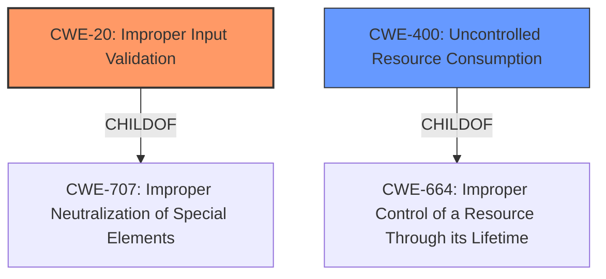

# Enhanced Analysis for CVE-2021-37206

# Summary
| CWE ID | CWE Name | Confidence | CWE Abstraction Level | CWE Vulnerability Mapping Label | CWE-Vulnerability Mapping Notes |
|---|---|---|---|---|---|
| CWE-20 | Improper Input Validation | 0.9 | Class | Primary | Discouraged. Although discouraged, this is the most accurate based on the current evidence.  |
| CWE-400 | Uncontrolled Resource Consumption | 0.6 | Class | Secondary | Discouraged. Considered due to the device restart, but the root cause is the input validation.|

## Evidence and Confidence

*   **Confidence Score:** 0.9
*   **Evidence Strength:** HIGH

## Relationship Analysis
The primary relationship that impacted the decision was the ChildOf relationship. CWE-20 **Improper Input Validation** is a child of CWE-707 which indicates that the product is not validating the input correctly. CWE-400 **Uncontrolled Resource Consumption** is a child of CWE-664 which implies that the product does not properly control the allocation and maintenance of a limited resource.



## Vulnerability Chain
The chain of root cause and weaknesses that followed for the Vulnerability Description:
1.  **Root Cause:** The SIPROTEC 5 relays **improperly process received web packets**.
2.  **Weakness:** This **improper processing** leads to a denial-of-service vulnerability due to **improper input validation**.
3.  **Impact:** An attacker can send specially crafted packets to force a restart of the target device, leading to a denial of service.

## Summary of Analysis
The initial assessment pointed towards CWE-20 **Improper Input Validation** because the vulnerability description and the CVE reference summary both highlight the lack of proper input validation of received web packets as the root cause. The **weakness** is that "received web packets are **not properly processed**." The reference links state "The web interface of SIPROTEC 5 devices does **not properly process** received web packets, leading to a denial-of-service vulnerability. The specific **weakness** identified is CWE-20: **Improper Input Validation**."

CWE-400 **Uncontrolled Resource Consumption** was considered because the attack leads to a device restart, which implies resource exhaustion. However, the root cause is the **improper input validation**, so CWE-20 is the more appropriate primary classification.

The relationships in the graph influenced the selection by providing context about the parent CWEs, which helped in understanding the broader context of the identified weaknesses.

CWE-20 is at the Class level, which is typically discouraged, however the suggested alternatives such as CWE-1284, CWE-1285, CWE-1286, CWE-1287, CWE-1288, and CWE-1289 are more specific types of **improper input validation** and there is not enough evidence in the description to select one of these. The evidence only states "improper packet processing" and "specially crafted packets".


## CWE Relationship Analysis

Current CWEs represent these abstraction levels: .


### Vulnerability Chain Analysis

**Chain starting from CWE-1286:**
- 1286 (Improper Validation of Syntactic Correctness of Input) - ROOT


**Chain starting from CWE-664:**
- 664 (Improper Control of a Resource Through its Lifetime) - ROOT


### CWE Relationship Diagram

```mermaid
graph TD
    classDef primary fill:#f96,stroke:#333,stroke-width:2px
    classDef secondary fill:#69f,stroke:#333
    classDef tertiary fill:#9e9,stroke:#333
```