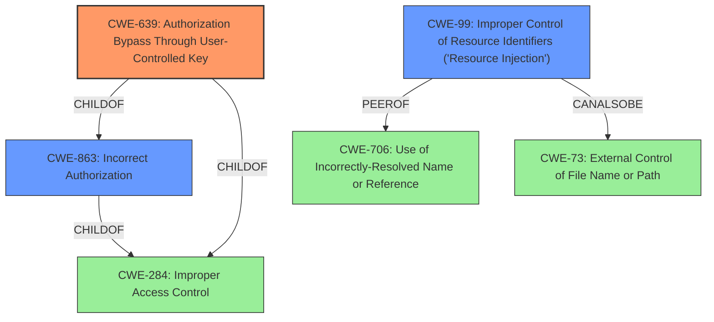

# Analysis for CVE-2021-37213

# Summary
| CWE ID | CWE Name | Confidence | CWE Abstraction Level | CWE Vulnerability Mapping Label | CWE-Vulnerability Mapping Notes |
|---|---|---|---|---|---|
| CWE-639 | Authorization Bypass Through User-Controlled Key | 0.9 | Base | Allowed | Primary CWE |
| CWE-99 | Improper Control of Resource Identifiers ('Resource Injection') | 0.7 | Class | Allowed-with-Review | Secondary Candidate |
| CWE-863 | Incorrect Authorization | 0.6 | Class | Allowed-with-Review | Secondary Candidate |

## Evidence and Confidence

*   **Confidence Score:** 0.9
*   **Evidence Strength:** HIGH

## Relationship Analysis
The primary CWE selected is CWE-639, which is a base-level CWE. It is a child of both CWE-863 (Incorrect Authorization) and CWE-284 (Improper Access Control). CWE-99 is a peer of CWE-706 (Use of Incorrectly-Resolved Name or Reference) and can also be CWE-73 (External Control of File Name or Path). These relationships suggest a hierarchy where a general authorization issue (CWE-284) leads to a more specific authorization bypass (CWE-639) through manipulation of resource identifiers (CWE-99). The base-level CWE-639 is chosen for its specificity to the vulnerability.

## Vulnerability Chain
The vulnerability chain starts with the **Insecure Direct Object Reference (IDOR) vulnerability**, where an authenticated user can manipulate parameters (employee ID and date) to access other employees' check-in records. This leads to unauthorized access to sensitive information. The chain consists of:
1.  **Improper authorization check (root cause):** The system **fails to properly** verify if the authenticated user is authorized to access the check-in record of the specified employee.
2.  **User-controlled key:** The employee ID and date are directly controlled by the user through modifiable parameters.
3.  **Unauthorized access (impact):** The attacker can access check-in records of other employees.

## Summary of Analysis
The initial assessment identified the **Insecure Direct Object Reference (IDOR) vulnerability** as the root cause. The Retriever results and complete CWE specifications were reviewed to select the most appropriate CWE.

The final decision is based on the following:

*   **CWE-639 (Authorization Bypass Through User-Controlled Key):** This CWE accurately captures the essence of the vulnerability, where attackers can modify key values (employee ID and date) to bypass authorization checks and access unauthorized data. The vulnerability description states that remote attackers can "manipulate the employee ID and date in specific parameters to access particular employees check-in record," which aligns perfectly with CWE-639's description: "The system's authorization functionality does not prevent one user from gaining access to another user's data or record by modifying the key value identifying the data."
*   **CWE-99 (Improper Control of Resource Identifiers ('Resource Injection'))**: This CWE was considered as a secondary candidate because the IDOR vulnerability allows attackers to specify identifiers (employee ID and date) to access resources outside their intended sphere of control. However, CWE-639 is more specific to authorization bypass, making it a better fit.
*   **CWE-863 (Incorrect Authorization):** This CWE was also considered, as the vulnerability involves an authorization check that is not correctly performed. However, CWE-639 provides a more precise description of how the authorization is bypassed through user-controlled keys.

The selected CWEs are at the optimal level of specificity. CWE-639 is a base-level CWE, providing a detailed description of the vulnerability. While CWE-863 is a class-level CWE, it is too generic and doesn't capture the specific mechanism of the authorization bypass. The selection is justified by the evidence from the vulnerability description and the CWE specifications.