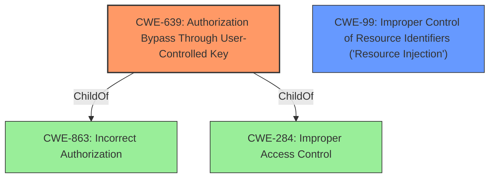

# Enhanced Analysis for CVE-2021-37214

# Summary
| CWE ID | CWE Name | Confidence | CWE Abstraction Level | CWE Vulnerability Mapping Label | CWE-Vulnerability Mapping Notes |
|---|---|---|---|---|---|
| CWE-639 | Authorization Bypass Through User-Controlled Key | 1.0 | Base | Allowed | Primary CWE |
| CWE-99 | Improper Control of Resource Identifiers ('Resource Injection') | 0.8 | Class | Allowed-with-Review | Secondary Candidate |

## Evidence and Confidence

*   **Confidence Score:** 0.9
*   **Evidence Strength:** HIGH

## Relationship Analysis
The primary CWE is CWE-639, which is a Base level CWE and is related to authorization bypass. CWE-99 is a Class-level CWE and is broader. CWE-639 is a child of CWE-863 and CWE-284, both related to authorization issues.



## Vulnerability Chain
The vulnerability chain starts with the **Insecure Direct Object Reference** (IDOR), which leads to unauthorized access and modification of employee data. This, in turn, allows the attacker to obtain administrator privileges and execute arbitrary commands. The root cause is the IDOR, and the impacts are privilege escalation and command execution.

## Summary of Analysis
The vulnerability description clearly states an **Insecure Direct Object Reference** (IDOR) vulnerability. This aligns directly with CWE-639, "Authorization Bypass Through User-Controlled Key." The description indicates that an authenticated general user can manipulate employee IDs in parameters to access and modify employee data. This falls squarely within the definition of CWE-639, where a user-controlled key (the employee ID) is used to bypass authorization and access another user's data. The retriever results also strongly suggest CWE-639 as the primary candidate. The evidence from the vulnerability description is: "remote attackers can manipulate the employee ID in specific parameters to arbitrary access employees data, modify it, and then obtain administrator privilege and execute arbitrary command."

CWE-99, "Improper Control of Resource Identifiers ('Resource Injection')", was also considered but is a broader Class-level CWE. While it could apply, CWE-639 is more specific to the authorization bypass aspect of the vulnerability, making it a better fit.

CWE-285, "Improper Authorization," is too high-level and doesn't capture the specifics of the IDOR vulnerability. CWE-732, "Incorrect Permission Assignment for Critical Resource," doesn't accurately describe the vulnerability, as it's not about incorrect permission assignments but rather a bypass of authorization through a manipulated key. CWE-425, "Direct Request ('Forced Browsing')," is also not the primary issue, as the vulnerability involves manipulating an identifier rather than directly accessing resources. CWE-306 "Missing Authentication for Critical Function" is not correct, since the user is authenticated as a general user.

Therefore, CWE-639 is the most appropriate CWE because it directly addresses the **root cause** of the vulnerability: the ability to bypass authorization by manipulating a user-controlled key. This is a Base level CWE, providing the right level of specificity.


## CWE Relationship Analysis

Current CWEs represent these abstraction levels: .


### Vulnerability Chain Analysis

**Chain starting from CWE-732:**
- 732 (Incorrect Permission Assignment for Critical Resource) - ROOT


**Chain starting from CWE-306:**
- 306 (Missing Authentication for Critical Function) - ROOT


### CWE Relationship Diagram

```mermaid
graph TD
    classDef primary fill:#f96,stroke:#333,stroke-width:2px
    classDef secondary fill:#69f,stroke:#333
    classDef tertiary fill:#9e9,stroke:#333
```