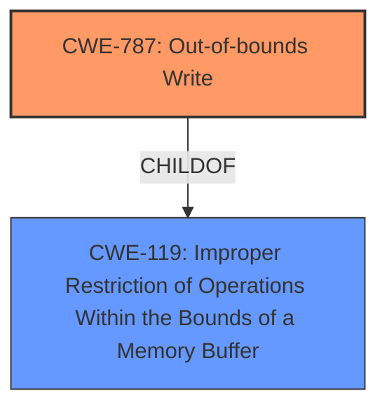

# Enhanced Analysis for CVE-2021-37220

# Summary
| CWE ID | CWE Name | Confidence | CWE Abstraction Level | CWE Vulnerability Mapping Label | CWE-Vulnerability Mapping Notes |
|---|---|---|---|---|---|
| CWE-787 | Out-of-bounds Write | 1.0 | Base | Allowed | Primary CWE |

## Evidence and Confidence

*   **Confidence Score:** 1.0
*   **Evidence Strength:** HIGH

## Relationship Analysis
The primary CWE is CWE-787, which is a base-level CWE. It has parent CWEs of CWE-119. It is a single CWE without any chain relationships in this case. The other CWEs considered did not fit well because they represented different types of errors (integer overflows, incorrect size calculations).



## Vulnerability Chain
The chain of root cause and weaknesses that followed for the Vulnerability Description:
  - **Root Cause:** The cached color converter does not properly consider the maximum key size of a hash table
  - **Weakness:** **Out-of-bounds write** because the cached color converter does not properly consider the maximum key size of a hash table.
  - **Impact:** Program crash (segmentation fault).

## Summary of Analysis
The vulnerability is clearly described as an **out-of-bounds write**. The "Vulnerability Description" states: "MuPDF through 1.18.1 has an **out-of-bounds write** because the cached color converter does not properly consider the maximum key size of a hash table." The "CVE Reference Links Content Summary" elaborates: "**Out-of-bounds write**: When a color conversion key exceeds the maximum size allowed by the hash table, it results in an out-of-bounds write." This strong evidence supports the selection of CWE-787.

CWE-787 (Out-of-bounds Write) is the best match because it directly describes the vulnerability. The description of CWE-787 states: "The product writes data past the end, or before the beginning, of the intended buffer." This perfectly aligns with the vulnerability description. The CWE-787 entry is at the Base level of abstraction, which is the preferred level. The mapping guidance also specifies "Usage: Allowed" with the rationale that "This CWE entry is at the Base level of abstraction, which is a preferred level of abstraction for mapping to the root causes of vulnerabilities."

Other CWEs were considered but ultimately rejected:

*   CWE-131 (Incorrect Calculation of Buffer Size): While a size calculation might be involved, the core issue is writing beyond the buffer, not the calculation itself.
*   CWE-190 (Integer Overflow or Wraparound): No integer overflow is mentioned in the vulnerability description.
*   CWE-125 (Out-of-bounds Read): The vulnerability is an out-of-bounds *write*, not a read.
*   CWE-1284 (Improper Validation of Specified Quantity in Input): Could be a contributing factor, but the OOB write is the direct weakness.
*   CWE-197 (Numeric Truncation Error): There is no mention of truncation errors.

The selection of CWE-787 is at the optimal level of specificity because it is a base-level CWE that accurately represents the root cause.


## CWE Relationship Analysis

Current CWEs represent these abstraction levels: .


### Vulnerability Chain Analysis

**Chain starting from CWE-787:**
- 787 (Out-of-bounds Write) - ROOT


**Chain starting from CWE-197:**
- 197 (Numeric Truncation Error) - ROOT


### CWE Relationship Diagram

```mermaid
graph TD
    classDef primary fill:#f96,stroke:#333,stroke-width:2px
    classDef secondary fill:#69f,stroke:#333
    classDef tertiary fill:#9e9,stroke:#333
```