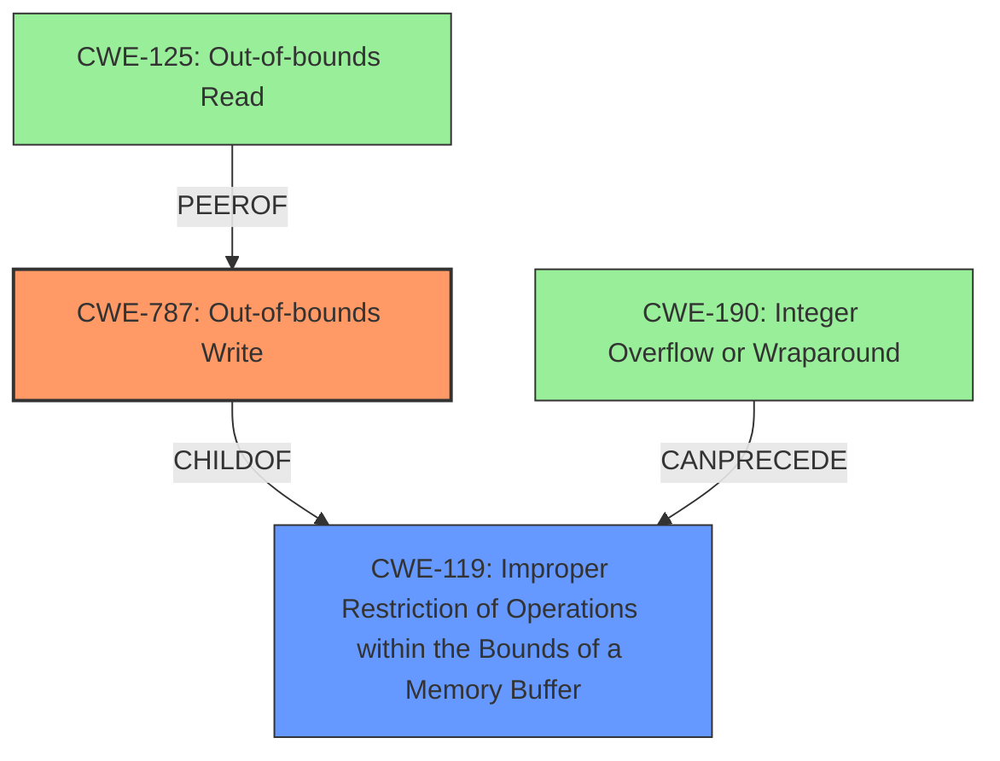

# Raw Analyzer Response for CVE-2021-37222

# Summary
| CWE ID | CWE Name | Confidence | CWE Abstraction Level | CWE Vulnerability Mapping Label | CWE-Vulnerability Mapping Notes |
|---|---|---|---|---|---|
| CWE-787 | Out-of-bounds Write | 1.0 | Base | Allowed | Primary CWE |
| CWE-119 | Improper Restriction of Operations within the Bounds of a Memory Buffer | 0.6 | Class | Discouraged | Secondary Candidate |
| CWE-125 | Out-of-bounds Read | 0.5 | Base | Allowed | Secondary Candidate |
| CWE-190 | Integer Overflow or Wraparound | 0.4 | Base | Allowed | Secondary Candidate |

## Evidence and Confidence

*   **Confidence Score:** 0.8
*   **Evidence Strength:** HIGH

## Relationship Analysis
The primary relationship that influenced the decision was the ChildOf relationship between CWE-787 and CWE-119. While CWE-119 is a broader category, the specific nature of the vulnerability as an out-of-bounds write makes CWE-787 a more precise classification.

## Vulnerability Chain
The vulnerability chain involves a lack of proper bounds checking, leading to an out-of-bounds write, which then results in memory corruption and potential code execution or denial of service.

## Summary of Analysis
The initial assessment strongly points towards CWE-787 (Out-of-bounds Write) as the primary weakness. The "CVE Reference Links Content Summary" explicitly mentions a **buffer overflow** due to a **lack of proper bounds checking** when copying data related to VLAN tags. This aligns directly with the description of CWE-787, where the product writes data past the end of the intended buffer. The fix implemented in the commit diff, introducing bounds checking, further supports this classification. While CWE-119 (Improper Restriction of Operations within the Bounds of a Memory Buffer) is a parent of CWE-787, it is discouraged for use when more specific CWEs are available. Therefore, CWE-787 is the more appropriate choice.

Other CWEs considered include:

*   CWE-125 (Out-of-bounds Read): Although related to buffer access issues, the primary vulnerability described is a write, not a read.
*   CWE-190 (Integer Overflow or Wraparound): While integer overflows can sometimes precede buffer overflows, the provided information does not explicitly indicate an integer overflow as the root cause in this case. The core issue is the lack of bounds checking during the copy operation.
*   CWE-20 (Improper Input Validation): Input validation is important but the code uses `std::copy` and `std::copy_n` without ensuring that the source data is within the bounds of the packet buffer, and that the destination has enough room for the copy, potentially leading to a buffer overflow. This is less about validation and more about the copy and destination issues.

The final decision is based on the clear evidence of an out-of-bounds write due to missing bounds checking, making CWE-787 the most accurate and specific classification.

Relevant CWE Information:

# Enhanced Context (25 CWEs)

## CWE-787: Out-of-bounds Write
**Abstraction:** Base
**Status:** Draft

### Description
The product writes data past the end, or before the beginning, of the intended buffer.

### Extended Description
Not provided

### Alternative Terms
Memory Corruption: Often used to describe the consequences of writing to memory outside the bounds of a buffer, or to memory that is otherwise invalid.

### Relationships
ChildOf -> CWE-119

### Mapping Guidance
**Usage:** Allowed
**Rationale:** This CWE entry is at the Base level of abstraction, which is a preferred level of abstraction for mapping to the root causes of vulnerabilities.
**Comments:** Carefully read both the name and description to ensure that this mapping is an appropriate fit. Do not try to 'force' a mapping to a lower-level Base/Variant simply to comply with this preferred level of abstraction.
**Reasons:**
- Acceptable-Use

### Observed Examples
- **CVE-2023-1017:** The reference implementation code for a Trusted Platform Module does not implement length checks on data, allowing for an attacker to write 2 bytes past the end of a buffer.
- **CVE-2021-21220:** Chain: insufficient input validation (CWE-20) in browser allows heap corruption (CWE-787), as exploited in the wild per CISA KEV.
- **CVE-2021-28664:** GPU kernel driver allows memory corruption because a user can obtain read/write access to read-only pages, as exploited in the wild per CISA KEV.