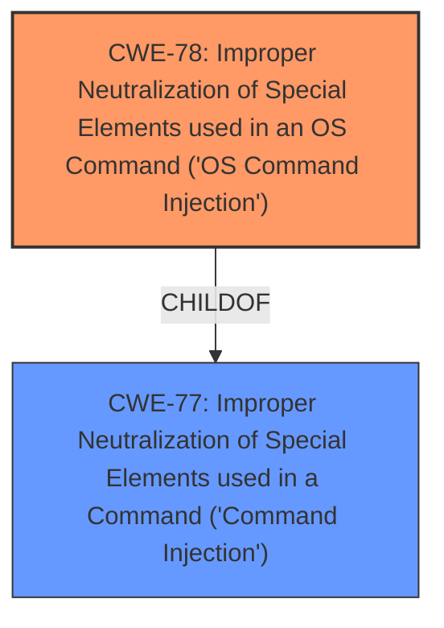

# Enhanced Analysis for CVE-2021-3723

# Summary
| CWE ID | CWE Name | Confidence | CWE Abstraction Level | CWE Vulnerability Mapping Label | CWE-Vulnerability Mapping Notes |
|---|---|---|---|---|---|
| CWE-78 | Improper Neutralization of Special Elements used in an OS Command ('OS Command Injection') | 1.0 | Base | Allowed | Primary CWE |

## Evidence and Confidence

*   **Confidence Score:** 1.0
*   **Evidence Strength:** HIGH

## Relationship Analysis
The primary relationship that impacted my decision was the ChildOf relationship between CWE-78 and CWE-77. CWE-78 is a more specific Base level CWE that is about **Improper Neutralization of Special Elements used in an OS Command ('OS Command Injection')**, whereas CWE-77 is a Class level CWE about **Improper Neutralization of Special Elements used in a Command ('Command Injection')**. Since the vulnerability description clearly indicates that this is an OS Command injection, CWE-78 is the more appropriate choice.



## Vulnerability Chain
The vulnerability chain is straightforward:
1.  The root cause is the **improper neutralization** of special elements in an OS command.
2.  The weakness allows an attacker to **execute operating system commands**.

## Summary of Analysis
The initial analysis and resulting conclusion are based on the provided evidence, which strongly supports the classification of this vulnerability as CWE-78. The vulnerability description explicitly mentions "**command injection**" and the ability to "**execute operating system commands**," aligning perfectly with the definition of CWE-78.

The graph relationships influenced the final selection by confirming that CWE-78 is a more specific instance of CWE-77, which is a more general class of command injection vulnerabilities. Since the description clearly indicates that this is related to OS commands, CWE-78 is the optimal choice.

The selected CWE is at the optimal level of specificity because it directly addresses the root cause of the vulnerability: the **improper neutralization** of special elements in an OS command, allowing for arbitrary command execution.

Relevant CWE Information:

# Enhanced Context (25 CWEs)
The following CWEs were identified as potentially relevant to this vulnerability:

## CWE-1240: Use of a Cryptographic Primitive with a Risky Implementation
**Abstraction Level**: Base
**Similarity Score**: 0.78
**Source**: dense
## CWE-327: Use of a Broken or Risky Cryptographic Algorithm
**Abstraction Level**: Class
**Similarity Score**: 0.74
**Source**: dense
## CWE-328: Use of Weak Hash
**Abstraction Level**: Base
**Similarity Score**: 0.74
**Source**: dense
## CWE-1289: Improper Validation of Unsafe Equivalence in Input
**Abstraction Level**: Base
**Similarity Score**: 0.73
**Source**: dense
## CWE-807: Reliance on Untrusted Inputs in a Security Decision
**Abstraction Level**: Base
**Similarity Score**: 0.73
**Source**: dense
## CWE-1391: Use of Weak Credentials
**Abstraction Level**: Class
**Similarity Score**: 0.73
**Source**: dense
## CWE-657: Violation of Secure Design Principles
**Abstraction Level**: Class
**Similarity Score**: 0.73
**Source**: dense
## CWE-330: Use of Insufficiently Random Values
**Abstraction Level**: Class
**Similarity Score**: 0.73
**Source**: dense
## CWE-319: Cleartext Transmission of Sensitive Information
**Abstraction Level**: Base
**Similarity Score**: 0.72
**Source**: dense
## CWE-345: Insufficient Verification of Data Authenticity
**Abstraction Level**: Class
**Similarity Score**: 0.72
**Source**: dense
## CWE-79: Improper Neutralization of Input During Web Page Generation ('Cross-site Scripting')
**Abstraction Level**: Base
**Similarity Score**: 10101.91
**Source**: sparse
## CWE-116: Improper Encoding or Escaping of Output
**Abstraction Level**: Class
**Similarity Score**: 10067.73
**Source**: sparse
## CWE-22: Improper Limitation of a Pathname to a Restricted Directory ('Path Traversal')
**Abstraction Level**: Base
**Similarity Score**: 10046.98
**Source**: sparse
## CWE-88: Improper Neutralization of Argument Delimiters in a Command ('Argument Injection')
**Abstraction Level**: Base
**Similarity Score**: 9882.33
**Source**: sparse
## CWE-138: Improper Neutralization of Special Elements
**Abstraction Level**: Class
**Similarity Score**: 9841.56
**Source**: sparse
## CWE-78: Improper Neutralization of Special Elements used in an OS Command ('OS Command Injection')
**Abstraction Level**: base
**Similarity Score**: 5.03
**Source**: graph
## CWE-79: Improper Neutralization of Input During Web Page Generation ('Cross-site Scripting')
**Abstraction Level**: base
**Similarity Score**: 5.03
**Source**: graph
## CWE-41: Improper Resolution of Path Equivalence
**Abstraction Level**: base
**Similarity Score**: 5.03
**Source**: graph
## CWE-494: Download of Code Without Integrity Check
**Abstraction Level**: base
**Similarity Score**: 4.33
**Source**: graph
## CWE-22: Improper Limitation of a Pathname to a Restricted Directory ('Path Traversal')
**Abstraction Level**: base
**Similarity Score**: 4.33
**Source**: graph
## CWE-770: Allocation of Resources Without Limits or Throttling
**Abstraction Level**: base
**Similarity Score**: 4.33
**Source**: graph
## CWE-190: Integer Overflow or Wraparound
**Abstraction Level**: base
**Similarity Score**: 4.33
**Source**: graph
## CWE-94: Improper Control of Generation of Code ('Code Injection')
**Abstraction Level**: base
**Similarity Score**: 3.89
**Source**: graph
## CWE-88: Improper Neutralization of Argument Delimiters in a Command ('Argument Injection')
**Abstraction Level**: base
**Similarity Score**: 3.64
**Source**: graph
## CWE-1284: Improper Validation of Specified Quantity in Input
**Abstraction Level**: base
**Similarity Score**: 3.42
**Source**: graph

**CWE-77: Improper Neutralization of Special Elements used in a Command ('Command Injection')** was considered but not used because it is a more general, Class-level CWE. While the vulnerability does involve command injection, it is specifically OS command injection, making CWE-78 a more accurate and specific classification.

**CWE-20: Improper Input Validation** was considered but not used because it is a very broad CWE and the specific weakness is known: **improper neutralization of special elements**.

**CWE-74: Improper Neutralization of Special Elements in Output Used by a Downstream Component ('Injection')** was considered but not used because CWE-78 is more specific and accurately reflects the root cause.


## CWE Relationship Analysis

Current CWEs represent these abstraction levels: .


### Vulnerability Chain Analysis

**Chain starting from CWE-116:**
- 116 (Improper Encoding or Escaping of Output) - ROOT


**Chain starting from CWE-330:**
- 330 (Use of Insufficiently Random Values) - ROOT


### CWE Relationship Diagram

```mermaid
graph TD
    classDef primary fill:#f96,stroke:#333,stroke-width:2px
    classDef secondary fill:#69f,stroke:#333
    classDef tertiary fill:#9e9,stroke:#333
```