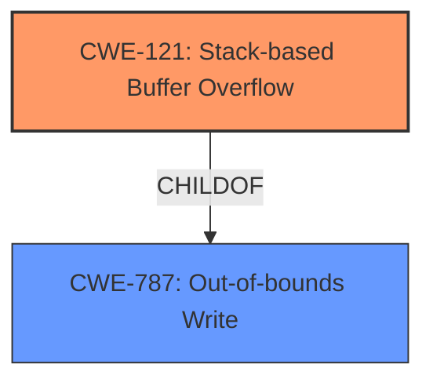

# Analysis for CVE-2021-37232

# Summary
| CWE ID | CWE Name | Confidence | CWE Abstraction Level | CWE Vulnerability Mapping Label | CWE-Vulnerability Mapping Notes |
|---|---|---|---|---|---|
| CWE-121 | Stack-based Buffer Overflow | 1.0 | Variant | Allowed | Primary CWE |

## Evidence and Confidence

*   **Confidence Score:** 1.0
*   **Evidence Strength:** HIGH

## Relationship Analysis
The primary relationship influencing the selection was the parent-child relationship between CWE-787 (Out-of-bounds Write) and CWE-121 (Stack-based Buffer Overflow), with CWE-121 being a specific variant of CWE-787.

## Vulnerability Chain
The vulnerability chain consists of a **stack overflow** due to a lack of buffer size which results in an out-of-bounds write on the stack.

## Summary of Analysis
The initial analysis identified a **stack overflow** vulnerability in Atomicparsley. The evidence provided in the "CVE Reference Links Content Summary" clearly indicates a stack-based buffer overflow due to **insufficient buffer size** when reading data in the `APar_read64` function. The buffer `uint32_buffer` is allocated with 5 bytes, but an 8-byte write operation (`fread`) is attempted, leading to the overflow.

The Retriever Results also highlighted CWE-121 (Stack-based Buffer Overflow) as the top candidate with a score of 1.0.

Given the clear evidence of a stack-based buffer overflow and the high score from the retriever, CWE-121 is the most appropriate mapping. It accurately represents the specific type of buffer overflow occurring on the stack.

CWE-121 is at the Variant level of abstraction, which is the preferred level.

Relevant CWE Information:

# Enhanced Context (25 CWEs)
The following CWEs were identified as potentially relevant to this vulnerability:

## CWE-121: Stack-based Buffer Overflow
**Abstraction:** Variant
**Similarity Score**: 1.000
**Source**: alternate_terms

**Description**:
A stack-based buffer overflow condition is a condition where the buffer being overwritten is allocated on the stack (i.e., is a local variable or, rarely, a parameter to a function).

## CWE-190: Integer Overflow or Wraparound
**Abstraction Level**: Base
**Similarity Score**: 0.800
**Source**: alternate_terms

**Description**:
The product performs a calculation that can
         produce an integer overflow or wraparound when the logic
         assumes that the resulting value will always be larger than
         the original value. This occurs when an integer value is
         incremented to a value that is too large to store in the
         associated representation. When this occurs, the value may
         become a very small or negative number.

## CWE-787: Out-of-bounds Write
**Abstraction Level**: Base
**Similarity Score**: 3.30
**Source**: graph

**Description**:
CWE-787: Out-of-bounds Write

**Mapping Guidance**:
- Usage: Allowed
- Rationale: This CWE entry is at the Base level of abstraction, which is a preferred level of abstraction for mapping to the root causes of vulnerabilities.