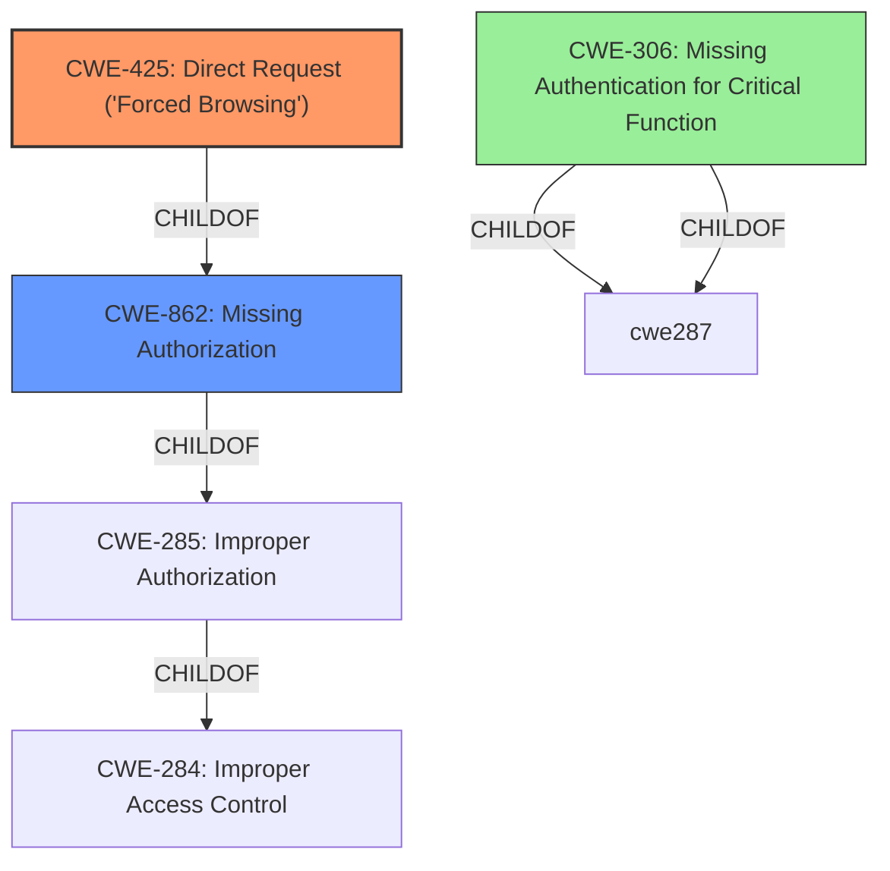

# Raw Analyzer Response for CVE-2021-37270

# Summary
| CWE ID  | CWE Name                                                                                                | Confidence | CWE Abstraction Level | CWE Vulnerability Mapping Label | CWE-Vulnerability Mapping Notes |
| :-------- | :-------------------------------------------------------------------------------------------------------- | :----------- | :---------------------- | :-------------------------------- | :-------------------------------- |
| CWE-425   | Direct Request ('Forced Browsing')                                                                        | 0.9          | Base                    | Primary                           | Allowed                         |
| CWE-862   | Missing Authorization                                                                                     | 0.7          | Class                    | Secondary                         | Allowed-with-Review             |
| CWE-306   | Missing Authentication for Critical Function                                                              | 0.6          | Base                    | Secondary                         | Allowed                         |

## Evidence and Confidence

*   **Confidence Score:** 0.8
*   **Evidence Strength:** HIGH

## Relationship Analysis
The primary CWE is CWE-425 Direct Request ('Forced Browsing'), which is a base-level CWE. It has child relationships with CWE-862 (Missing Authorization) and peer relationships with CWE-471 (Modification of Assumed-Immutable Data). CWE-862 is a Class-level CWE and a parent of CWE-425. The chain relationship CANPRECEDE suggests that CWE-425 can precede other vulnerabilities. CWE-306, Missing Authentication for Critical Function is related because the vulnerability involves accessing a resource without proper authentication or authorization.

## Vulnerability Chain
The chain of events starts with a **missing authorization** check, leading to **unauthorized access** to a background path, ultimately resulting in the attacker obtaining background administrator authority.

## Summary of Analysis
The initial analysis focused on identifying the root cause of the vulnerability, which is the **unauthorized access** to a background path in the CMS Enterprise Website Construction System 5.0. The vulnerability description explicitly mentions that attackers can directly access the specified background path without logging in, allowing them to obtain background administrator authority.

The primary CWE identified is CWE-425 Direct Request ('Forced Browsing'). This CWE accurately describes the vulnerability because the application does not adequately enforce appropriate authorization on all restricted URLs. Attackers can bypass the login and directly access the background path, which should be protected. The supporting evidence from the vulnerability description is: "Attackers can use this vulnerability to directly access the specified background path without logging in to the background." This aligns with the CWE-425 description: "The web application does not adequately enforce appropriate authorization on all restricted URLs, scripts, or files."

The secondary CWE candidate is CWE-862 Missing Authorization, which is a Class-level CWE. This CWE is related to CWE-425 because direct request vulnerabilities often arise from a **lack of authorization** checks. While CWE-862 is relevant, CWE-425 is more specific and better captures the direct request aspect of the vulnerability.

Another secondary candidate is CWE-306 Missing Authentication for Critical Function, which is a base-level CWE. This is applicable because the attacker is able to access a critical function (obtaining background administrator authority) without any authentication.

The selection of CWE-425 as the primary CWE is based on its specificity and the direct evidence from the vulnerability description. It is the most accurate representation of the root cause, which is the **lack of authorization** enforcement on a specific URL.

Relevant CWE Information:

# Enhanced Context (25 CWEs)
The following CWEs were identified as potentially relevant to this vulnerability:

## CWE-807: Reliance on Untrusted Inputs in a Security Decision
**Abstraction Level**: Base
**Similarity Score**: 0.77
**Source**: dense

**Description**:
The product uses a protection mechanism that relies on the existence or values of an input, but the input can be modified by an untrusted actor in a way that bypasses the protection mechanism.

**Mapping Guidance**:
- Usage: Allowed
- Rationale: This CWE entry is at the Base level of abstraction, which is a preferred level of abstraction for mapping to the root causes of vulnerabilities.

## CWE-472: External Control of Assumed-Immutable Web Parameter
**Abstraction Level**: Base
**Similarity Score**: 0.77
**Source**: dense

**Description**:
The web application does not sufficiently verify inputs that are assumed to be immutable but are actually externally controllable, such as hidden form fields.

**Mapping Guidance**:
- Usage: Allowed
- Rationale: This CWE entry is at the Base level of abstraction, which is a preferred level of abstraction for mapping to the root causes of vulnerabilities.

## CWE-1220: Insufficient Granularity of Access Control
**Abstraction Level**: Base
**Similarity Score**: 0.77
**Source**: dense

**Description**:
The product implements access controls via a policy or other feature with the intention to disable or restrict accesses (reads and/or writes) to assets in a system from untrusted agents. However, implemented access controls lack required granularity, which renders the control policy too broad because it allows accesses from unauthorized agents to the security-sensitive assets.

**Mapping Guidance**:
- Usage: Allowed
- Rationale: This CWE entry is at the Base level of abstraction, which is a preferred level of abstraction for mapping to the root causes of vulnerabilities.

## CWE-274: Improper Handling of Insufficient Privileges
**Abstraction Level**: Base
**Similarity Score**: 0.77
**Source**: dense

**Description**:
The product does not handle or incorrectly handles when it has insufficient privileges to perform an operation, leading to resultant weaknesses.

**Mapping Guidance**:
- Usage: Discouraged
- Rationale: This CWE entry could be deprecated in a future version of CWE.

## CWE-639: Authorization Bypass Through User-Controlled Key
**Abstraction Level**: Base
**Similarity Score**: 0.77
**Source**: dense

**Description**:
The system's authorization functionality does not prevent one user from gaining access to another user's data or record by modifying the key value identifying the data.

**Mapping Guidance**:
- Usage: Allowed
- Rationale: This CWE entry is at the Base level of abstraction, which is a preferred level of abstraction for mapping to the root causes of vulnerabilities.

## CWE-424: Improper Protection of Alternate Path
**Abstraction Level**: Class
**Similarity Score**: 0.76
**Source**: dense

**Description**:
The product does not sufficiently protect all possible paths that a user can take to access restricted functionality or resources.

**Mapping Guidance**:
- Usage: Allowed-with-Review
- Rationale: This CWE entry is a Class and might have Base-level children that would be more appropriate

## CWE-280: Improper Handling of Insufficient Permissions or Privileges
**Abstraction Level**: Base
**Similarity Score**: 0.76
**Source**: dense

**Description**:
The product does not handle or incorrectly handles when it has insufficient privileges to access resources or functionality as specified by their permissions. This may cause it to follow unexpected code paths that may leave the product in an invalid state.

**Mapping Guidance**:
- Usage: Allowed
- Rationale: This CWE entry is at the Base level of abstraction, which is a preferred level of abstraction for mapping to the root causes of vulnerabilities.

## CWE-552: Files or Directories Accessible to External Parties
**Abstraction Level**: Base
**Similarity Score**: 0.76
**Source**: dense

**Description**:
The product makes files or directories accessible to unauthorized actors, even though they should not be.

**Mapping Guidance**:
- Usage: Allowed
- Rationale: This CWE entry is at the Base level of abstraction, which is a preferred level of abstraction for mapping to the root causes of vulnerabilities.

## CWE-668: Exposure of Resource to Wrong Sphere
**Abstraction Level**: Class
**Similarity Score**: 0.75
**Source**: dense

**Description**:
The product exposes a resource to the wrong control sphere, providing unintended actors with inappropriate access to the resource.

**Mapping Guidance**:
- Usage: Discouraged
- Rationale: CWE-668 is high-level and is often misused as a catch-all when lower-