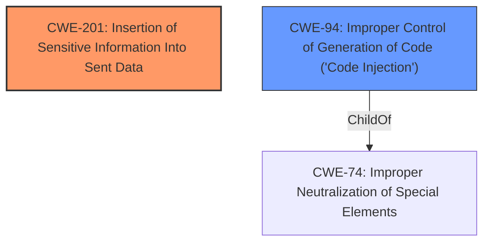

# Enhanced Analysis for CVE-2021-37326

# Summary
| CWE ID | CWE Name | Confidence | CWE Abstraction Level | CWE Vulnerability Mapping Label | CWE-Vulnerability Mapping Notes |
|---|---|---|---|---|---|
| CWE-201 | Insertion of Sensitive Information Into Sent Data | 0.6 | Base | Allowed | Primary CWE. The vulnerability involves unintended code strings being included in paste operations, which can be seen as a form of sensitive information being inserted into sent data. |
| CWE-94 | Improper Control of Generation of Code ('Code Injection') | 0.3 | Base | Allowed-with-Review | Secondary CWE. The unintended code strings in paste operations might lead to the execution of unintended code, but this is speculative based on the limited evidence. |

## Evidence and Confidence

*   **Confidence Score:** 0.6
*   **Evidence Strength:** LOW

## Relationship Analysis
The primary CWE, CWE-201, is a base-level weakness that focuses on sensitive information being included in sent data. It has relationships with CWE-200 (Information Exposure) and can also be related to CWE-209 (Generation of Error Message Containing Sensitive Information) or CWE-202 (Exposure of Sensitive Information Through Data Queries). However, these relationships are not directly applicable based on the limited information in the vulnerability description.

CWE-94, a base-level weakness, is considered a possible secondary weakness here. It focuses on the improper control of code generation, which could potentially be triggered by the unintended code strings. CWE-94 is a child of CWE-74 (Improper Neutralization of Special Elements in Output Used by a Downstream Component ('Injection')).



## Vulnerability Chain
The vulnerability chain, based on the limited information, appears to be:
1.  **Root Cause:** Unintended code strings are present in the application.
2.  **Weakness:** CWE-201 - Insertion of Sensitive Information Into Sent Data.
3.  **Possible Impact:** If the unintended code strings are executed, it could lead to CWE-94 - Improper Control of Generation of Code ('Code Injection').

## Summary of Analysis
The initial analysis focused on the vulnerability description, which mentions "unintended code strings in paste operations." The primary concern is the presence of sensitive or malicious code being inadvertently included in data that is sent or processed. This aligns with CWE-201 (Insertion of Sensitive Information Into Sent Data).

Since the evidence is weak, with no detailed rootcause information, I can only speculate on the full impact. However, if the unintended code strings lead to code execution, CWE-94 (Improper Control of Generation of Code ('Code Injection')) could also be relevant.

The retriever results and graph relationships support this assessment, with CWE-201 being a top combined result and CWE-94 having potential relevance if the code strings are executed.

Given the limited evidence and the lack of detail about the root cause, the confidence in the mapping is moderate (0.6).
The selected CWEs are at the base level of specificity, which is appropriate for the available information.
The primary CWE is CWE-201, with CWE-94 being a secondary consideration contingent on further information about the execution of the unintended code strings.


## CWE Relationship Analysis

Current CWEs represent these abstraction levels: .


### Vulnerability Chain Analysis

**Chain starting from CWE-201:**
- 201 (Insertion of Sensitive Information Into Sent Data) - ROOT


**Chain starting from CWE-200:**
- 200 (Exposure of Sensitive Information to an Unauthorized Actor) - ROOT


### CWE Relationship Diagram

```mermaid
graph TD
    classDef primary fill:#f96,stroke:#333,stroke-width:2px
    classDef secondary fill:#69f,stroke:#333
    classDef tertiary fill:#9e9,stroke:#333
```